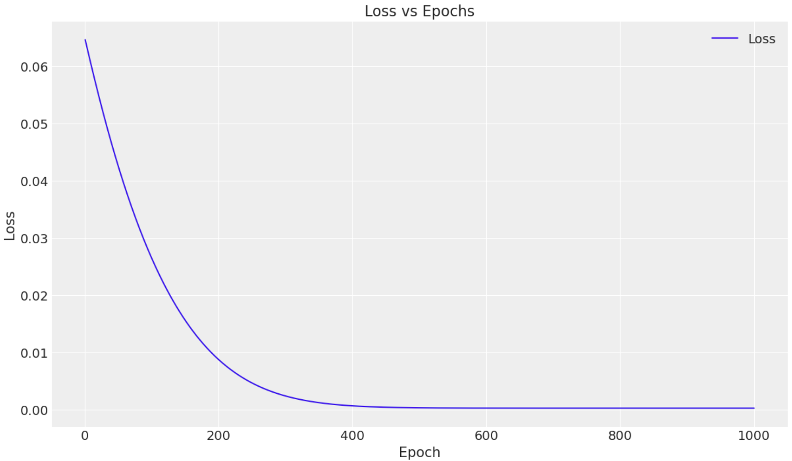

Hôm nay, chúng ta sẽ cùng nhau thảo luận về các phương pháp khác nhau để giải quyết bài toán Linear regression - Hồi quy tuyến tính.

## Vậy Linear regression là gì?

Hồi quy tuyến tính là phương pháp thống kê dùng để mô hình hóa mối quan hệ giữa biến phụ thuộc và các biến độc lập. Hay nói cách khác, hồi quy tuyến tính là đi tìm mối quan hệ tuyến tính (y=ax+b) giữa 2 biến với nhau.

Ở bài này, mình sẽ không bàn luận sâu về toán, các bạn có thể đọc ở đây để nắm lý thuyết cần thiết [link](https://machinelearningcoban.com/2016/12/28/linearregression/). Thay vào đó, bài viết này sẽ đi thực hiện bài toán đơn giản này theo 3 cách tiếp cận khác nhau:

- Sử dụng linear algebra để tính trực tiếp
- Thông qua deep learning, sử dụng đạo hàm
- Thông qua bayesian inference, sử dụng phương pháp lấy mẫu (sampling)

Ngoài ra, bài viết sẽ áp dụng phương pháp này để đi xác định hệ số Beta cho cổ phiếu HPG. Các bạn có thể đọc về beta [tại đây.](https://www.cmcmarkets.com/en/trading-guides/stock-beta)


Ở bài toán này, dữ liệu X sẽ là VNINDEX, trong khi y sẽ là HPG.

Về mặt tài chính, điều này có thể được xem như là ước tính rủi ro thị trường, hay rủi ro hệ thống (market risk, systematic risk) cho HPG.

### 1. Tính trực tiếp từ dữ liệu

Lời giả cho phương pháp này là:

$$
\hat{\beta} = (X^\top X)^{-1} X^\top y 
$$

```python
class Algebra_linear_regression:
    def __init__(self):
        self.coef_ = None
        self.intercept_ = None

    def fit(self, X, y):
        X = np.array(X)
        y = np.array(y)
        X = np.c_[np.ones(X.shape[0]), X]
        
        self.coef_ = np.linalg.inv(X.T @ X) @ X.T @ y
        self.intercept_ = self.coef_[0]
        self.coef_ = self.coef_[1:]

    def predict(self, X):
        X = np.array(X)
        return X @ self.coef_ + self.intercept_

    def score(self, X, y):
        X = np.array(X)
        y = np.array(y)
        y_pred = self.predict(X)
        return 1 - ((y - y_pred) ** 2).sum() / ((y - y.mean()) ** 2).sum()
        
model = Algebra_linear_regression()
model.fit(X,y)
model.coef_.round(3), model.intercept_.round(4)
-> output: (array([[1.23]]), array([0.0005]))
```

Từ phương pháp này, ta có thể ước lượng được rằng hệ số beta cho cổ phiếu HPG là 1.23 tương ứng với việc rủi ro thị trường tương đối cao.


### 2. Sử dụng deep learning

Deep learning cũng là một trong những phương pháp thông dụng có thể được sử dụng trong bài toán này. Thông qua thuật toán **Gradient Descent,** ta có đi tìm bộ tham số phù hợp với hàm mất mát (loss function) là thấp nhất.

Quá trình đi tìm điểm tối ưu của bài toán này giống như khi bạn đi xuống núi. Ban đầu, bạn sẽ bắt đầu ở một điểm nào đó, tại mỗi điểm bạn sẽ luôn biết nên đi hướng nào. Mục tiêu của bạn sẽ đi xuống núi từng bước nhỏ một. Bạn cứ liên tục đi cho đến khi bạn đạt đến điểm trũng của thung lũng!


```python
import torch
import torch.nn as nn

# Create class
class LinearRegressionModel(nn.Module):
    def __init__(self, input_dim, output_dim):
        super(LinearRegressionModel, self).__init__()
        self.linear = nn.Linear(input_dim, output_dim)  

    def forward(self, x):
        out = self.linear(x)
        return out
        

input_dim = 1
output_dim = 1

model = LinearRegressionModel(input_dim, output_dim)
criterion = nn.MSELoss()

learning_rate = 0.001
optimizer = torch.optim.Adam(model.parameters(), lr=learning_rate)
epochs = 1000

losses = []  # List to store loss at each epoch

for epoch in range(epochs):
    epoch += 1
    # Convert numpy array to torch Variable
    inputs = torch.from_numpy(X).requires_grad_()
    labels = torch.from_numpy(y)

    # Clear gradients w.r.t. parameters
    optimizer.zero_grad() 

    # Forward to get output
    outputs = model(inputs)

    # Calculate Loss
    loss = criterion(outputs, labels)
    
    # Getting gradients w.r.t. parameters
    loss.backward()

    # Updating parameters
    optimizer.step()
    losses.append(loss.item())
    print('epoch {}, loss {}'.format(epoch, loss.item()))
```



Thông qua phương pháp này, ta cũng tìm được mối quan hệ giống hệt với phương pháp tính trực tiếp! 


### 3. Bayesian linear regression

Thay vì chỉ đưa ra một giá trị cố định cho các hệ số như hồi quy tuyến tính thông thường, phương pháp bayes coi các hệ số là những giá trị có thể thay đổi và có xác suất xảy ra. Ban đầu, ta có một "niềm tin" về các tham số này (prior). Khi thu thập thêm dữ liệu, ta sẽ cập nhật niềm tin đó, từ đó giúp dự đoán chính xác hơn và biết mức độ chắc chắn của các kết quả (posterior). Khoá [Coursera](https://www.coursera.org/learn/mcmc-bayesian-statistics?specialization=bayesian-statistics) này sẽ cho bạn cái nhìn kĩ hơn về phương pháp này.

Để hiểu đơn giản hơn, ta có một ví dụ này: Với 2 phương pháp trên, hệ số beta của HPG là 1.23. Vậy có bao nhiêu phần trăm (%) hệ số beta là 1.23, hệ số beta lớn hơn 1 với độ tự tin bao nhiêu phần trăm (%)? Giá trị của hệ số beta của HPG có thể có giá trị từ đâu tới đâu với độ tư tin là bao nhiêu phần trăm (%)?

Đây là một trong những vấn đề có thể được giải quyết thông qua phương pháp Bayes. Bạn có thể đọc kĩ hơn về ý tưởng đằng sau phương pháp này [tại đây](https://brunaw.com/phd/bayes-regression/report.pdf).

```python
def numpyro_model(X, y):
    # Priors for the parameters
    num_features = X.shape[1]
    beta = numpyro.sample("beta", dist.Normal(0,1))  # Coefficients
    intercept = numpyro.sample("intercept", dist.Normal(0, 1))  # Intercept
    sigma = numpyro.sample("sigma", dist.Normal(0,1))  # Noise level
    # Linear model
    mean = jnp.dot(X, beta) + intercept
    # Likelihood
    numpyro.sample("obs", dist.Normal(mean, sigma), obs=y)

# Instantiate a `MCMC` object using a NUTS sampler
mcmc = MCMC(sampler=NUTS(numpyro_model),
            num_warmup=1000,
            num_samples=1000,
            num_chains=4)

# Run the MCMC sampler and collect samples
mcmc.run(rng_key=random.PRNGKey(seed=42),
         X=X,
         y=y)
         
az.plot_trace(mcmc, var_names=['intercept', 'beta', 'sigma'], figsize=(9,9));
```

$$
Y = \beta_0 + \beta_1 X + \epsilon
$$


Phương pháp biểu diễn các biến trong Bayesian inference (plate notion). Ở bài toán này, ta sẽ có 3 biến chính: beta, intercept và sigma. Tất cả đều được giả định là phân phối chuẩn.

```
             mean       std    median      5.0%     95.0%     n_eff     r_hat
  beta       1.23      0.03      1.23      1.18      1.28    734.39      1.01
  intercept  0.00      0.00      0.00     -0.00      0.00   3212.78      1.00
  sigma      0.02      0.00      0.02      0.02      0.02   5063.55      1.00
```


Hình này được gọi là trace plot. Phương pháp này được dùng để đánh giá quá trình hội tụ của mô hình Bayes. Cột bên trái cho ta thấy phân phối, trong khi bên phải cho ta thấy sự giao động của các tham số. 


Từ kết quả mô hình trên, ta ra được kết luận rằng, hệ số beta trung bình cho cổ phiếu HPG cũng là 1.23, và ta có thể tự tin nói rằng, 90% trường hợp hệ số beta của HPG sẽ trong vùng 1.18 - 1.23.


## Kết luận

Từ 3 phương pháp trên ta đều thu được chung 1 kết quả. Ngoài ra, mỗi phương pháp có ưu và nhược điểm của mình. 

Với phương pháp tính toán trực tiếp, ta có thể dễ dàng tính toán ra được đáp án với độ phức tạp là thấp nhất. Tuy nhiên, với những trường hợp mà dữ liệu là không khả nghịch (singular), thì bài toán có khả năng không có khả năng giải được theo phương pháp này (analytical solution). 

Ngược lại, với phương pháp deep learning, ta có thể dễ dàng xử lý các bài toán khi không thể giải trực tiếp (analytical solution). Thông qua Gradient Descent, ta có thể ước tính được các điểm tối ưu, tuy nhiên đi kèm với đó là yêu cầu tính toán lớn hơn nhiều (computational cost).

Cuối cùng, phương pháp Bayesian có thể được sử dụng khi ta mong muốn đưa niềm tin của ta vào mô hình, cũng như đầu ra mong muốn là một phân phối các kết quả có thể xảy ra thay vì chỉ muốn một điểm ước lượng duy nhất. Quan trọng nhất là mô hình hoá được độ không chắc chắn (uncertainty). Tuy nhiên, yếu tố giả định của người sử dụng có thể có tác động tiêu cực đến mô hình nếu giả định sai.

Và tất nhiên, 2 phương pháp sau là phức tạp hoá vấn đề cho bài toán đơn giản này. Tuy nhiên, để gần gũi nhất thì mình chọn ước lượng beta cho dễ hình dung!