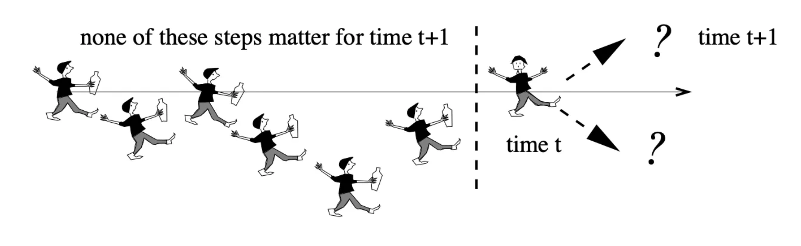
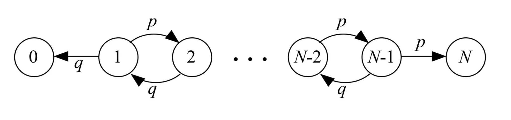
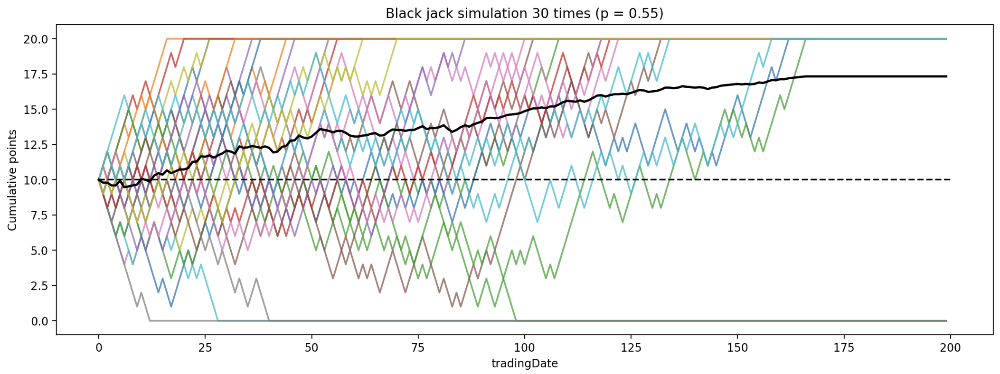
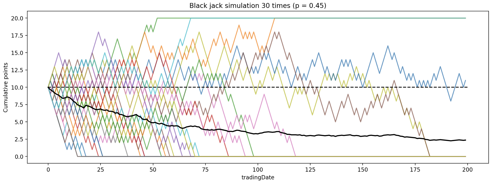
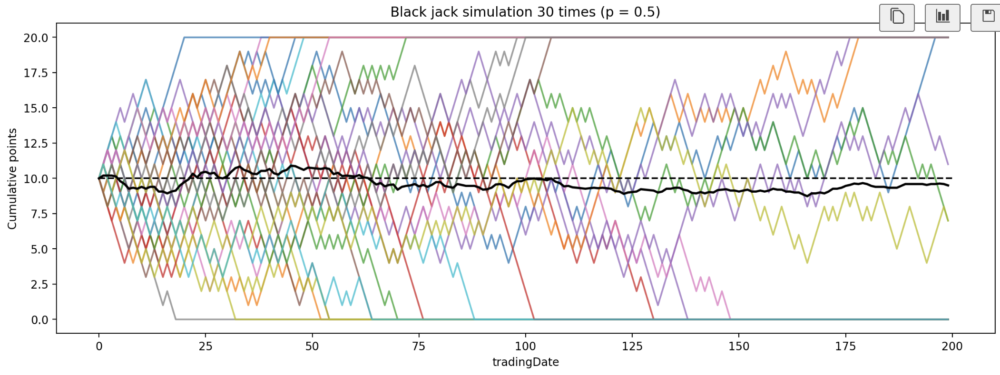
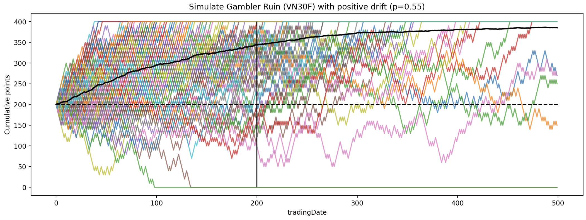
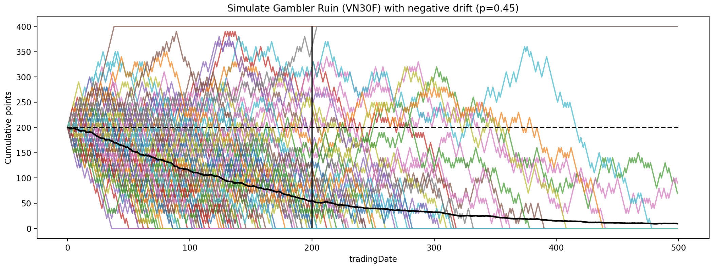
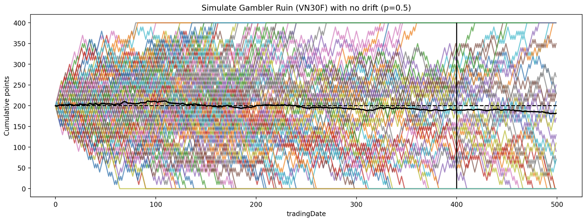

## Giới thiệu
Stochastic process là ngôn ngữ để miêu tả sự ngẫu nhiên, cũng giống như Calculus là ngôn ngữ để miêu tả sự thay đổi của hàm số.

Bài viết giới thiệu về stochastic process thông qua bài toán Gambler's Ruin. Bài viết cũng mô phỏng chiến lược giao dịch VN30F1M như một trường hợp của Gambler's ruin và sử dụng phương pháp Monte Carlo để xấp xỉ các giá trị cần thiết, nhấn mạnh tầm quan trọng của xác suất và kỳ vọng trong việc ra quyết định.

## Concept

Gambler’s Ruin, hay Sự phá sản của con bạc, là một trong những concept cổ điển trong lý thuyết xác suất (probability theory) và quá trình ngẫu nhiên (stochastic process). Vấn đề này có thể được mô tả trong nhiều trường hợp, trong đó phổ biến nhất là:

>Một con bạc bước vào sòng bạc với số tiền `$n` trong tay và bắt đầu chơi một trò chơi, trong đó anh ta thắng với xác suất p và thua với xác suất $q = 1-p$. Người chơi lặp lại trò chơi này nhiều lần, đặt cược `$1` mỗi lượt. Anh ta sẽ rời khỏi trò chơi nếu tổng số tiền của anh ta đạt đến `$N` hoặc nếu anh ta hết tiền (phá sản), tùy thuộc vào điều gì xảy ra trước. Xác suất mà con bạc bị phá sản hoặc thắng chung cuộc là bao nhiêu? 
>


### Xác suất con bạc thắng cả trận

Gambler’s Ruin có thể được mô hình hoá như một bước đi ngẫu nhiên (random walk) mà ở đó chúng ta quan tâm đến xác suất người chơi sẽ thắng khi đạt được `$N` mong muốn.  Ở bài viết này, mình sẽ sử dụng kết quả, bước giải chi tiết các bạn có thể tham khảo [tại đây](https://randomdeterminism.wordpress.com/2010/07/07/gamblers-ruin/). 



Với $P_N(n)$ là xác suất người chơi sẽ đạt được `$N` với số tiền hiện tại là `$n`. Tương tự, $P_N(n+1)$ là xác suất người chơi sẽ đạt được `$N` với số tiền hiện tại là `$n+1`.  $p$ là xác suất thắng 1 trận,  $q = 1 - p$ là xác suất thua của 1 trận.  

$$
P(\text{sucess}) = P(\text{sucess}| \text{win first round}) P(\text{win first round})\\ + P(\text{sucess}| \text{lose first round}) P(\text{lose first round}) \\
P_N(n) = P(n| W) P(W) + P(n| L) P(L) \\
P_N(n) = P_N(n+1) p + P_N(n-1) q
$$

Với $\lambda = \frac{q}{p}$, xác suất người chơi sẽ đạt được N là:

$$
P_N(n) = \begin{cases} 
\frac{1 - \lambda^n}{1 - \lambda^N}, & \lambda \neq 1 \\ 
\frac{n}{N}, & \lambda = 1 
\end{cases} \tag{1}
$$

```python
def win_probability(p, initial_cap, expected_cap):
    
    assert 0<= p <=1 , "`p` must be a probability between 0 and 1."
    assert 0 <= initial_cap <= expected_cap, "`` an initial_cap integer between 0 and expected_cap."
    
    very_small_number = 1e-12
    lambda_ = (1-p)/p
    if p<= very_small_number:
        return 0
    if p>= 1-very_small_number:
        return 1
    if lambda_==1:
        return initial_cap/expected_cap
    
    return (1-lambda_**initial_cap)/(1-lambda_**expected_cap)
```

Bài toán giả định như sau:

Giả sử trường hợp sau, anh A có 10 đồng và quyết định đi đánh black jack (xì dách) với mục tiêu sẽ gấp đôi số tiền (20 đồng), mỗi trận thắng/thua anh A sẽ lời/mất 1 đồng. Anh A sử dụng chiến thuật với xác suất thắng trong 1 ván là (a) 50%, (b) 55%, (c) 45%  thì xác suất anh A đạt được mục tiêu 20 đồng là bao nhiêu.

```python
### Closed-form solution
p = 0.5

initial_cap = 10
expected_cap = 20

win_rate = round(win_probability(p, initial_cap, expected_cap),5)

p = 0.55
win_rate = round(win_probability(p, initial_cap, expected_cap),5)

p = 0.45
win_rate = round(win_probability(p, initial_cap, expected_cap),5)

-----------------------------------
Output:

Win rate: 0.5, Initial capital: 10, Expected capital: 20
Sucess rate: 50%
-----------------------------------
Win rate: 0.55, Initial capital: 10, Expected capital: 20
Sucess rate: 88.15%
-----------------------------------
Win rate: 0.45, Initial capital: 10, Expected capital: 20
Sucess rate: 11.85%
-----------------------------------
```

Từ công thức trên, ta có thể tính toán được xác suất con bạc thắng chung cuộc. Vậy, trong thực tế, nó sẽ “trông” như thế nào nhỉ?







Ta tiến hành giả lập chuỗi thời gian của bài toán này. Từ xác suất trên, ta có thể tính toán được nhiều thứ. Giá trị kì vọng trong 3 trường hợp 0.5, 0.55, 0.45 lần lượt là 10, 18, 2. Với việc giả lập 30 lần, ta có thể thấy giá trị trung bình (hay kì vọng) cũng tiến tới mức này. 

Ngoài ra, dựa trên giả lập trên, ta cũng có thể nhận thấy 1 tính chất rằng, sẽ tới 1 thời gian là các chuỗi sẽ đạt tới điểm dừng (absorbing state). Nôm na là thời điểm kì vọng (hay trung bình) con bạc đạt được $N hoặc thua hết “xèng”.

Với S là thời gian kỳ vọng, D là bước (step), ta có:

$$
\begin{align*}
E(\text{duration}) = E(\text{duration}| \text{win first round}) P(\text{win first round}) \\+ E(\text{duration}| \text{lose first round}) P(\text{lose first round})\\
\end{align*}\\
$$

$$
\begin{align*}
E_n(S) 
&= E(S|D_1=n+1)p +E(S|D_1=n-1)q\\
&= (1+E(S|D_0=n+1))p + (1+E(S|D_0=n-1))q\\
&= p+q+E(S|D_0=n+1)p +E(S|D_0=n-1)q\\
&= 1+E_{n+1}(S)p +E_{n-1}(S)q
\end{align*}
$$

$$
\begin{align*}
E_n(S) 
= \frac{S}{q - p} - \frac{M}{q - p} \cdot \frac{(\frac{q}{p})^S - 1}{(\frac{q}{p})^M - 1}
\end{align*}
$$

```python
def expected_duration(p, initial_cap, expected_cap):
    assert 0<= p <=1 , "`p` must be a probability between 0 and 1."
    assert 0 <= initial_cap <= expected_cap, "`` an initial_cap integer between 0 and expected_cap."
    
    very_small_number = 1e-12
    q = 1-p
    lambda_ = q/p
    
    if lambda_==1:
        return initial_cap*(expected_cap - initial_cap)
    
    duration = (
                initial_cap/(q-p) - expected_cap/(q-p)*
                ((lambda_**initial_cap-1)/(lambda_**expected_cap-1))
               )
    return duration
 
-------  
initial_cap = 10
expected_cap = 20

Win rate: 0.5, Expected duration: 100

Win rate: 0.45, Expected duration: 76.3

Win rate: 0.55, Expected duration: 76.3    
```

Vậy, ta có thể tự tin nói rằng: Nếu xác suất của ván bài là 50/50 cho mỗi ván, thì kỳ vọng con bạc sẽ dừng cuộc chơi (cả thắng lẫn thua) sẽ là sau 100 ván. Còn nếu xác suất là 45% hoặc 55% thì (dự kiến) sau 77 ván con bạc sẽ dừng cuộc chơi.

## VN30F1M

Bối cảnh về con bạc đã xong, giờ ta qua tới VN30F1. Ta sẽ trade với chiến lược siêu đơn giản như sau: Long giá mở cửa (Open) và đóng giá đóng cửa (Close). Với dữ liệu daily từ 2018 tới nay, ta thu được các kết quả như sau:

- Trung bình tăng:  9.21
- Trung bình giảm:  -10.14
- Số ngày tăng: 777; Số ngày giảm 734
- Xác suất tăng giảm hằng ngày: 51%

Cũng khá tương đồng với bài toán black jack ở trên 🙂. Từ các tham số trên, ta mô hình hoá như sau: Xác suất lời lỗ là 50%, mỗi ngày tăng giảm trung bình 10 điểm. Giả sử bạn 1 số tiền đủ để bạn “risk” 200 điểm (~200tr). Bạn kỳ vọng sẽ gấp đôi trong 400 điểm. Để đưa về bài toán gambler’s ruin, ta cần chuẩn hoá lời lỗ về 1 điểm. Từ đó, thông số của bài toán sẽ là p=0.5, n=20, N= 40.

Sucess_prob = n/N = 20/40 = 50%

Expected_duration = n*(N-n) = 20*(40-20) = 400 (days)

Lợi nhuận kỳ vọng: 40 * 50% + 0 * 50% = 20 (bằng số vốn ban đầu)

Từ đó công thức ta có thể suy luận các ý như sau:

- Khi bạn kỳ vọng càng cao (so với số tiền bạn có) thì xác suất bạn thành công càng thấp và thời gian dự kiến bạn lỗ sạch càng nhanh.
- Bạn muốn tăng xác suất thành công thì nên có vốn dài (hay có nhiều tiền) 😃
- Tăng xác suất thắng cho từng lần trade thì lợi nhuận kỳ vọng tăng và xác suất bạn thua sạch càng thấp.

Giả lập VN30F1M cho các trường hợp xác suất thắng cho từng lần trade là 55%, 45% và 50%.

```python
def simulation_plot(p, initial_cap, each_step, expected_cap, n, n_sim, expected_stopping = None,title = 'Simulate Gambler Ruin'):
    capital = np.zeros((n_sim, n))
    for i in range(n_sim):
        capital[i] = simulate_gambler_ruin(p, initial_cap, expected_cap, each_step, n)    
    
    plt.figure(figsize=(15,5), dpi = 200)    

    plt.plot(capital.T, alpha = 0.75)
    ## Mean and standard deviation
    plt.hlines(initial_cap, 0, n, colors='black', linestyles='dashed', label='Initial capital')
    # plt.fill_between(np.arange(n), np.min(capital, axis = 0), np.max(capital, axis = 0), color = 'gray', alpha = 0.5, label = 'Mean +/- std')

    #Mean
    plt.plot(np.mean(capital, axis = 0), color = 'black', linewidth = 2, label = 'Mean')
    if expected_stopping:
        plt.vlines(expected_stopping,0, expected_cap, colors='black', label='Expected stopping point')
        
    plt.title(title)
    plt.xlabel('tradingDate')
    plt.ylabel('Cumulative points')
    plt.show()
    return capital
    
initial_cap = 200
each_step = 10
expected_cap = 400
n= 500
n_sim = 100
```



Với chiến lược có xác suất lời 55%, chỉ có 2 lần là bạn thua sạch tiền trong số 100 lần giả lập.





Từ giả lập trên, ta có thể dễ dàng nhận ra 1 số tính chất cơ bản và nền móng của stochastic process như sau:

- Nếu xác suất là p=0.5, giá trị kỳ vọng bằng đúng với giá trị ban đầu. Đây là tính chất martingale cơ bản trong stochastic process $E(X_n) = E(X_0) \text{ với } n \ge 0$ .
- Với p > 0.5, ta có thể thấy xu hướng của chuỗi thời gian có chiều hướng lên (positive drift), và ngược lại với. p< 0.5, xu hướng có chiều hướng xuống (negative drift).
- Giá trị của $X_{n+1}$ chỉ phụ thuộc vào $X_{n}$, hay giá trị của ngày hôm sau chỉ phụ thuộc vào ngày hôm nay và không phụ thuộc vào quá khứ trước đó. Đây là tính chất Markov.
- Variance của chuỗi thời gian này mở rộng theo thời gian (hay phụ thuộc vào thời gian t).

### Ngoài lề: Monte carlo simulation xấp xỉ các giá trị cần thiết

Ngoài ra, dựa vào phương pháp giả lập (Monte carlo) này, ta có thể xấp xỉ các giá trị xác suất, kỳ vọng như phương pháp closed-form solution như trên. Dựa trên lý thuyết số lớn (Law of large number), bằng cách lấy mẫu ngẫu nhiên nhiều lần, ta có thể mô phỏng lại các trường hợp có thể xảy ra nhằm tính toán các giá trị mong muốn.

```python
# tham số
initial_cap = 200
each_step = 10
expected_cap = 400
## giả lập
n = 2000 # (giả lập tới vô cực; 2000 là cũng đủ lớn)
n_sim = 20000 # (giả lập nhiều lần; 20000 là cũng đủ lớn)

capital_up = simulation_plot(0.55, initial_cap, each_step, expected_cap, n, n_sim, title = 'Simulate Gambler Ruin with positive drift (p>0.5)')
capital_down = simulation_plot(0.45, initial_cap, each_step, expected_cap, n, n_sim, title = 'Simulate Gambler Ruin with negative drift (p<0.5)')
capital_neutral = simulation_plot(0.5, initial_cap, each_step, expected_cap, n, n_sim, title = 'Simulate Gambler Ruin with no drift (p=0.5)')

def stopping_time(capital, threshold):
    ls_positive = []
    ls_negative = []
    for i in range(capital.shape[0]):
        ls_positive.append(np.argmax(capital[i,:]>=threshold))
        ls_negative.append(np.argmax(capital[i,:]<=0))
    # ls = ls_positive + ls_negative
    ls = pd.DataFrame([ls_positive, ls_negative]).sum(axis = 0).mean()
    return ls

## tính toán xác suất
unique, counts = np.unique(capital_neutral[:,-1], return_counts=True)
print(counts/np.sum(counts))
unique, counts = np.unique(capital_up[:,-1], return_counts=True)
print(counts/np.sum(counts))
unique, counts = np.unique(capital_down[:,-1], return_counts=True)
print(counts/np.sum(counts))

## Tính toán stopping time
stopping_time(capital_neutral, 400), stopping_time(capital_up, 400), stopping_time(capital_down, 400)
```

Kết quả giả lập so với sử dụng closed-form như sau:

|  | Sucess probability |  | Expected duration |  |
| --- | --- | --- | --- | --- |
| p | Simulation | Closed-form | Simulation | Closed-form |
| 0.5 | 0.4944 | 0.5 | 395.27 | 400 |
| 0.55 | 0.9803 | 0.98 | 190.263 | 192.9 |
| 0.45 | 0.0157 | 0.02 | 190.594 | 192.9 |

Từ đó, ta có thể thấy rằng, với những bài toán chưa có một cách giải “đẹp”, ta có thể tiến hành giả lập các trường hợp xảy ra như một phương án chữa cháy để tính toán các giá trị mong muốn. Tuy nhiên, ta phải đánh đổi bằng tốc độ và độ “đẹp” của kết quả.

## Kết luận

Okay, đã đủ cho bài giới thiệu về stochastic process rồi. Chúng ta đã cùng nhau đi qua nhiều thứ nền móng: (1) Gambler’s ruin để giới thiệu về stochastic process; (2) Giả lập cho VN30F1M; (3) Monte Carlo để đi xấp xỉ các giá trị cần thiết.

Thông qua bài viết trên, bạn đã nắm được gì:

- Nền móng cho việc “gambling”: dựa vào xác suất, vốn của bạn, và kỳ vọng, bạn có thể gamble tốt hơn rồi đó. Trước khi bắt đầu bet vào một thứ gì đó, hãy chậm lại 1 bước, suy nghĩ về toán một tí, rồi mới quyết định chơi hay không. Hay đúng không nào ^^
- Khi gặp 1 bài toán và bí. Hãy đi giả lập nó để xấp xỉ trước kết quả cuối cùng.
- Strategy phái sinh có xác suất thắng dưới 50% thì nên xem xét lại.
- Nền móng cho vài tính chất cơ bản của stochastic process.

Ngoài ra, mình có để những bài viết rất hay của chủ đề tương tự ở phần ref, bạn nên nghía qua để hiểu sâu hơn về phần toán ở phía dưới nhé!

## Ref

https://randomdeterminism.wordpress.com/2010/07/07/gamblers-ruin/

https://web.mit.edu/neboat/Public/6.042/randomwalks.pdf

https://sites.pitt.edu/~jdnorton/teaching/paradox/chapters/probability_from_expectation/gambler_ruin.pdf

[https://en.wikipedia.org/wiki/Monte_Carlo_method#:~:text=Sawilowsky distinguishes between a simulation,uses repeated sampling to obtain](https://en.wikipedia.org/wiki/Monte_Carlo_method#:~:text=Sawilowsky%20distinguishes%20between%20a%20simulation,uses%20repeated%20sampling%20to%20obtain)