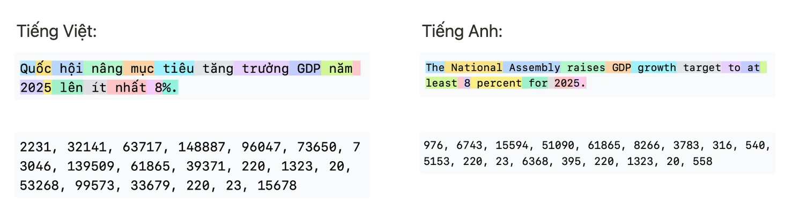
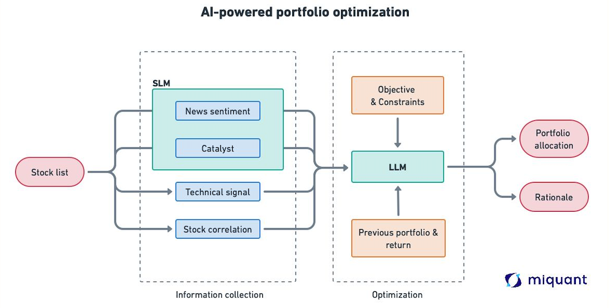
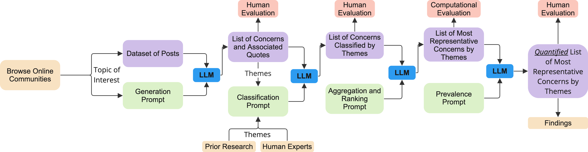

Đây là bài viết đầu tiên trong chuỗi series “LLM, AI agent, kinh tế học và đầu tư” của miquant. Chuỗi bài này mong muốn cung cấp cho nhà đầu tư, nhà phân tích và người dùng một góc nhìn tổng quan về mô hình ngôn ngữ lớn (LLM), trí tuệ nhân tạo (AI) và cách các công cụ này đang thay đổi thế giới nói chung và cách chúng ta đầu tư nói riêng.

## Sự tổng hợp của Trí tuệ

Trong câu chuyện về sự tiến hóa của công nghệ, có những khoảnh khắc đặc biệt khi ranh giới giữa tưởng tượng và thực tế trở nên mờ nhạt. Trí tuệ nhân tạo là một câu chuyện như vậy - một hành trình từ ý tưởng táo bạo trở thành hiện thực đang định hình lại thế giới của chúng ta. Giống như cách ánh sáng điện đã thắp sáng bóng tối, hay Internet đã kết nối nhân loại, AI đang viết nên chương mới trong câu chuyện tiến hóa của công nghệ. Từ những giấc mơ về máy móc thông minh, chúng ta đã chứng kiến sự xuất hiện của những người bạn số có thể hiểu, giao tiếp và sáng tạo theo cách tưởng chừng chỉ có trên phim.

Không giống như các cuộc cách mạng công nghệ trước đây thường tập trung vào việc tăng cường sức mạnh thể chất, AI đang khuếch đại chính khả năng trí tuệ - thứ làm nên bản chất con người. Đây không đơn thuần là một công cụ mới, mà là một người cộng sự mới trong hành trình khám phá và sáng tạo của nhân loại.

## Trí tuệ nhân tạo AI, định nghĩa chung

Dưới góc nhìn của miquant, AI được mô tả như sau:

- AI (trí tuệ nhân tạo) là tập hợp các thuật toán có khả năng **lý luận (reason), học hỏi (learn)** và **hành động (act)** theo cách mà thông thường đòi hỏi trí thông minh của con người.
- Điểm khác biệt lớn nhất giữa AI và con người nằm ở **cường độ và tốc độ** xử lý thông tin—AI có thể tiếp nhận và phân tích dữ liệu với quy mô vượt xa khả năng của con người.

Trong một hệ thống AI, yếu tố cốt lõi tạo nên sự khác biệt chính là dữ liệu mà nó được “dạy”. Tương tự con người, khả năng lý luận, học hỏi và hành động ở AI cũng hình thành từ quá trình tích lũy kinh nghiệm, kiến thức và trải nghiệm. Khi gặp một vấn đề mới, con người thường tìm kiếm các trường hợp tương tự (tối ưu hóa xác suất) và áp dụng những giải pháp đã có.

Điều thú vị là AI cũng được xây dựng và tối ưu dựa trên nguyên lý tương tự. Từ bắt đầu, các thuật toán AI đã được thiết kế để tìm ra mối quan hệ giữa các sự vật hiện tượng thông qua phương thức pattern-matching (tìm kiếm điểm tương đồng). Bằng cách quan sát và học từ rất nhiều ví dụ, khi gặp một tình huống gần giống, AI sẽ đưa ra dự đoán có xác suất tương đồng cao nhất. Con người cũng hoạt động theo cách này—trước khi đến tuổi đi học, chúng ta học ngôn ngữ mẹ đẻ thông qua vô vàn ví dụ từ cha mẹ, được lặp đi lặp lại hằng ngày. Hoặc khi học một môn thể thao, chúng ta phải tập thử nhiều lần để dần đoán được hướng đi của quả bóng khi đá mạnh hay nhẹ.

Trong vòng 5 năm trở lại đây, AI đã có một bước tiến vượt bậc—đến mức được xem như cột mốc lịch sử. Cũng như con người khác biệt với động vật ở khả năng hiểu và sử dụng ngôn ngữ, các nhà khoa học đã nhận ra tầm quan trọng của ngôn ngữ trong AI. Họ thành công xây dựng các mô hình ngôn ngữ lớn (Large Language Model—LLM) dựa trên cơ chế tương tự, coi đó như một phương thức giao tiếp chung giữa người với máy, giữa máy với máy, và giữa nhiều lĩnh vực khác nhau.

Code là ngôn ngữ của máy tính, protein và phân tử là ngôn ngữ của tế bào. Giờ đây, các mô hình ngôn ngữ lớn (LLM) trở thành cây cầu nối giúp kết hợp khả năng suy luận và kiến thức, tạo nên một nền tảng chung vững chắc.

Phần tiếp theo của bài viết sẽ đào sâu vào chủ đề LLM và giải thích tại sao nó đã và đang thay đổi cách con người làm việc.

## AI trong thập niên 2010

Trong thập niên 2010, trí tuệ nhân tạo (AI) chủ yếu được phát triển với mục tiêu giải quyết các nhiệm vụ cụ thể, như một loạt các “chuyên gia” nhỏ trong mỗi lĩnh vực. Các hệ thống AI thời đó được thiết kế để thực hiện những tác vụ định sẵn với hiệu suất cao, thay vì cố gắng hiểu và xử lý mọi vấn đề một cách tổng quát.

Ví dụ, trong lĩnh vực xử lý ngôn ngữ tự nhiên, các mô hình như máy dịch tự động hay phân tích cảm xúc (sentiment analysis) được tạo ra riêng biệt dành cho một ngôn ngữ xác định trước. Các hệ thống này được tạo ra với một múc đích xác định và cố gắng tối ưu duy nhất bài toán đó.

Hay trong tài chính, các mô hình AI như dự đoán giá cổ phiếu, giá commodity hay tối ưu hoá danh mục được thiết kế riêng nhằm tối ưu hoá bài toán cụ thể này.

Trong thập kỷ này, sự thành công của AI nằm ở phương pháp học có giám sát (supervised learning) thông qua mô hình các học sâu (Deep learning) mà nền tảng của chúng là các mạng neural.

Với học có giám sát, ở từng bài toán cụ thể, nhà phát triển (Developer) sẽ gán nhãn (label) các ví dụ để biểu diễn các hành vi mà họ muốn mô hình AI học và huấn luyện dựa trên các ví dụ đó. Sau khi được huấn luyện, các mô hình AI này có thể được áp dụng vào dữ liệu mới. Ví dụ, để đào tạo mô hình phát hiện gian lận, các giao dịch sẽ được gán nhãn (target) là "lừa đảo" hoặc "không lừa đảo" cùng với các đặc điểm của từng giao dịch (features). Sau khi mô hình học được từ các đặc điểm này (như địa điểm gửi tiền, số tiền, tốc độ, cường độ...) và các nhãn tương ứng, nó có thể dự đoán liệu một giao dịch mới có phải là lừa đảo hay không chỉ dựa trên các đặc điểm tương tự.

## Khoảnh khắc ChatGPT (ChatGPT moment)

Vào ngày 30/11/2022, ChatGPT, một mô hình ngôn ngữ lớn đột phá từ OpenAI ra mắt, đánh dấu một cột mốc quan trọng trong lịch sử công nghệ. Không phải là một phép màu, ChatGPT là kết quả tổng hợp của nhiều thập kỷ nghiên cứu từ những năm 1950. 

Tổng quát mà nói, **mô hình ngôn ngữ** (*language model*) hoạt động theo nguyên tắc đơn giản: chúng mã hóa ngôn ngữ thành các thông tin mang tính thống kê để ước tính xác suất xuất hiện của một từ trong một ngữ cảnh nhất định. Điều này giúp mô hình dự đoán và tạo ra văn bản một cách tự nhiên, phù hợp với ngữ cảnh. Ví dụ, với ngữ cảnh **"Yếu tố quan trọng nhất ảnh hưởng đến thị trường tài chính là __"**, một mô hình ngôn ngữ sẽ dự đoán xác suất xuất hiện của chữ **"kì vọng"**  sẽ cao hơn nhiều so với chữ **"thời tiết"**.

Dưới góc nhìn của thuật toán, khác với con người, thay vì nhìn một câu dài với nhiều kí tự, chúng sẽ sử dụng “*token*”. Một token có thể là một từ, một phần của từ hoặc thậm chí là các ký tự đơn lẻ, ví dụ chữ “nhắc” là 2 token là “nh” và “ắc” được biểu diễn bằng 2 token 5380 và 35708; trong khi chữ “đẹp” được biểu diễn bằng 1 token 75134. Với phương pháp trên, một câu sẽ được biểu diễn bằng nhiều token khác nhau.

Tiếng Việt:

Thông qua [dataset](https://huggingface.co/datasets/truongpdd/vietnamese_10classes_train_test_split) trên hugging face, team miquant nhận thấy rằng, sau khi chuyển sang token (GPT-4o), một câu tiếng Việt ở dạng token sẽ dài hơn trung bình 35% so với câu nguyên bản. **Tức 100 chữ tiếng Việt sẽ xấp xỉ 135 token.**

Dựa trên các token này, một mô hình ngôn ngữ sẽ cố gắng dự đoán lần lượt các token tiếp theo có xác suất xuất hiện cao nhất dựa trên các token trước đó. Các mô hình này liên tục dự đoán lần lượt từng token cho đến khi hoàn thành câu. **Quy trình này hoạt động dựa trên xác suất và không đảm bảo luôn luôn chính xác.** Tuy nhiên, nhờ vào cơ chế này, LLM lại có một sức mạnh to lớn so với rất nhiều mô hình AI khác. 

Với mọi yêu cầu bạn đặt ra (prompt), các mô hình LLM này luôn cố gắng hoàn thành nó, vì thế được gọi là tác vụ hoàn thành **(completion tasks)**. Rất nhiều vấn đề của chúng ta có thể được diễn giải thành các tác vụ phải hoàn thành. Các bài toán như phiên dịch, lập trình, phân tích dữ liệu, hay giải toán hay phân tích cơ bản, doanh thu đều có thể được thiết kế dưới dạng các tác vụ hoàn thành thông qua cách bạn thiết kế câu prompt. Từ đó, các mô hình ngôn ngữ sẽ cố gắng đưa ra câu trả lời có xác suất cao nhất dựa trên tất cả thông tin bạn cung cấp. 

<aside>
💡

**Ví dụ cụ thể**

Câu hỏi: Dựa trên bài báo được cung cấp, hãy phân tích cảm xúc (Sentiment) của bài báo này.

**<Tiêu đề>**

Quốc Hội đề xuất ….

**<Nội dung>**

Ngày 28/12 vừa qua ...

**Trả lời:** Tích cực!

Mô hình ngôn ngữ sẽ cố gắng xác định bài báo với nội dung này có cảm xúc là tích cực, tiêu cực hay trung tính. Từ đó, mô hình ngôn ngữ đã trở thành một mô hình phân loại cảm xúc cho tin tức thông qua quá trình tối ưu hoá xác suất.

</aside>

## AI trong tài chính

Như đã bàn luận kĩ ở trên, bản thân các mô hình ngôn ngữ có sức mạnh rất lớn, nhờ vào khả năng hoàn thành các yêu cầu được giao. Tuy nhiên, cần nhấn mạnh rằng quy trình này là một quy trình dự đoán dựa trên xác suất, nên không đảm bảo luôn luôn chính xác. Mặc dù vậy, nhờ khả năng này, rất nhiều tác vụ trước đây tốn nhiều nhân lực, nguồn lực và thời gian đã trở nên đơn giản hơn, hiệu quả hơn và còn có độ chính xác cao hơn rất nhiều.

Lấy một ví dụ cụ thể, tại **miquant**, trong các nghiên cứu đã thực hiện, việc tạo ra một mô hình phân tích cảm xúc cho các thông tin báo chí Việt Nam đòi hỏi một lượng dữ liệu có cấu trúc (structured data) rất lớn. Miquant từng xây dựng bộ dữ liệu với 20.000 điểm mẫu phân loại thông tin tích cực, tiêu cực hay trung tính. Không chỉ vậy, việc huấn luyện một mô hình nhận diện cảm xúc còn đòi hỏi rất nhiều thời gian để huấn luyện, kiểm tra và triển khai. Tuy nhiên, kể từ khi LLM xuất hiện, miquant đã tối ưu hóa đáng kể cho bài toán phân tích cảm xúc. Thay vì 20.000 điểm mẫu, miquant chỉ cần sử dụng chưa đến 200 mẫu, đồng thời thời gian triển khai được rút ngắn xuống còn vài giây để xử lý các bài báo khác nhau—với độ chính xác thậm chí còn cao hơn trước. Một kết quả mà ngay cả đội ngũ miquant cũng không ngờ tới!

Ngoài ra, các mô hình LLM cũng đã được thử nghiệm cho quá trình thu thập dữ liệu, backtest các chiến lược đầu tư, [tối ưu hoá danh mục](https://www.linkedin.com/posts/haquochung11_t%E1%BB%91i-%C6%B0u-ho%C3%A1-danh-m%E1%BB%A5c-%C4%91%E1%BA%A7u-t%C6%B0-s%E1%BB%AD-d%E1%BB%A5ng-large-activity-7292116099603517441-G9AT?utm_source=share&utm_medium=member_desktop&rcm=ACoAADgFvCUBI6YyHzl_4OjhHwfxoEw1MaKwoOI), hay gần hơn, các mô hình về AI agent nhằm tăng độ chính xác cho các bài toán phức tạp hơn. 

Song, miquant tin rằng, sức mạnh lớn nhất của các mô hình LLM chính là **tự động hoá khâu phân tính định tính (qualitative analysis)** hơn là cho các phân tích về định lượng (quantitative analysis) trong đầu tư. Dựa trên cơ chế khác hẳn các mô hình AI truyền thống, LLM có thể hiểu ngôn ngữ (understanding) , suy luận (reasoning) và đưa ra một kết luận hay khuyến nghị (acting). Chính nhờ các yếu tố này, khâu phân tính về định tính mà chỉ con người mới có thể làm được, giờ đây đã được tự động hoá. 

(https://arxiv.org/pdf/2405.05345v1)

Phân tích định tính truyền thống trong đầu tư tài chính thường đòi hỏi chuyên gia xử lý và nghiên cứu hàng trăm báo cáo tài chính, tin tức, và tài liệu khác để đánh giá các yếu tố không thể lượng hóa như chiến lược công ty, năng lực ban lãnh đạo, các xu hướng thị trường và cảm xúc của nhà đầu tư. Với sự xuất hiện của các mô hình LLM, phân tích định tính không chỉ được tự động hoá mà còn nâng cao đáng kể theo nhiều cách:

- **Phân tích báo cáo tài chính toàn diện:** LLM có thể nhanh chóng đọc và tóm tắt các báo cáo tài chính dài, xác định các điểm mạnh, điểm yếu, cơ hội và thách thức mà công ty đang đối mặt. Các mô hình này có thể đạt độ chính xác tương đương với phương pháp tuyền thống như các analyst trên thị trường. Điều đặc biệt ở đây chính là tốc độ và độ bao phủ (cover) khắp các mã trên thị trường.
- **Đánh giá điểm nhìn chung (consensus) thị trường:** LLM có thể phân tích hàng nghìn bài báo, bình luận trên mạng xã hội và diễn đàn đầu tư để đánh giá cảm xúc thị trường đối với một cổ phiếu hoặc ngành cụ thể. Điều này giúp nhà đầu tư hiểu được phần "tâm lý" của thị trường, một yếu tố quan trọng trong việc định giá tài sản.

Mặc dù vậy, cần lưu ý rằng LLM không phải là giải pháp tuyệt đối. Các mô hình này vẫn có thể gặp phải vấn đề như "ảo giác" (hallucination), khi chúng tạo ra thông tin không chính xác hoặc không tồn tại, điều này chính là một điểm yếu lớn vì bản thân cơ chế của LLM là dự đoán dựa trên xác suất. Do đó, vai trò của con người vẫn rất quan trọng trong việc xác minh, đánh giá và đưa ra quyết định cuối cùng dựa trên những phân tích này. 

Để sử dụng được các mô hình LLM hiệu quả, điều quan trọng nhất là không được lệ thuộc vào nó. Như mọi giai đoạn phát triển của lịch sử khác, công nghệ đến rồi đi. Tất cả công nghệ cũng chỉ là công cụ nhằm hỗ trợ cho con người thực hiện được các tác vụ của họ với tốc độ nhanh nhất, xử lý được nhiều tác vụ nhất và độ chính xác là cao nhất.

## Kết luận

Trong thời đại của sự bùng nổ công nghệ AI, các mô hình ngôn ngữ lớn (LLM) và AI agent đang dần định hình lại cách thức hoạt động của ngành tài chính và đầu tư. Những công cụ này không chỉ đơn thuần là phương tiện tự động hóa các tác vụ lặp đi lặp lại, mà còn mở ra một kỷ nguyên mới trong phân tích tài chính—nơi phân tích định tính được thực hiện với tốc độ, quy mô và độ chính xác chưa từng có.

Tại miquant, chúng tôi tin rằng tương lai của đầu tư tài chính sẽ là sự kết hợp hài hòa giữa sức mạnh của AI và kinh nghiệm của con người. LLM và AI agent sẽ tiếp tục phát triển, trở thành những công cụ không thể thiếu cho các nhà đầu tư hiện đại, giúp họ đưa ra quyết định sáng suốt hơn trong một thị trường ngày càng phức tạp và biến động.

Tuy nhiên, đừng quên rằng, dù công nghệ có tiên tiến đến đâu, trí tuệ, kinh nghiệm và khả năng phán đoán của con người vẫn là yếu tố quyết định cuối cùng trong hành trình đầu tư thành công. Những công cụ AI chỉ thực sự phát huy giá trị khi được sử dụng như một phần bổ sung cho kiến thức và kỹ năng của nhà đầu tư, chứ không phải thay thế hoàn toàn vai trò của họ.

Trong các bài viết tiếp theo của chuỗi series này, chúng tôi sẽ đi sâu hơn vào những ứng dụng cụ thể của LLM và AI agent trong đầu tư, chia sẻ những nghiên cứu và kinh nghiệm thực tế từ miquant, đồng thời mang đến những góc nhìn mới về tương lai của ngành tài chính trong kỷ nguyên trí tuệ nhân tạo.