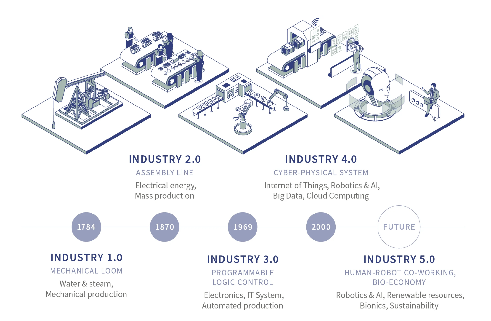
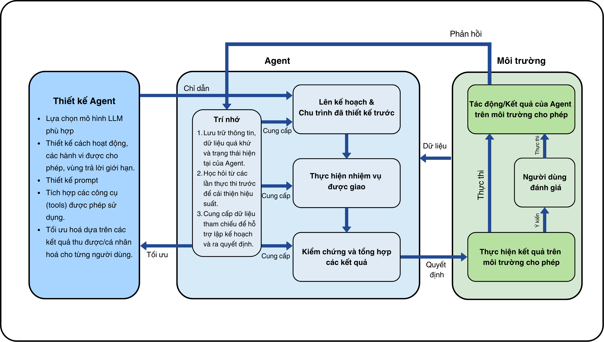
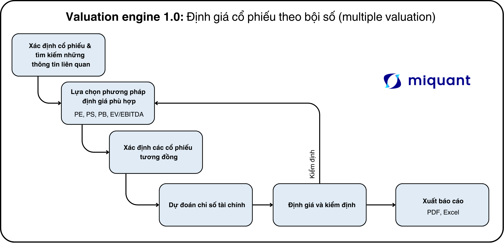
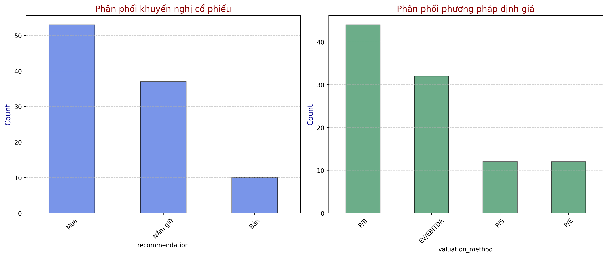
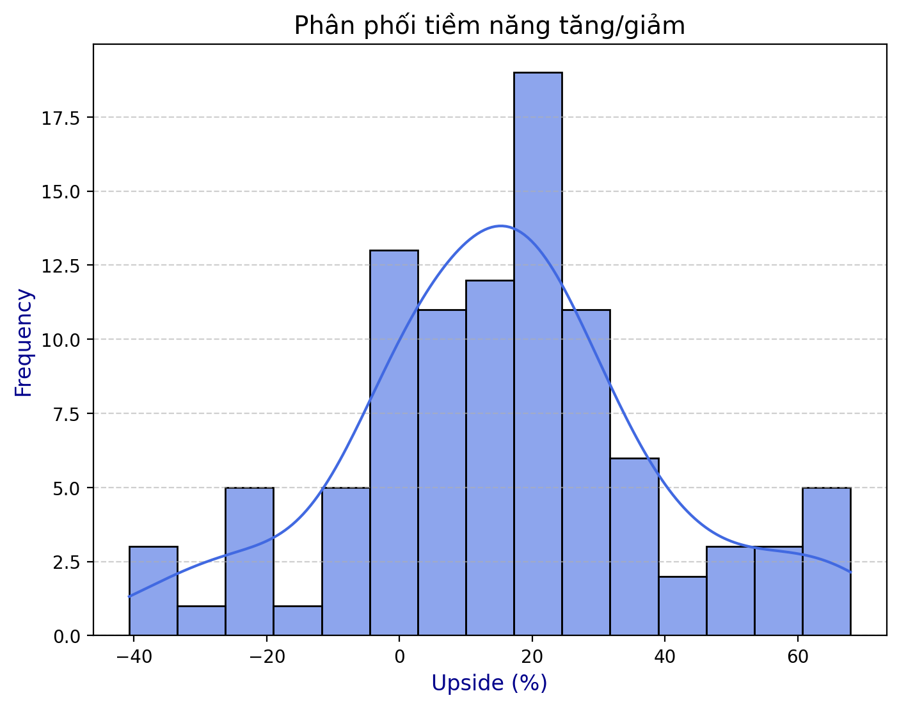
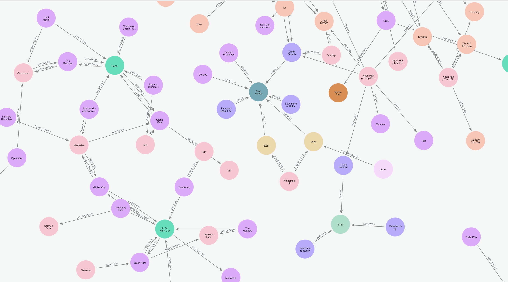

Đây là bài viết thứ 2 trong chuỗi series “LLM, AI agent, kinh tế học và đầu tư” của miquant. Chuỗi bài này mong muốn cung cấp cho nhà đầu tư, nhà phân tích và người dùng một góc nhìn tổng quan về mô hình ngôn ngữ lớn (LLM), trí tuệ nhân tạo (AI) và cách các công cụ này đang thay đổi thế giới nói chung và cách chúng ta đầu tư nói riêng. Đọc qua bài viết trước [tại đây](https://miquant.vn/blog-detail2).

## Công nghiệp hoá và tự động hoá

Thế giới đang bước vào cuộc cách mạng công nghiệp mới—cuộc cách mạng công nghiệp lần thứ 5.

Công nghệ hóa và tự động hóa luôn đóng vai trò then chốt trong sự phát triển của loài người. Từ cuộc cách mạng công nghiệp lần thứ nhất với động cơ hơi nước cho đến cuộc cách mạng công nghiệp lần thứ tư với trí tuệ nhân tạo và robot, con người không ngừng tìm cách tối ưu hóa quy trình sản xuất và nâng cao năng suất lao động. Trong khi các cuộc cách mạng công nghiệp trước đây chủ yếu tập trung vào việc tự động hóa các công việc thể chất và lặp đi lặp lại, cuộc cách mạng công nghiệp lần thứ 5 đang mở ra một chương hoàn toàn mới với sự tự động hóa những công việc trí tuệ và sáng tạo.

(https://www.rothschildandco.com/en/newsroom/insights/2024/10/the-dawn-of-industry-5.0/)

Cuộc cách mạng này được thúc đẩy mạnh mẽ bởi sự ra đời của các mô hình ngôn ngữ lớn (LLM) và AI tiên tiến. Những công cụ này có khả năng xử lý ngôn ngữ tự nhiên, tạo ra nội dung đa dạng, và tham gia vào các quá trình ra quyết định phức tạp mà trước đây chỉ con người mới thực hiện được. Đây chính là bước tiến đột phá, đánh dấu một bước ngoặt quan trọng trong lịch sử phát triển công nghệ của nhân loại, định hình lại cách con người tương tác với công nghệ.

Ở trung tâm của cuộc cách mạng này, AI agent đang nổi lên như một trong những công nghệ tiên tiến nhất, kế thừa thành tựu phát triển của khoa học máy tính và khoa học dữ liệu—những yếu tố cốt lõi của cuộc cách mạng công nghiệp lần thứ 4. Đây là hệ thống trí tuệ nhân tạo có khả năng tự động hóa các tác vụ phức tạp, tương tác tự nhiên với người dùng và thực hiện nhiệm vụ theo mục tiêu với sự can thiệp tối thiểu từ con người. 

Như đã bàn luận ở bài viết trước, một hệ thống AI cần thoả mãn 3 yếu tố:  **suy luận (reason), học hỏi (learn)** và **hành động (act)** theo cách thông thường đòi hỏi trí thông minh của con người. Dựa trên định nghĩa này, AI agent là công nghệ đang tiến gần nhất đến việc đạt được cả ba yếu tố trên. 

Vậy AI agent là gì, và tại sao công nghệ này lại mạnh mẽ đến thế? Chúng ta sẽ cùng tìm hiểu sâu hơn thông qua sản phẩm mới nhất của miquant, Valuation Engine 1.0 sẽ ra mắt trong thời gian sắp tới.

## AI agent là gì?

Có rất nhiều định nghĩa chuyên sâu về AI agent như từ [Anthropic](https://www.anthropic.com/engineering/building-effective-agents) hay [Chip Huyen](https://huyenchip.com/2025/01/07/agents.html), [NVDIA](https://developer.nvidia.com/blog/introduction-to-llm-agents/) hay [FPT](https://fpt.ai/vi/san-pham/fpt-ai-agents/), tuy nhiên, để tổng hợp lại thì chúng ta có thể hiểu AI agent như sau.

- AI Agent là một hệ thống trí tuệ nhân tạo dựa trên các mô hình ngôn ngữ lớn (LLM) để thực hiện suy luận (reason) và học hỏi (learn). Hệ thống này có khả năng đưa ra quyết định và thực hiện các hành động (act) thông qua các công cụ và hành vi được cho phép do người phát triển (developer) quyết định.
- AI Agent có những đặc điểm và cơ chế hoạt động khác nhau tuỳ thuộc vào môi trường nó được thiết kế để vận hành.

Ví dụ, AI Agent cho việc nghiên cứu (Deep research) có thể truy cập internet, tìm kiếm và phân tích thông tin liên quan, sau đó tổng hợp thành một bài nghiên cứu hoàn chỉnh cho người dùng (act).

Trong khi đó, một Agent cho tài chính có khả năng thu thập dữ liệu giá chứng khoán, thực hiện các phép tính cần thiết và đưa ra cảnh báo cho người dùng (act 1), hoặc thậm chí thực hiện lệnh đặt mua/bán (act 2)—tuỳ theo thiết kế và mức độ được phép từ nhà phát triển hệ thống AI.

Tuy nhiên, như mọi hệ thống khác, AI agent không thể tránh khỏi sai số và đôi khi có thể vi phạm các quy định pháp lý hoặc tiêu chuẩn đạo đức. Do đó, việc thiết kế và triển khai AI agent đòi hỏi sự thận trọng cao độ, kèm theo các biện pháp kiểm soát chặt chẽ và khung quản trị rõ ràng. Không chỉ nhà phát triển cần cẩn trọng trong quá trình nghiên cứu và vận hành, người dùng cuối cũng phải thận trọng khi sử dụng các công cụ AI và hiểu rõ cả khả năng lẫn giới hạn của chúng. Tương tự như khi sử dụng các phương tiện giao thông, trách nhiệm của nhà phát triển là đảm bảo phương tiện hoạt động an toàn và hiệu quả, trong khi người dùng cần trang bị kiến thức và kỹ năng cần thiết để sử dụng chúng một cách có trách nhiệm. Miquant luôn đặt sự an toàn và tính minh bạch lên hàng đầu trong quá trình phát triển các công cụ AI.

## Use case: định giá cổ phiếu sử dụng AI agent.

Là một công ty fintech trong lĩnh vực nghiên cứu thị trường tài chính Việt Nam, **miquant** nhận thấy một thách thức lớn trong ngành đầu tư: sự chênh lệch về khả năng tiếp cận thông tin giữa các tổ chức tài chính chuyên nghiệp và nhà đầu tư cá nhân ngày càng gia tăng.

Thực tế này được phản ánh rõ qua dữ liệu thị trường: trong hơn 1.500 mã cổ phiếu niêm yết tại Việt Nam, các công ty chứng khoán hàng đầu chỉ thường xuyên phát hành báo cáo phân tích cho khoảng 50-100 mã, chủ yếu tập trung vào các doanh nghiệp vốn hóa lớn trong VN30 hoặc các cổ phiếu đầu ngành. Điều này đồng nghĩa với việc hàng nghìn mã cổ phiếu khác—bao gồm cả những cơ hội đầu tư tiềm năng—không được phân tích một cách đầy đủ và chuyên sâu.

Ngay cả khi có báo cáo phân tích, một vấn đề khác nảy sinh: **mỗi báo cáo đều dựa trên một tập hợp giả định cố định của người phân tích**, khiến nhà đầu tư khó có thể đánh giá các kịch bản khác nhau hoặc cập nhật mô hình định giá khi xuất hiện thông tin mới. Giải pháp truyền thống là tự xây dựng mô hình định giá riêng—một quá trình đòi hỏi hàng chục giờ nghiên cứu và nền tảng phân tích chuyên sâu mà không phải nhà đầu tư nào cũng có sẵn.

### **Công nghệ có thể thay đổi cuộc chơi?**

Trước thách thức này, chúng tôi đặt ra câu hỏi:

- Trong kỷ nguyên dữ liệu, liệu công nghệ có thể giúp thu hẹp khoảng cách thông tin này?
- Liệu có thể xây dựng một công cụ giúp nhà đầu tư tiếp cận phân tích chuyên sâu cho bất kỳ cổ phiếu nào họ quan tâm, đồng thời cho phép điều chỉnh các giả định theo nhu cầu thực tế?

**Câu trả lời của chúng tôi: "Có".**

Đó là lý do miquant phát triển Valuation Engine 1.0, ứng dụng công nghệ AI Agent, giúp nhà đầu tư tiếp cận phân tích định giá linh hoạt, có thể tùy chỉnh—một bước tiến mới trong việc xử lý các thông tin tài chính. 

### Valuation Engine: nhìn vào trong hộp đen

Valuation Agent được thiết kế theo một quy trình 7 bước, mô phỏng cách làm việc của các chuyên gia phân tích tài chính:

1. **Thu thập dữ liệu:** Agent thu thập thông tin cơ bản về công ty, ngành nghề hoạt động và vị thế trên thị trường, dữ liệu về cơ bản và các dữ liệu liên quan.
2. **Lựa chọn phương pháp định giá:** Dựa trên đặc điểm của công ty, Agent sẽ xác định phương pháp định giá phù hợp nhất, ví dụ như P/E cho công ty tiêu dùng ổn định, P/B cho ngân hàng, hay EV/EBITDA cho doanh nghiệp cơ sở hạ tầng. 
3. **Xác định nhóm công ty tương đồng:** Đây là bước quan trọng và phức tạp. Agent không chỉ đơn thuần tìm các công ty cùng ngành mà còn phân tích sâu về quy mô, cơ cấu vốn và mô hình kinh doanh để tìm ra những doanh nghiệp thực sự có thể so sánh được.
4. **Dự báo các chỉ số tài chính:** Agent phân tích xu hướng lịch sử và thông tin hiện tại cũng như triển vọng tương lai liên quan đến công ty để đưa ra dự báo về các chỉ số tài chính trong tương lai.
5. **Thực hiện định giá và kiểm định:** Kết hợp các chỉ số dự báo với hệ số định giá mục tiêu để xác định giá hợp lý cho cổ phiếu. Nếu như kết quả định giá vượt quá xa so với giá thị trường, Agent sẽ tìm kiếm thêm thông tin và điều chỉnh các giả định để đảm bảo kết quả phản ánh chính xác nhất giá trị thực của doanh nghiệp. 
6. **Tạo báo cáo định giá:** Cuối cùng, Agent tổng hợp tất cả thông tin thành một báo cáo định giá cấu trúc rõ ràng và dễ hiểu, và gửi cho người dùng file PDF phân tích đi kèm với file Excel định giá.

Xuyên suốt quá trình này, Agent sẽ liên tục tìm kiếm thông tin, đọc BCTC, đọc các báo cáo phân tích trong lịch sử của công ty,… một quá trình nghiên cứu như một analyst thông thường, nhưng với tốc độ rất cao và với lượng dữ liệu xử lý rất rất lớn.

Một báo cáo định giá truyền thống thường mất từ vài ngày đến vài tuần để hoàn thành. Với AI Agent, quy trình này được rút ngắn xuống còn vài phút. Nhưng điều này không đồng nghĩa với việc hy sinh chất lượng phân tích mà ngược lại, người dùng có thể cùng với công cụ này để thử nghiệm định giá dưới nhiều kịch bản khác nhau để đi tới được kết luận cuối cùng.

### Thử nghiệm: định giá VN100

Miquant tiến hành định giá các cổ phiếu có trong chỉ số VN100 hiện tại (tính đến ngày thực hiện là 12/03/2025). Các kế quả thu được như sau. Kết quả khi thực hiện định giá các cổ phiếu có thể được tiếp cận tại đây.

Tổng hợp thống kê các khuyến nghị và các phương pháp định giá

Phân phối tiềm năng tăng giảm giá của các cổ phiếu trong chỉ số VN100

Các thống kê liên quan

|  | Tiềm năng tăng/giảm giá |
| --- | --- |
| Trung bình (Mean) | 15.41 |
| Trung vị (Median) | 16.62 |
| Độ lệch chuẩn (Std) | 23.25 |
| Giá trị lớn nhất (Max) | 67.97 |
| Giá trị nhỏ nhất (Min) | -40.73 |

Top 10 cổ phiếu có tiềm năng tăng/giảm nhiều nhất

| Cổ phiếu | Tăng | Cổ phiếu | Giảm |
| --- | --- | --- | --- |
| PPC | 67.97 | BCG | -40.73 |
| VTP | 67.57 | AAA | -37.68 |
| NLG | 65.61 | KDC | -35.47 |
| DXG | 65.36 | SJS | -28.43 |
| VND | 65.08 | FTS | -26.01 |
| VJC | 58.23 | HHV | -24.78 |
| SHB | 57.59 | LPB | -23.64 |
| VHM | 55.68 | GVR | -23.24 |
| NT2 | 50.62 | NKG | -20.67 |
| PAN | 49.74 | CTS | -17.70 |

Điểm yếu của hệ thống này nằm ở khả năng tiếp cận thông tin: chỉ giới hạn ở các thông tin công khai và chính thống (tính tới thời điểm hiện tại). Đôi khi, có những thông tin nội bộ chưa được công ty công bố ra thị trường mà hệ thống không thể tiếp cận được.

Tuy nhiên, điểm mạnh nổi bật nhất của hệ thống này là tính **linh hoạt cho phép người dùng tùy chỉnh và đưa vào các giả định riêng**. Với những thông tin độc quyền mà người dùng nắm được, họ có thể nhanh chóng kết hợp và thử nghiệm các thông tin này với dữ liệu thị trường sẵn có để nhận được kết quả định giá cổ phiếu phù hợp.

Ngoài ra, tốc độ xử lý thông tin nhanh chóng của AI Agent cho phép nhà đầu tư có thể nhanh chóng điều chỉnh và cập nhật mô hình định giá khi có thông tin mới. Điều này đặc biệt hữu ích trong thị trường chứng khoán năng động, nơi giá cổ phiếu có thể thay đổi nhanh chóng dựa trên tin tức và sự kiện mới.

Để giảm thiểu rủi ro hallucination (hiện tượng AI tạo ra thông tin không chính xác), miquant liên tục cải tiến và nâng cấp hệ thống của mình. Chúng tôi áp dụng nhiều biện pháp kiểm soát chất lượng như:

- Kiểm tra chéo thông tin từ nhiều nguồn dữ liệu đáng tin cậy
- Giới hạn phạm vi dự đoán của AI trong khuôn khổ các dữ liệu đã được xác thực nếu người dùng không cung cấp thông tin mới.
- Cho phép người dùng điều chỉnh và kiểm tra lại các giả định quan trọng
- Cập nhật liên tục cơ sở dữ liệu và các phương pháp kiểm soát chất lượng.

Ngoài ra, miquant cũng liên tục ứng dụng các công nghệ mới nhất như knowledge graph, reflection agent để liên tục cải tiến các dự đoán, giả định và xác minh thông tin.

## Kết luận

Công nghệ AI và LLM đang mang đến một cuộc cách mạng trong cách chúng ta tiếp cận phân tích và định giá cổ phiếu. Với khả năng xử lý thông tin nhanh chóng và chính xác, AI Agent có thể hỗ trợ đắc lực cho các nhà đầu tư và chuyên gia phân tích trong việc ra quyết định đầu tư.

Tuy nhiên, điều quan trọng cần nhấn mạnh là AI Agent không nhằm mục đích thay thế hoàn toàn các chuyên gia phân tích, mà đóng vai trò như một công cụ hỗ trợ mạnh mẽ. Sự kết hợp giữa kinh nghiệm của con người và khả năng xử lý dữ liệu của AI sẽ tạo ra những phân tích sâu sắc và toàn diện hơn, giúp nhà đầu tư đưa ra quyết định đầu tư thông minh và hiệu quả hơn.

Trong tương lai, miquant sẽ tiếp tục phát triển và hoàn thiện công cụ AI Agent, tích hợp thêm nhiều tính năng mới và cải thiện độ chính xác của các phân tích, nhằm mang đến cho người dùng những trải nghiệm đầu tư tốt nhất.

Để sử dụng được AI Agent sớm nhất, gia nhập danh sách chờ tại miquant.vn