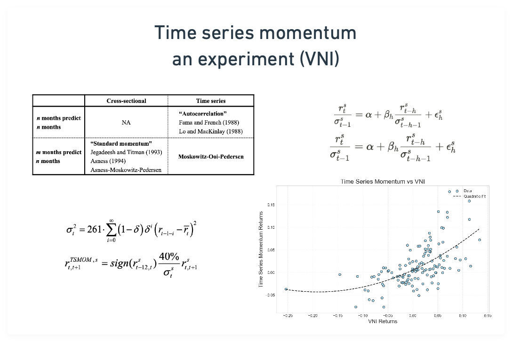

Time Series Momentum - TSMOM, được Moskowitz, Ooi và Pedersen (2012), là một trong những chiến lược factor investing nổi bật và được nhiều nhà phân tích, nhà nghiên cứu thử nghiệm trên đa dạng thị trường. Hôm nay chúng ta sẽ tìm hiểu về chiến lược này, xem xét cách họ kiểm định các giả thuyết và xây dựng nên một chiến lược factor investing.

## Concept

Khác với XSMOM (Cross sectional momentum , bạn có thể đọc [tại đây](https://www.linkedin.com/feed/update/urn:li:activity:7305494271439081472)), TSMOM tập trung vào khai thác động lượng của cổ phiếu đó so với quá khứ của chính nó (thay vì nhìn con nhà người ta và so sánh với họ, thì TSMOM là vượt lên chính mình là được rồi, haha). Chiến lược này dựa trên giả thuyết rằng xu hướng giá có tính liên tục (persistence) và có thể dự đoán được phần nào dựa trên lịch sử giá. Thay vì so sánh hiệu suất giữa các tài sản như XSMOM, TSMOM xem xét liệu một tài sản có duy trì được đà tăng/giảm của chính nó hay không.

Quantopia có 1 bài viết và video rất sâu về TSMOM: [link](https://quantpedia.com/strategies/time-series-momentum-effect/)

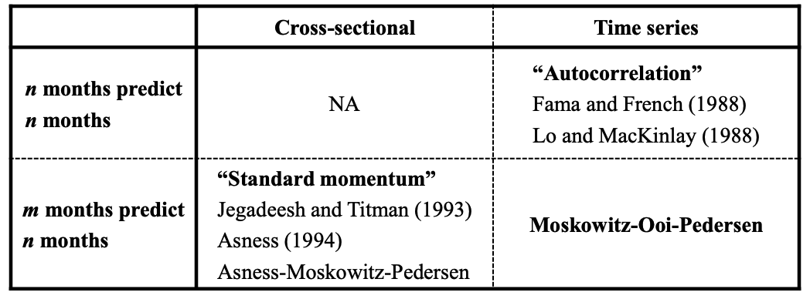

OK, khái niệm rất đơn giản. Giả thuyết của chúng ta là: "Cổ phiếu sẽ tiếp tục đà tăng/giảm dựa trên hiệu suất trong quá khứ". Hãy cùng kiểm định giả thuyết này cho thị trường Việt Nam nhé. 

Bài viết này sẽ cố gắng xây dựng lại các thử nghiệm và giả thuyết dựa trên: 

https://pages.stern.nyu.edu/~lpederse/papers/TSMOM_Slides.pdf

## Regression and evidence

Họ bắt đầu với độ biến động (volatility) như một biến chuẩn hóa cho lợi nhuận vì mỗi cổ phiếu có mức độ volatile khác nhau. Trong bài viết, họ sử dụng mô hình EWMA đơn giản để tính toán độ rủi ro (volatility).

$$
\sigma_t^2\;=\;261\sum_{i=0}^\infty(1-\delta)\,\delta^i\bigl(r_{t-1-i} - \overline{r}_t\bigr)^2
$$

Với:

- σ²ₜ là phương sai tại thời điểm t
- 261 là số ngày giao dịch trong năm → chúng ta sẽ đổi tham số này thành 252 cho thị trường Việt Nam.
- δ (delta) là hệ số suy giảm. Một cách tính toán để gán trọng số cao hơn cho dữ liệu gần đây và giảm dần theo thời gian. → phản ảnh biến động gần đây quan trọng hơn. Cách tính này khác độ biến động volatility thông thường khi độ biến động mọi ngày trong khoảng thời gian quan sát có độ quan trọng giống nhau.
- rₜ₋₁₋ᵢ là lợi nhuận tại thời điểm t-1-i
- r̄ₜ là lợi nhuận trung bình

Volatility thu được từ công thức này sẽ được sử dụng để chuẩn hóa lợi nhuận, giúp so sánh công bằng giữa các cổ phiếu có mức độ biến động khác nhau.

Let’s code it in python

```python
def exante_volatility(returns, com=60, annualization=252):
    """
    Compute the ex ante annualized volatility using an exponentially weighted variance.

    The formula is:
      σ_t^2 = 252 * Σ_{i=0}^∞ w_i (r_{t-1-i} - r̄_t)^2,
    
    Parameters:
        returns (pd.Series): Asset returns.
        com (int): Center of mass for the exponential weights (default is 60).
		    annualization: annualization factor - default is 252    
    Returns:
        pd.Series: The ex ante volatility σ_t (annualized by multiplying the variance by 261).
                   Volatility is computed using returns up to t-1.
    """
    ewm_variance = returns.ewm(com=com, adjust=False,min_periods=com).var()
    sigma = np.sqrt(annualization * ewm_variance)
    return sigma
```

Kết quả của tính toán trên sẽ trông như sau, với đường màu xanh tượng trưng cho độ biến động (volatility) và đường màu cam là giá cổ phiếu ACB.

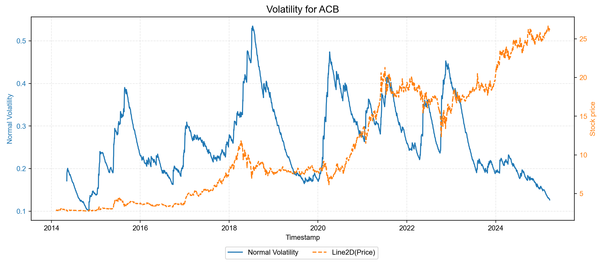

### Regression analysis

Để kiểm định giả thuyết "Cổ phiếu sẽ tiếp tục đà tăng/giảm dựa trên hiệu suất trong quá khứ", chúng ta sẽ sử dụng phân tích hồi quy (regression analysis). Phân tích hồi quy sẽ giúp chúng ta hiểu mối quan hệ giữa lợi nhuận trong quá khứ và lợi nhuận trong tương lai, cũng như đánh giá độ tin cậy của mối quan hệ này. Cụ thể, chúng ta sẽ thực hiện hồi quy lợi nhuận trong tương lai (future returns) lên lợi nhuận trong quá khứ (past returns). 

Tuy nhiên, kiểm định này được thực hiện khác với bài viết gốc. Trong khi bài viết gốc sử dụng dữ liệu tháng để chạy hồi quy, người viết muốn thử nghiệm với dữ liệu tuần (tức giao dịch theo tuần) để xem chiến lược này hoạt động như thế nào. Do đó, tất cả các thử nghiệm hồi quy và chiến lược backtest sẽ được thực hiện trên dữ liệu tuần.

Mô hình hồi quy cơ bản có dạng:

$$
\frac{r_{t}^s}{\sigma_{t-1}^s} = \alpha + \beta_h \frac{r_{t-h}^s}{\sigma_{t-h-1}^s} + \epsilon_h^s
$$

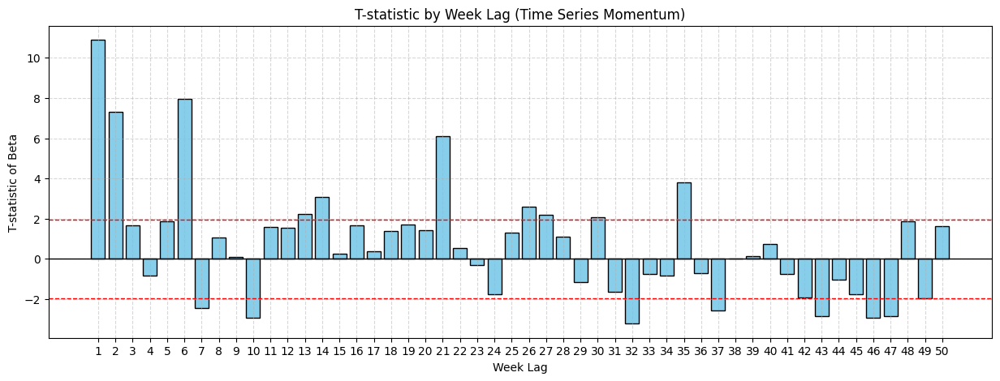

Ngoài ra, không chỉ đánh giá mỗi lợi nhuận lịch sử, tác giả đánh giá khả năng dự đoán của TSMOM thông qua hồi quy tín hiệu đơn giản - [sign](https://en.wikipedia.org/wiki/Sign_function)- của lợi nhuận (sign số dương bằng 1 và số âm bằng -1)

$$
\frac{r_{t}^s}{\sigma_{t-1}^s} = \alpha + \beta_h \text{sign}(r_{t-h}^s) + \epsilon_h^s
$$

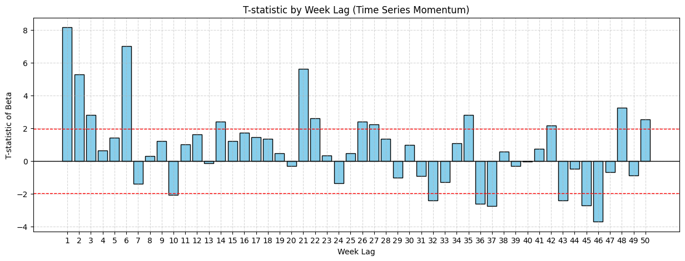

2 mô hình hồi quy trên được chạy trên giá của 60 cổ phiếu có giá trị giao dịch cao nhất và niêm yết từ 2014 tới nay.

- Mỗi cột biểu diễn giá trị t-statistic của βh ứng với từng độ trễ (week lag) từ 1 đến 50 tuần.
- Đường nét đứt màu đỏ (thường) biểu thị mức ý nghĩa thống kê ở khoảng ±1.96(tương đương kiểm định hai phía với mức ý nghĩa 5%). Nếu cột (tức t-statistic) vượt quá giá trị này về phía dương hoặc âm, ta có thể kết luận hệ số βh là có ý nghĩa thống kê tại độ trễ (lookback) tương ứng.
- Ở độ trễ 2 và 6, ta thấy nhiều cột t-statistic rất cao, cho thấy βh dương và có ý nghĩa thống kê. Điều này chứng tỏ có hiệu ứng động lượng (momentum) đáng kể trong ngắn hạn, tức là cổ phiếu có xu hướng duy trì đà tăng/giảm trong vài tuần đầu tiên. Tức nếu 2 hoặc 6 tuần trước giá cổ phiếu tăng thì tuần này cũng có khả năng tăng rất cao và ngược lại.
- Khi độ trễ tăng (từ khoảng 10 tuần trở đi), ta thấy t-stat dưới -2 cho thấy có thể có yếu tố “reversal” tức sau 10 tuần thì trend có khả năng đảo chiều.

Một chút phân tích: ở khung thời gian tuần, thị trường có thể bị ảnh hưởng nhiều bởi các yếu tố tâm lý, thanh khoản, tin tức ngắn hạn… Do đó, **momentum** thường bộc lộ rõ hơn trong vài tuần đầu, rồi nhanh chóng phai dần hoặc đảo ngược khi nhà đầu tư điều chỉnh vị thế hoặc chốt lời (10 tuần ~ 2 tháng)

[Vì code cho regression test khá dài nên nhờ bạn comment email ở linkedin và mình sẽ gửi đến bạn nhanh nhất]

Sau khi chạy kiểm định hồi quy, ta rút ra được rằng chiến lược TSMOM có hiệu quả đáng kể trong ngắn hạn, đặc biệt là trong khoảng 2-6 tuần đầu tiên khi cổ phiếu có xu hướng duy trì đà tăng/giảm của mình. Tuy nhiên, sau khoảng 10 tuần (tương đương 2 tháng), hiệu ứng này có dấu hiệu đảo chiều, cho thấy các nhà đầu tư nên cân nhắc điều chỉnh chiến lược giao dịch của mình sau khung thời gian này. Giờ chúng ta sẽ cùng phát triển chiến lược TSMOM dựa trên khung thời gian tuần nhé.

## TSMOM, design from scratch.

Đối với bất kỳ chiến lược giao dịch nào, chúng ta cần xác định 2 yếu tố: thời điểm mua (**signal**) và số lượng mua (**position**). TSMOM cũng cần 2 bước này.

### Signal

Chiến lược momentum có signal tương đối đơn giản, nếu lợi nhuận tích luỹ trong “h” tháng lớn hơn 0 thì long, nếu âm thì short, còn nếu bằng 0 thì không làm gì. Vì chúng ta đang thử nghiệm ở thị trường VN nên chiến lược được thiết kế dạng long-only.

```python
def compute_signal(returns, window=6):
    """
    Compute the trading signal based on cumulative standardized returns over a rolling window.
    
    The paper uses:
       signal_t = sign(r_{t-6,t}^s)
    where r_{t-6,t}^s is the return from t-window to t.
    
    """

    cum_rets = returns.rolling(window=window).apply(lambda x: np.prod(x)) ## lợi nhuận tích luỹ 
    signal = np.sign(cum_rets).clip(lower=0) ## sign để lấy chiều, clip lower 0 để loại bỏ các tín hiệu -1 tượng trưng cho short
    return signal
```

Signal sẽ trông như thế này. 1 sẽ tương ứng với mua, và 0 là không làm gì.

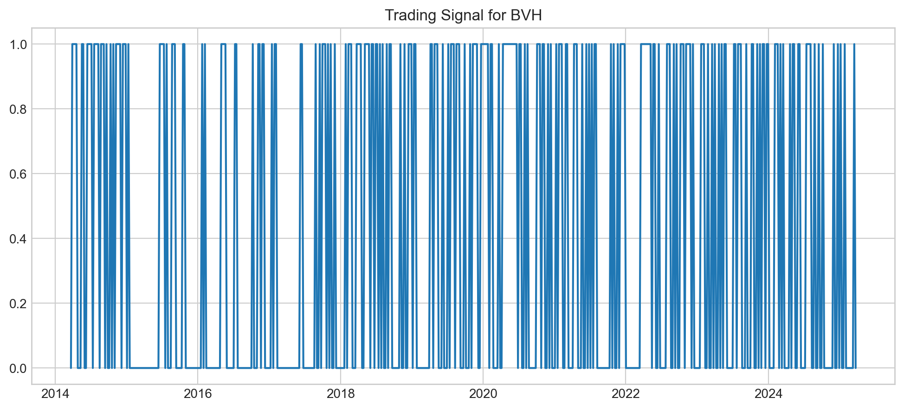

## Position sizing

Với chiến lược momentum, rủi ro chính là việc không thể dự đoán được thời điểm thị trường đảo chiều. Tuy nhiên, chúng ta có thể hạn chế rủi ro này thông qua kỹ thuật "Inverse volatility" (đi ngược biến động).

Thay vì cố đoán thời điểm đảo chiều, chúng ta sẽ xác định trước mức rủi ro chấp nhận được và điều chỉnh vị thế khi rủi ro tăng - Volatility targeting. Đối với cổ phiếu có biến động thấp, ta có thể sử dụng thêm margin để tăng mức độ phơi nhiễm lên mức mục tiêu, từ đó tối ưu hóa cơ hội đầu tư.

Bài viết gốc sử dụng mức rủi ro mục tiêu là 40% (hàng năm). Chúng ta sẽ cùng thử nghiệm với cổ phiếu ACB, sử dụng volatility targeting để xác định kích thước vị thế như sau:

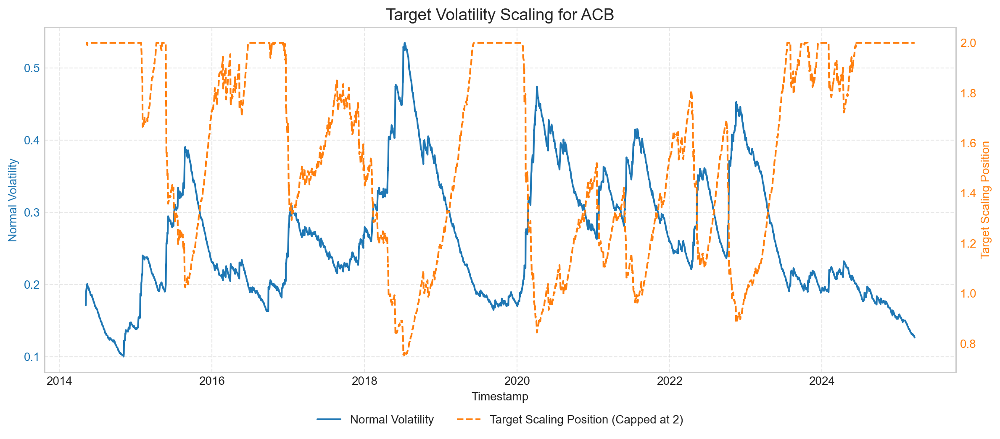

Cột màu cam thể hiện số lượng cổ phiếu mua dưới dạng phần trăm (%) trong khoảng từ 0 đến 2 (tức 0–200%). Mức trần được giới hạn ở 2 với giả định chúng ta luôn ký quỹ được 50%. Trong các giai đoạn rủi ro cao như 2016, 2018 và 2022, sizing của chúng ta dao động từ 0 đến 1.8 tùy thời điểm. Đặc biệt năm 2018—năm biến động rất lớn của ACB—chúng ta chỉ mua cổ phiếu dưới 100% số tiền hiện có (đi ngược độ biến động), từ đó bảo toàn được vốn. Sizing phụ thuộc vào Volaitlity target chúng ta đã đặt từ trước, volatility target càng nhỏ thì position sẽ giảm lại.

Chung quy lại, TSMOM dựa trên 2 kỹ thuật sau

- Xác định cổ phiếu có đang trend không dựa trên lợi nhuận tích luỹ trong “h” tháng vừa qua.
- Xác định số cổ phiếu cần mua dựa trên kỹ thuật volatility targeting.

## Backtest

Thử nghiệm với cổ phiếu HPG.

```python
def backtest(daily_price, vol_target=0.4, look_back = 6, commission=0.001):
    """
    Backtest a trading strategy that goes long (short) when the signal is +1 (-1).
    
    Parameters:
        returns (pd.Series): Asset returns.
        
    Returns:
        pd.Series: The strategy returns.
    """
    ## compute the daily ex ante volatility first
    daily_return = daily_price.pct_change().dropna()
    weekly_return = daily_price.resample('W').last().pct_change().dropna()
    
    daily_vol = exante_volatility(daily_return, com=60)
    weekly_vol = daily_vol.resample('W').last().ffill()
    
    ## position sizing
    position_size = vol_target / weekly_vol
    position_size = position_size.clip(upper=2) ## max margin is 2

    signal = compute_signal(weekly_return, window=look_back)
    position = signal * position_size
    
    trade_cost = 2 * commission * position.diff().abs().shift(-1)
    
    ## Compute strategy returns:
    # Use the previous period's position (position.shift(1)) applied to the current week's return,
    # and subtract any commission cost incurred at the beginning of the period.
    strat_ret = (position * weekly_return.shift(-1) 
                 - trade_cost)
    
    return_df = pd.DataFrame({
        'raw_rets': weekly_return,
        'signal': signal,
        'position_size': position_size,
        'position': position,
        'trade_cost': trade_cost,
        'strat_rets': strat_ret
    })
    
    return return_df.dropna()
```

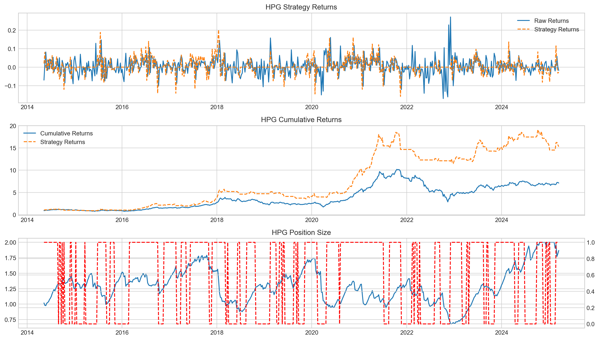

Thử nghiệm trên cổ phiếu HPG, ta thấy lợi nhuận tích luỹ vượt trội hẳn so với chiến lược buy and hold thông thường.

|  | TSMOM - HPG | Buy&Hold - HPG |
| --- | --- | --- |
| Lợi nhuận hàng năm | 29.23% | 23.63% |
| Biến động hằng năm | 29.03% | 33.65% |
| Sharpe | 1.01 | 0.7 |
| Skewness | 0.36 | 0.36 |
| Kurtosis | 4.16 | 3.67 |

Vì chỉ mua khi cổ phiếu có “trend” và tận dụng sử dụng margin khi cổ phiếu biến động thấp và giảm vị thế khi cổ phiếu biến động mạnh, nên lợi nhuận cũng như độ biến động trung bình hằng năm đều tốt hơn so với chiến lược chỉ buy and hold cổ phiếu. Từ đó dẫn đến tỷ lệ sharpe vượt lên mức 1. 

60 cổ phiếu trong sample test

| symbol | Annualized Return | Annualized Volatility | Sharpe Ratio | Skewness | Kurtosis |
| --- | --- | --- | --- | --- | --- |
| FPT | 39% | 31% | 1.26 | 1.28 | 6.60 |
| PDR | 36% | 32% | 1.10 | 1.19 | 6.96 |
| MBB | 32% | 31% | 1.03 | 1.29 | 5.57 |
| VND | 31% | 30% | 1.03 | 1.38 | 7.40 |
| HCM | 28% | 28% | 1.02 | 1.00 | 5.98 |
| TCM | 29% | 30% | 0.98 | 1.52 | 7.69 |
| HPG | 27% | 29% | 0.93 | 0.41 | 4.11 |
| VCB | 30% | 32% | 0.93 | 1.33 | 6.02 |
| VIX | 29% | 31% | 0.93 | 1.53 | 7.92 |
| HSG | 24% | 27% | 0.89 | 0.73 | 4.03 |
| NKG | 29% | 32% | 0.89 | 0.98 | 5.41 |
| PNJ | 29% | 33% | 0.89 | 0.80 | 5.62 |
| KDH | 26% | 32% | 0.81 | 1.18 | 5.45 |
| HDG | 22% | 28% | 0.80 | 0.61 | 4.14 |
| ACB | 25% | 33% | 0.77 | 1.92 | 14.27 |
| CTD | 23% | 33% | 0.69 | 0.43 | 4.34 |
| SSI | 19% | 28% | 0.68 | 0.46 | 5.39 |
| DIG | 21% | 31% | 0.67 | 1.37 | 8.70 |
| SHB | 20% | 32% | 0.63 | 3.04 | 20.06 |
| HDC | 20% | 32% | 0.62 | 1.08 | 4.97 |
| REE | 17% | 29% | 0.60 | 0.47 | 4.33 |
| TSC | 20% | 34% | 0.60 | 1.03 | 7.22 |
| CTG | 18% | 31% | 0.59 | 0.66 | 6.49 |
| KBC | 18% | 31% | 0.58 | 1.19 | 8.48 |
| PHR | 19% | 33% | 0.58 | 0.78 | 5.49 |
| NLG | 16% | 29% | 0.57 | 1.03 | 7.06 |
| KSB | 15% | 31% | 0.50 | 0.81 | 6.68 |
| VNM | 13% | 27% | 0.50 | 0.70 | 7.44 |
| IJC | 16% | 33% | 0.49 | 2.77 | 19.07 |
| TTF | 14% | 28% | 0.49 | 0.18 | 5.94 |
| CII | 12% | 27% | 0.45 | 1.68 | 11.26 |
| DBC | 13% | 31% | 0.43 | 0.80 | 8.50 |
| DXG | 12% | 28% | 0.43 | (0.15) | 5.11 |
| STB | 13% | 29% | 0.43 | 0.39 | 5.32 |
| FIT | 14% | 34% | 0.41 | 1.30 | 9.66 |
| DRC | 11% | 28% | 0.40 | 0.22 | 4.87 |
| LCG | 10% | 25% | 0.40 | 0.45 | 5.13 |
| GAS | 11% | 28% | 0.39 | 0.12 | 7.19 |
| HHS | 14% | 35% | 0.39 | (1.36) | 21.84 |
| PVT | 11% | 28% | 0.39 | 0.60 | 7.48 |
| IDI | 12% | 33% | 0.38 | 1.90 | 13.31 |
| KDC | 12% | 33% | 0.38 | 2.93 | 25.95 |
| PAN | 12% | 31% | 0.37 | 1.86 | 15.15 |
| VIC | 10% | 32% | 0.30 | 1.48 | 9.59 |
| OGC | 9% | 31% | 0.29 | 1.98 | 12.33 |
| SBT | 9% | 33% | 0.28 | (1.09) | 14.14 |
| VCG | 7% | 28% | 0.26 | 0.48 | 6.63 |
| HAG | 7% | 30% | 0.24 | 1.35 | 13.48 |
| ASM | 7% | 28% | 0.23 | (0.02) | 7.90 |
| PET | 7% | 31% | 0.23 | 1.47 | 10.78 |
| DPM | 6% | 28% | 0.22 | 0.63 | 6.32 |
| DLG | 6% | 31% | 0.19 | 1.30 | 11.48 |
| PVD | 6% | 30% | 0.19 | 0.07 | 6.02 |
| BVH | 5% | 30% | 0.18 | 1.15 | 11.03 |
| GMD | 4% | 26% | 0.16 | 0.79 | 4.16 |
| HQC | 5% | 31% | 0.16 | 2.68 | 20.08 |
| MSN | 4% | 31% | 0.14 | 1.72 | 13.40 |
| VHC | 3% | 30% | 0.11 | (0.15) | 5.46 |
| FCN | 2% | 29% | 0.09 | 0.38 | 8.03 |
| EIB | -2% | 29% | (0.08) | 0.40 | 8.00 |

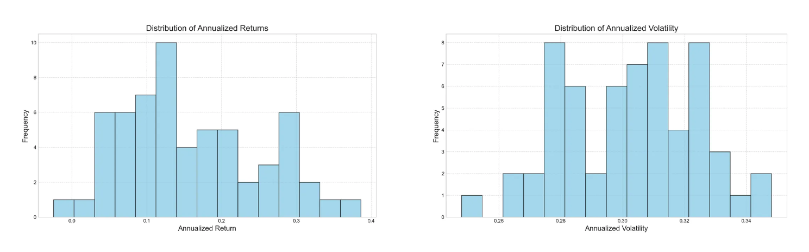


Để tạo một factor TSMOM, chúng ta cần tính trung bình cho toàn bộ mẫu nghiên cứu.

$$
r_{t,t+1}^{TSMOM} = \frac{1}{S_t} \sum sign(r_{t-6, t})\frac{0.4}{\sigma_t}r_{t,t+1}
$$

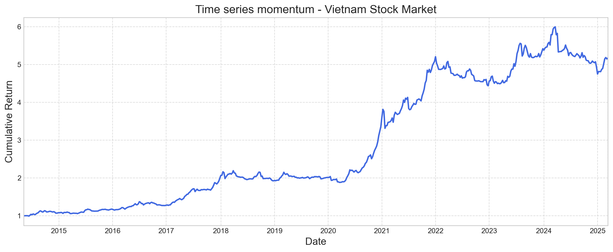

So sánh với VNINDEX, trong khung thời gian tháng, ta có mối tương quan giữa chiến lược TSMOM và lợi nhuận của VNINDEX như sau
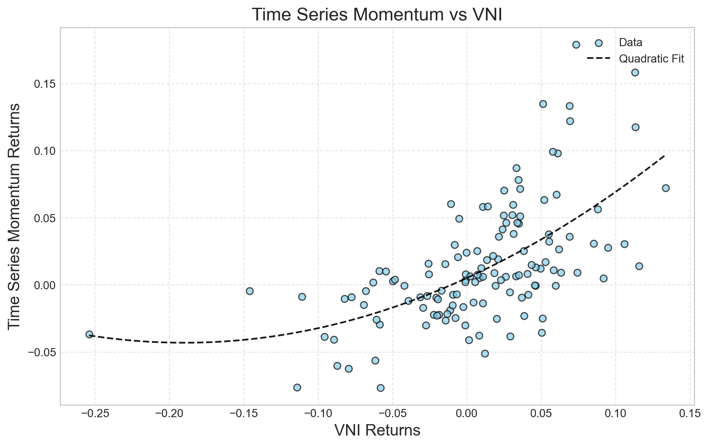
Với đặc tính momentum, chúng ta sẽ được bảo vệ khi thị trường giảm hoặc volatile thì chúng ta sẽ không có vị thế hoặc position sẽ giảm lại. Trong khi gia tăng “expose” khi thị trường ổn định và “đu sóng”.

## Kết luận

Chiến lược Time Series Momentum (TSMOM) là một phương pháp giao dịch hiệu quả khai thác động lượng giá của cổ phiếu dựa trên hiệu suất quá khứ. Qua phân tích dữ liệu thị trường Việt Nam, chúng ta có thể rút ra một số kết luận chính:

1. Hiệu ứng momentum tồn tại rõ rệt trong ngắn hạn, đặc biệt là trong khoảng 2-6 tuần đầu tiên sau khi có tín hiệu.
2. Các cổ phiếu có xu hướng duy trì đà tăng/giảm trong ngắn hạn, tuy nhiên sau khoảng 10 tuần có thể có hiện tượng đảo chiều → chúng ta có thể tạo ra một factor “Reversal” dựa trên phát hiện này.
3. Để áp dụng hiệu quả chiến lược TSMOM, cần chú ý:
- Xác định chính xác tín hiệu mua dựa trên momentum quá khứ - Sử dụng các kĩ thuật regression analysis
- Điều chỉnh kích thước vị thế theo biến động của thị trường (a.k.a xác định volatility target)

Chiến lược này có thể được cải thiện thêm bằng cách kết hợp với các chỉ báo kỹ thuật khác nhằm thay đổi signal hoặc sizing theo một công thức khác.