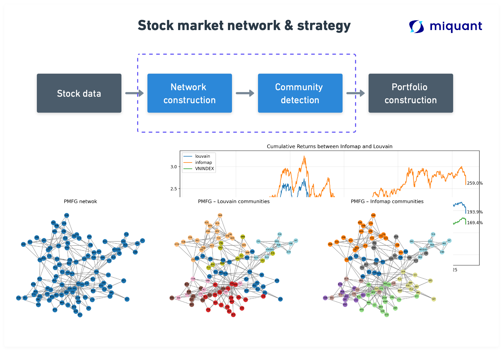
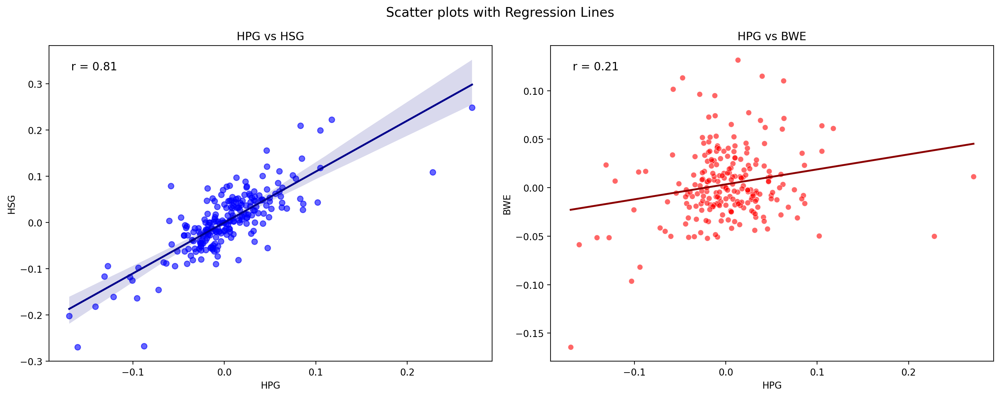
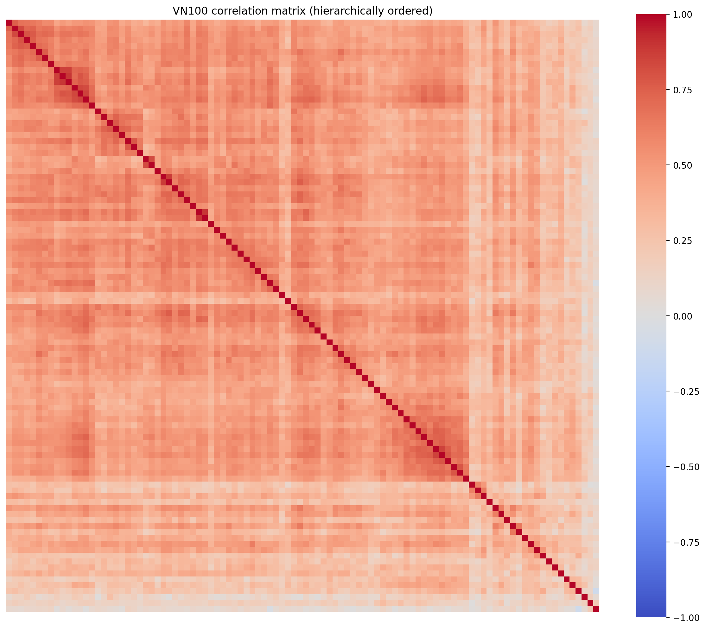
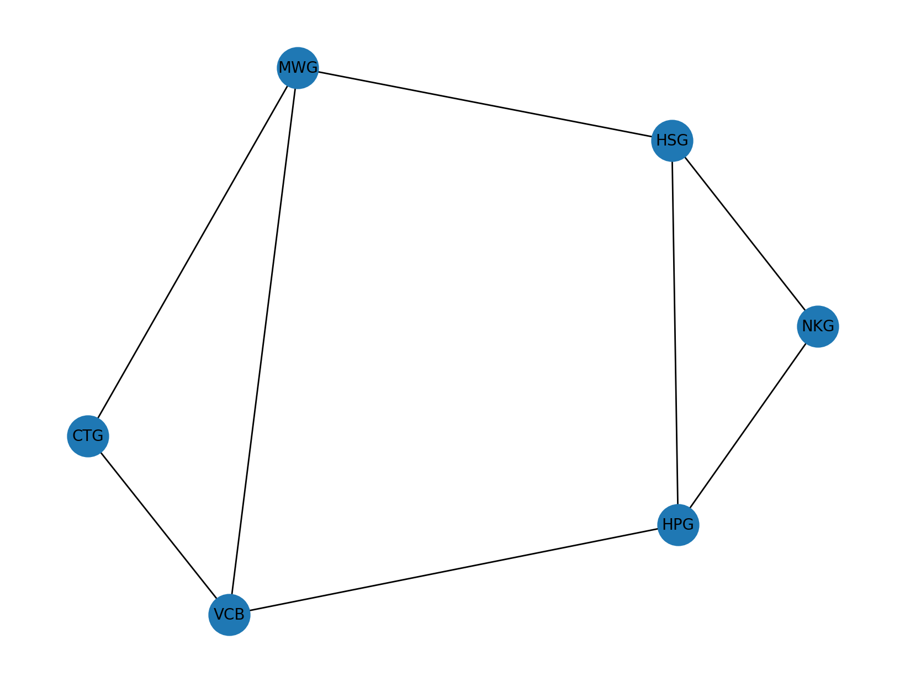
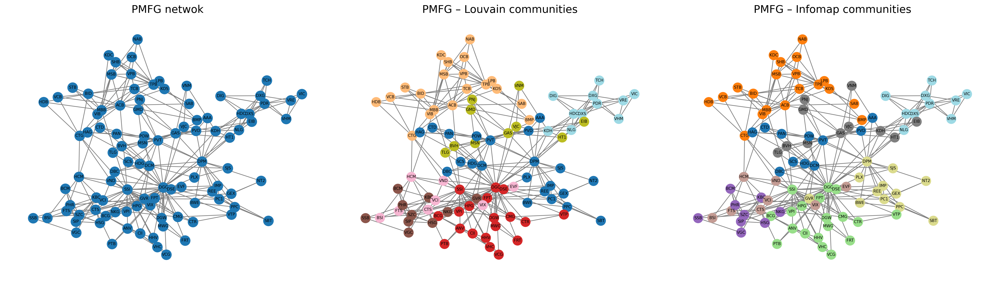
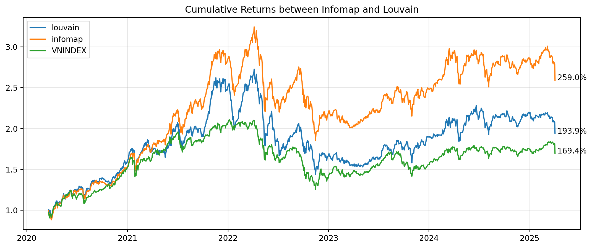

Bài viết này thử nghiệm bài toán “Community detection” cho thị trường chứng khoán Việt Nam (VN100) và backtest 1 chiến lược dựa trên thuật toán này.

Bài viết được lấy ý tưởng từ: https://arxiv.org/pdf/2112.13383

Để lấy file code và dữ liệu, vui lòng gửi email tới hung.ha@miquant.vn

## Concept
Trong một môi trường có nhiều yếu tố tương tác với nhau, sự tương quan (thể hiện qua xu hướng biến động giống nhau) là điều tất yếu, và thị trường chứng khoán cũng không ngoại lệ. Mặc dù mối tương quan giữa các cổ phiếu đã được biết đến từ lâu, nhưng phải đến khi Harry Markowitz giới thiệu Lý thuyết Danh mục Đầu tư Hiện đại vào năm 1952, nó mới được áp dụng rộng rãi. Lý thuyết này đề xuất phương pháp định lượng để tối ưu hóa danh mục đầu tư dựa trên mối tương quan giữa các tài sản. Kể từ đó, việc nghiên cứu mối liên hệ giữa các cổ phiếu đã phát triển theo nhiều hướng, trong đó việc áp dụng lý thuyết mạng (Network Theory) nổi lên như một phương pháp hiệu quả và đang được đặc biệt quan tâm trong giai đoạn đầy biến động này.

## Starting simple, correlation matrix

### Correlation: what is it?



Tương quan (correlation) là một chỉ số thống kê đo lường mức độ biến động đồng thời giữa hai biến số. Trong thị trường chứng khoán, tương quan thường được sử dụng để đánh giá mối liên hệ giữa giá của các cổ phiếu. 

Công thức tính hệ số tương quan Pearson:

$$
r = \frac{\sum_{i=1}^{n} (x_i - \bar{x})(y_i - \bar{y})}{\sqrt{\sum_{i=1}^{n} (x_i - \bar{x})^2}\sqrt{\sum_{i=1}^{n} (y_i - \bar{y})^2}}
$$

Nói một cách đơn giản, tương quan giữa các cổ phiếu thể hiện mức độ "đồng hành" của chúng. Khi hai cổ phiếu có tương quan cao (gần 1), chúng thường tăng giảm cùng nhau—ví dụ, khi một cổ phiếu tăng 5%, cổ phiếu kia cũng có xu hướng tăng tương tự. Ngược lại, tương quan âm (gần -1) nghĩa là khi cổ phiếu này tăng, cổ phiếu kia thường giảm. Tương quan bằng 0 không đồng nghĩa với việc hai cổ phiếu không liên quan đến nhau, mà chỉ cho thấy không có mối liên hệ tuyến tính rõ ràng trong biến động giá của chúng. 

Bài viết minh họa điều này qua việc so sánh tương quan giữa HPG với HSG và BWE. Với hệ số tương quan 0,8 (tính trên hiệu suất tuần), HPG và HSG có mối tương quan mạnh. Điều này dễ hiểu bởi cả hai đều là doanh nghiệp sản xuất thép, chịu tác động từ cùng các yếu tố thị trường như giá nguyên liệu đầu vào và nhu cầu xây dựng. Ngược lại, HPG và BWE chỉ có hệ số tương quan 0,2, cho thấy sự khác biệt trong mô hình kinh doanh và các yếu tố ảnh hưởng đến giá cổ phiếu của hai doanh nghiệp.

Qua đó có thể thấy, các cổ phiếu cùng ngành (hay rộng hơn là có chung các yếu tố cơ bản) thường phản ánh xu hướng biến động giá và rủi ro tương tự nhau, do nhà đầu tư thường định giá và quyết định dựa trên những yếu tố tương đồng. Hiện tượng này tạo ra hiệu ứng "cộng hưởng" trong biến động giá, khiến các cổ phiếu cùng nhóm ngành thường di chuyển đồng thời với nhau. Đây chính là nguồn gốc của rủi ro hệ thống (systematic risk).



Khi mở rộng phân tích từ một vài cổ phiếu lên hàng chục, thậm chí hàng trăm mã (ví dụ như VN100), phương pháp chỉ dựa vào ma trận tương quan thuần túy sẽ gặp phải nhiều hạn chế sau:

1. **Curse of dimensionality**
Với $N$ tài sản, ta phải tính tới $\tfrac{N(N-1)}{2}$ cặp tương quan. Khi $\tfrac{N(N-1)}{2}$, con số này lên tới 4.950 cặp — vượt ra ngoài khả năng trực quan hóa và so sánh thủ công, dẫn đến “quá tải thông tin”.
2. **Noise và sai số ước lượng lớn**
Dữ liệu giá luôn chứa nhiều nhiễu và có tính không ổn định theo thời gian. Khi số tài sản tăng, sai số ước lượng hệ số tương quan (nhất là với mẫu nhỏ) càng lớn, dễ sinh ra các giá trị tương quan “giả” (spurious), từ đó gây hiểu nhầm về mối quan hệ giữa các cổ phiếu.
3. **Khó trích xuất cấu trúc**
Ma trận tương quan thuần túy thường rất “đậm đặc” (dense) — hầu như mọi cặp đều có tương quan khác 0. Điều này khiến khó khăn trong việc phân nhóm (clustering) hay tìm kiếm các cấu trúc ẩn (hidden pattern), vì không có điểm nhấn rõ nét để tách biệt các khối tài sản liên quan chặt chẽ.

### From correlation to network and community

Con người vốn quen mô tả thế giới qua các **thực thể (node)** và **mối quan hệ (edge)**: trong mạng xã hội, mỗi người là một nút, các liên hệ "kết bạn", "theo dõi" tạo thành cạnh, và nhờ đó ta dễ dàng nhận ra gia đình, nhóm bạn, hay những nhân vật trung tâm chỉ bằng cách quan sát cấu trúc kết nối. 

Tư duy trực quan này được áp dụng cho thị trường chứng khoán: thay vì xem xét từng cặp hệ số tương quan riêng lẻ, ta biến mỗi cổ phiếu thành một nút (node) và dùng đường nối (edge) thể hiện mức độ liên hệ về giá. Kết quả là một "bản đồ" mạng lưới, nơi các nhóm cổ phiếu cùng ngành hay cùng chu kỳ kinh doanh tự động hiện ra như những cộng đồng trong mạng xã hội. Điều này giúp nhà đầu tư nhanh chóng nắm bắt được các mối liên hệ, xác định được những cổ phiếu đóng vai trò "cầu nối" và nhận diện được các tâm điểm rủi ro – cơ hội mà không cần đi sâu vào khối dữ liệu đồ sộ của ma trận tương quan.



## Theory & Mathematical model

Để biến đổi từ correlation matrix thành 1 network, bước 1 ta cần biến đổi từ cấu trúc matrix thành cấu trúc network. Sau đó, từ network tạo ra, ta tiến hành gom nhóm các cổ phiếu giống nhau lại. 

Để xây dựng 1 network, 2 thuật toán nổi tiếng là Planar Maximally Filtered Graph và Minimum Spanning Tree.

### Planar Maximally Filtered Graph (PMFG)

PMFG giữ lại các liên kết quan trọng nhất trong khi buộc đồ thị phải duy trì tính **phẳng (planar)** (có thể vẽ trên một tờ giấy mà không có cạnh nào cắt nhau). Vì một đồ thị phẳng chỉ có thể có tối đa $E_{\text{PMFG}} = 3(N-2)$ cạnh, bộ lọc thu gọn mạng lưới một cách đáng kể (nhưng vẫn bảo toàn được gấp ba lần thông tin so với Minimum Spanning Tree, vốn chỉ có $N-1$ cạnh) (đọc kĩ hơn tại đây: https://gmarti.gitlab.io/networks/2018/06/03/pmfg-algorithm.html).

Kết quả thu được sẽ giữ lại **cấu trúc cốt lõi** của các mối quan hệ mạnh nhất :). In a simple way, thay vì giữ toàn bộ N*(N-1)/2 thì giờ chỉ còn tối đa 3(N-2) cạnh (mối quan hệ), tương đương với 3*(100-2) = 294 cạnh so với 4950 (giảm 16 lần)

Input của PMFG hay MST trong trường hợp này đều là correlation matrix.

### Community detection

Sau khi đã có mạng PMFG tinh gọn, bước tiếp theo là chia mạng thành những “cụm” (community) cổ phiếu giống nhau. Hai cách phổ biến nhất là **Louvain** (tối ưu modularity) và **Infomap** (tối ưu dòng ngẫu nhiên).

### Louvain

Louvain chia mạng thành cộng đồng bằng cách **tối đa hóa chỉ số modularity Q** – thước đo so sánh mật độ liên kết **trong** cộng đồng với mật độ mong đợi nếu các cạnh được nối ngẫu nhiên.

$$
Q = \frac{1}{2m}\sum_{i,j}\Bigl(A_{ij} - \frac{k_i k_j}{2m}\Bigr)\delta(c_i,c_j),
$$

trong đó:

- Aij = trọng số của cạnh giữa i và j,
- ki = tổng trọng số gắn với nút i,
- m = tổng trọng số cạnh,
- δ(ci,cj) = 1 nếu các nút cùng cộng đồng.

**Thuật toán Louvain** hoạt động lặp đi lặp lại. Ban đầu, mỗi cổ phiếu được coi là một cộng đồng riêng. Sau đó, thuật toán kiểm tra từng cổ phiếu và phân bổ lại nó vào cộng đồng lân cận mà việc di chuyển đó mang lại sự gia tăng lớn nhất về **modularity** – một thước đo mật độ các liên kết bên trong các cộng đồng so với các liên kết giữa các cộng đồng. Quá trình này được lặp lại cho đến khi không còn sự di chuyển nào cải thiện **modularity**. Khi giai đoạn này hoàn thành, mỗi cộng đồng được nén lại thành một "siêu nút" duy nhất, và quá trình phân bổ lại các siêu nút này được lặp lại. 

Việc tinh chỉnh và nén lặp đi lặp lại này tiếp tục cho đến khi cấu trúc cộng đồng ổn định. Trên thực tế, các cổ phiếu có tương quan cặp đôi cao, chẳng hạn như HPG, HSG và NKG, có xu hướng nhóm lại với nhau trong một cộng đồng "thép", trong khi VCB, BID và CTG hợp nhất thành một cộng đồng "ngân hàng". Sau vài lần lặp, Louvain thường hội tụ về một phân vùng ổn định của mạng lưới thành các cộng đồng dày đặc, được tách biệt rõ ràng, thường tương ứng với các lĩnh vực kinh tế rõ ràng như thép, ngân hàng hoặc công nghệ/bán lẻ (ví dụ: FPT, MWG), mà không yêu cầu các nhãn ngành được xác định trước.

### InfoMap

Infomap xem mạng lưới như một **quá trình đi ngẫu nhiên (random walk)**  qua các nút và cạnh và đi tối thiểu hoá độ không chắc chắn - uncertainty (entropy) của chuỗi di chuyển này.

$$
L(M) = q_{\curvearrowright}H(Q) + \sum_{i=1}^{m} p_{\circlearrowright}^{\,i} \, H(P^{i})
$$

- $q_{\curvearrowright}$: xác suất thoát khỏi một module
- H(Q): entropy của mã thoát
- $p_{\circlearrowright}$: xác suất ở lại trong module i
- H(Pi): entropy của các di chuyển trong module

**Thuật toán Infomap** tiếp cận việc phát hiện cộng đồng bằng cách mô phỏng một **random walk** (bước đi ngẫu nhiên) trên cùng network. Ý tưởng cốt lõi là một người đi ngẫu nhiên (random walker) có khả năng ở lại trong các vùng được kết nối dày đặc (dense) trong thời gian dài hơn. Bằng cách gán mã ngắn hơn cho các phân đoạn đường đi bên trong các cộng đồng này và mã dài hơn cho các chuyển đổi giữa các cộng đồng, thuật toán xác định hiệu quả các module. 

Hãy hình dung random walker này có nhiều khả năng di chuyển giữa các cổ phiếu có tương quan cao. Thuật toán Infomap tìm cách chia mạng lưới thành các nhóm (cộng đồng) sao cho người đi bộ ngẫu nhiên có xu hướng ở lại trong cùng một nhóm trong thời gian dài. Khi người đi bộ di chuyển từ nhóm này sang nhóm khác, điều đó giống như việc cần "thông báo" rằng họ đã rời khỏi nhóm hiện tại và vào một nhóm mới. Infomap tìm cách phân chia mạng lưới sao cho số lần "thông báo" này (số lần di chuyển giữa các nhóm) được giảm thiểu. Các vùng mà người đi bộ dành phần lớn thời gian của họ - di chuyển qua lại giữa các cổ phiếu có liên quan chặt chẽ - được xác định là các module hoặc cộng đồng. Bởi vì người đi bộ mô phỏng có xu hướng "dừng chân" lâu hơn giữa các cổ phiếu tương quan cao, thuật toán này cũng có xu hướng nhóm HPG, HSG và NKG lại với nhau, và giữ bộ ba ngân hàng VCB, BID, CTG trong cùng một module. 

| **Thuật toán** | **Tối ưu tiêu chí** | **Cách tiếp cận** | **Ưu điểm** | **Nhược điểm** |
| --- | --- | --- | --- | --- |
| **Louvain** | Modularity Q | Greedy optimization | Rất nhanh, hiệu quả, có thể áp dụng cho mạng lớn | Có thể mắc kẹt ở tối ưu cục bộ, khó phát hiện cộng đồng nhỏ hoặc chồng lấn |
| **Infomap** | Entropy (Description Length) | Random Walk | Phân biệt tốt các cộng đồng nhỏ và chồng lấn, cho kết quả “kĩ” hơn | Chạy chậm hơn Louvain, nhạy cảm với cấu trúc mạng và random. |

Đọc kĩ hơn 2 thuật toán này tại đây: https://www.statworx.com/en/content-hub/blog/community-detection-with-louvain-and-infomap

Tóm gọn lại, ta sẽ xây dựng mạng và sử dụng thuật toán community detection như sau

B1: Xây dựng mạng (network) - Sử dụng PMFG

B2: Tiến hành gom nhóm (coloring graph): Louvain hoặc InfoMap. 2 thuật toán có 2 cách tiếp cận khác nhau.



Mặc dù lý thuyết rất phức tạp, nhưng implement bằng python thì rất đơn giản vì rất nhiều thư viện hỗ trợ rồi! So lucky to be living in the 21st century.

```python
import igraph as ig
import community as louvain
import networkx as nx

def build_pmfg(corr):
    tickers = corr.columns.tolist()
    N = len(tickers)
    dists = np.sqrt(2 * (1 - corr.values))
    edges = [(i, j, dists[i, j]) for i in range(N) for j in range(i)]
    edges.sort(key=lambda x: x[2])
    
    G = nx.Graph()
    G.add_nodes_from(range(N))
    max_edges = 3 * (N - 2)
    for u, v, w in edges:
        if G.number_of_edges() >= max_edges: break
        G.add_edge(u, v, weight=w)
        if not nx.check_planarity(G, False)[0]:
            G.remove_edge(u, v)
    return nx.relabel_nodes(G, dict(enumerate(tickers)))

def detect_communities_infomap(G):
    tickers = list(G.nodes)
    g = ig.Graph()
    g.add_vertices(len(tickers))
    g.vs["name"] = tickers
    edges = [(tickers.index(u), tickers.index(v)) for u, v in G.edges()]
    weights = [1.0 / G[u][v]["weight"] for u, v in G.edges()]
    g.add_edges(edges)
    g.es["weight"] = weights
    communities = g.community_infomap(edge_weights="weight", trials=10)
    return [[g.vs[idx]["name"] for idx in comm] for comm in communities]

def detect_communities_louvain(G):
    for u, v, d in G.edges(data=True):
        d['weight'] = 1.0 / d['weight']
    partition = louvain.best_partition(G, weight='weight')
    comms = {}
    for node, cid in partition.items():
        comms.setdefault(cid, []).append(node)
    return list(comms.values())
```

## Experiments: VN100

Sau khi ta đã phân tích được các community của các cổ phiếu , ta thử nghiệm 1 chiến lược đơn giản: “Mua cổ phiếu có Sharpe cao nhất trong 300 ngày vừa qua của mỗi cụm và nắm giữ trong vòng 60 ngày tiếp theo”. Tỷ trọng sẽ được phân bổ đều (equal weighted) cho các cổ phiếu được chọn. Việc tái cân bằng danh mục được thực hiện sau mỗi 60 ngày.

Chiến lược này không nhằm “dự đoán giá cổ phiếu”, mà cung cấp một bộ lọc & phân bổ danh mục hợp lý dựa trên cấu trúc thị trường.

Sample danh mục hiện tại (2025-01-03)

| Số lượng | Infomap | Louvain |
| --- | --- | --- |
| 1 | BMP | BMP |
| 2 | LPB | LPB |
| 3 | FPT | FPT |
| 4 | CTD | DBC |
| 5 | DBC | VPI |
| 6 | IMP | IMP |
| 7 | HCM | KDH |
| 8 | KDH |  |
| 9 | TLG |  |

2 chiến lược chỉ khác nhau phương pháp “community detection” mà sự khác biệt đã khác lớn đúng không!



| Chiến lược | Lợi nhuận hằng năm | Biến động hằng năm | Sharpe | Max drawdown |
| --- | --- | --- | --- | --- |
| InfoMap | 22.07 | 24.5 | 0.90 | -42.85 |
| Louvain | 16.71 | 26.21 | 0.64 | -47.26 |
| VNINDEX | 12.53 | 19.83 | 0.63 | -40.34 |

Từ kết quả thử nghiệm trên, ta có thể thấy:

- Chiến lược sử dụng InfoMap cho kết quả tốt hơn với Sharpe ratio 0.90, cao hơn đáng kể so với Louvain (0.64) và VNINDEX (0.63)
- Lợi nhuận hằng năm của InfoMap (22.07%) cũng vượt trội hơn Louvain (16.71%) và VNINDEX (12.53%)
- Tuy nhiên, biến động của cả hai chiến lược (24.5% và 26.21%) đều cao hơn VNINDEX (19.83%).
- Drawdown tối đa của hai chiến lược (-42.85% và -47.26%) cũng lớn hơn so với VNINDEX (-40.34%), phản ánh rủi ro giảm giá lớn hơn

Tuy nhiên, rủi ro có thể được hạn chế nếu sử dụng các phương pháp tối ưu hoá khác so với equal weighted như thử nghiệm này. 

```python
def select_portfolio(returns_window, communities):
    sharpe = returns_window.mean() / returns_window.std()
    K = len(communities)
    weights = {}
    for comm in communities:
        best = sharpe[comm].idxmax()
        weights[best] = 1.0 / K
    return weights
   
def backtest_and_save(df, method="infomap", window=300, step=60):
    df = df.ffill().dropna(axis=1)
    returns = compute_returns(df)
    portfolios, metrics, all_returns = {}, [], []

    for t in range(window, len(returns), step):
        if t + step > len(returns): break
        label = returns.index[t].strftime("%Y-%m-%d")
        windowed = returns.iloc[t-window:t]
        out = returns.iloc[t:t+step]

        G = build_pmfg(windowed.corr())
        if method == "infomap":
            comms = detect_communities_infomap(G)
        elif method == "louvain":
            comms = detect_communities_louvain(G)
        else:
            raise ValueError("Unknown method")

        weights = select_portfolio(windowed, comms)
        portfolios[label] = weights

        visualize_and_save(G, comms, label, method)

        port_series = out[list(weights)].dot(pd.Series(weights)).rename("rets")
        port_series = port_series.reset_index().rename(columns={"index": "timestamps"})
        all_returns.append(port_series)

        cum = (1+port_series["rets"]).prod()-1
        vol = port_series["rets"].std()*np.sqrt(252)
        sr = port_series["rets"].mean()/port_series["rets"].std()*np.sqrt(252)
        metrics.append({"period": label, "CumReturn": cum, "Volatility": vol, "Sharpe": sr})

    final_df = pd.concat(all_returns, axis=0).reset_index(drop=True)
    final_df.to_csv(f"data/{method}/raw_returns.csv", index=False)
    pd.DataFrame(metrics).set_index("period").to_csv(f"data/{method}/metrics.csv")
    with open(f"data/{method}/portfolios.json", "w") as f:
        json.dump(portfolios, f, indent=2)
```

Ngoài ra, InfoMap có hiệu suất tốt hơn trong trường hợp này. Louvain thường có xu hướng gom các nhóm lại thành **cộng đồng lớn**, do thuật toán ưu tiên tối đa hóa modularity – một đại lượng có thể bị "bẫy tối ưu cục bộ", dẫn đến cộng đồng bị trộn lẫn (ví dụ: nhóm cổ phiếu ngân hàng có thể bị gom chung với cổ phiếu tài chính hoặc bảo hiểm). Trong khi đó, Infomap, nhờ đặc tính tối ưu “entropy”, thường **tách rời** được các nhóm hoạt động chặt chẽ hơn, như nhóm "thép", "ngân hàng", hay "bán lẻ - công nghệ" mà không bị pha tạp.

Ngoài ra, còn rất nhiều thuật toán community detection khác như : Walktrap, Clique Percolation Method, Leiden,.. mà bạn đọc có thể thử nghiệm.

| **Thuật toán** | **Tối ưu tiêu chí** | **Cách tiếp cận** | **Ưu điểm** | **Nhược điểm** |
| --- | --- | --- | --- | --- |
| **Louvain** | Modularity Q | Heuristic | Rất nhanh, hiệu quả, có thể áp dụng cho mạng lớn | Có thể mắc kẹt ở tối ưu cục bộ, khó phát hiện cộng đồng nhỏ hoặc chồng lấn |
| **Infomap** | Entropy (Description Length) | Random Walk | Phân biệt tốt các cộng đồng nhỏ và chồng lấn, cho kết quả sắc nét hơn | Chạy chậm hơn Louvain, nhạy cảm với cấu trúc mạng và ngẫu nhiên hóa |

### Conclusion

Nghiên cứu này thử nghiệm việc áp dụng network theory và community detection trong thị trường chứng khoán Việt Nam (VN100). Kết quả cho thấy:

- Phương pháp phát hiện cộng đồng có thể giúp hiểu rõ hơn về cấu trúc thị trường và mối quan hệ giữa các cổ phiếu
- Chiến lược đầu tư dựa trên InfoMap cho kết quả vượt trội hơn so với Louvain và VNINDEX về mặt Sharpe ratio và lợi nhuận
- Tuy nhiên, các chiến lược này cũng đi kèm với rủi ro cao hơn thể hiện qua biến động và drawdown lớn hơn

Nghiên cứu này mở ra hướng phát triển tiếp theo bằng cách:

- Thử nghiệm các thuật toán phát hiện cộng đồng khác
- Áp dụng các phương pháp tối ưu hóa danh mục đầu tư thay vì phân bổ đều
- Kết hợp với các chỉ báo kỹ thuật khác để cải thiện hiệu suất

Cuối cùng, phương pháp này có thể được sử dụng như một công cụ hỗ trợ trong việc ra quyết định đầu tư, không nên được sử dụng một cách độc lập mà nên kết hợp với các phương pháp phân tích khác.


### Reference
[1] https://arxiv.org/pdf/2112.13383\
[2] https://gmarti.gitlab.io/networks/2018/06/03/pmfg-algorithm.html\
[3] https://www.statworx.com/en/content-hub/blog/community-detection-with-louvain-and-infomap\
[4] ChatGPT o3 :)