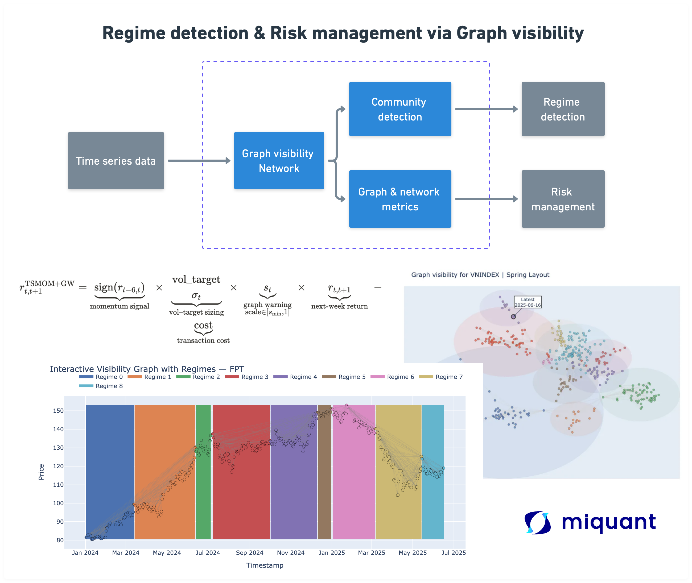
Để lấy file code và dữ liệu, vui lòng gửi email tới [hung.ha@miquant.vn](mailto:hung.ha@miquant.vn)

## Concept

Trong thị trường tài chính đầy biến động, mỗi điểm dữ liệu không chỉ chứa giá trị tức thời mà còn ẩn chứa các mối liên hệ ngầm hình thành từ quy luật biến động theo thời gian. Các mô hình thống kê chuỗi thời gian (time series) truyền thống—với giả định tuyến tính và tính dừng— khó phát hiện chuyển đổi giữa các “regime” với nhau hay các phụ thuộc phi tuyến tính (non-linear) ẩn sâu trong dữ liệu chuỗi thời gian. Nhằm khắc phục những vấn đề này, Visibility Graph được phát triển, chuyển bài toán phân tích chuỗi thời gian (time series) thành phân tích mạng (network), từ đó tận dụng các công cụ của khoa học mạng (network science) để khai thác thông tin động lực và cấu trúc tiềm ẩn.

## Time Series to Visibility Graph?

### Time series

Chuỗi thời gian là một dãy các điểm dữ liệu được liệt kê theo thứ tự thời gian, thường được thu thập tại các khoảng thời gian đều nhau. Nói cách khác, chuỗi thời gian là bất kỳ dãy dữ liệu nào được lấy ở các thời điểm rời rạc (discrete).  Chuỗi thời gian thường được trực quan hóa bằng đồ thị đường, đồ thị diện tích hoặc đồ thị cột, trong đó trục hoành (x) tương ứng với thời gian, còn chiều cao (trục tung, y) tương ứng với giá trị dữ liệu tại thời điểm đó.

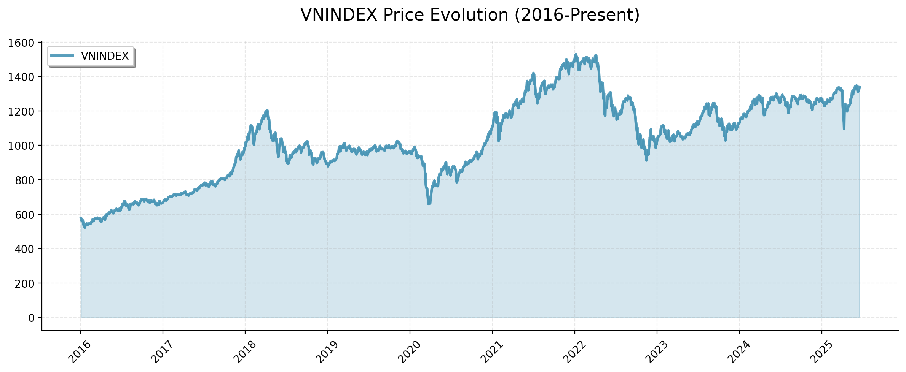

Mặc dù biểu đồ đường, diện tích hay cột cho ta cái nhìn tổng quan về xu hướng và biến động, nhưng rất khó để nhận diện:

- Các mối liên kết phi tuyến giữa hai điểm thời gian không kề nhau
- Những motif (pattern) lặp lại hay sự tự tương quan có thể tới từ những khoảng cách lớn trong dữ liệu
- Điểm gãy (change point) tiềm ẩn khi cấu trúc phụ thuộc giữa các giá thay đổi đột ngột
- Hay các trạng thái khác nhau của những giai đoạn thời gian khác nhau.

Chính vì những khó khăn này của phương pháp pháp chuỗi thời gian, trong 2 thập kỷ trở lại đây, các nhà nghiên cứu bắt đầu chuyển hướng sang việc sử dụng các phương pháp “complex network” để mô tả các thông tin đầy biến động và phụ thuộc lẫn nhau của time series! Các phương pháp có thể kể đến như: proximity networks, transition networks, and
visibility graphs. Bài viết sẽ tiến hành thử nghiệm với visibility graph.

### Visibility graph

Visibility graph  ra đời vào năm 2008, trong đó các nút (node) tương ứng với các điểm dữ liệu của chuỗi thời gian, và cạnh (edge) được nối giữa hai nút nếu chúng “nhìn thấy” nhau. Thuật toán này có thể ánh xạ mọi loại chuỗi thời gian thành mạng: chuyển chuỗi tuần hoàn thành đồ thị đều, chuỗi ngẫu nhiên thành đồ thị ngẫu nhiên và dễ dàng scale với mọi độ lớn của dữ liệu. Ngoài ra, có nhiều cách xây dựng visibility graph như: natural, horizontal và limited penetrable visibility graph. Bài viết thử nghiệm với natural visibility graph và mọi thử nghiệm luôn ngầm định là natural.

Việc xây dựng visibility graph rất dễ, hai điểm dữ liệu được nối với nhau khi và chỉ khi đường thẳng nối chúng không bị bất kỳ điểm nào nằm giữa “che khuất” – tức là mọi giá trị tại các điểm giữa đều nằm dưới đường thẳng đó.

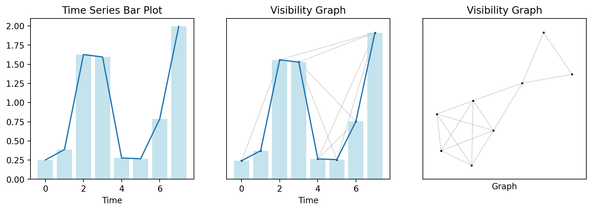

```python
from ts2vg import NaturalVG
import networkx as nx
import numpy as np
import matplotlib.pyplot as plt

# 1. Generate random time series (Brownian motion)
rng = np.random.default_rng(110)
ts = rng.standard_normal(size=8)
ts = np.cumsum(ts)

# 2. Build visibility graph
g = NaturalVG(directed=None).build(ts)
nxg = g.as_networkx()

# 3. Make plots
fig, [ax0, ax1, ax2] = plt.subplots(ncols=3, figsize=(12, 3.5),dpi=200)

ax0.plot(ts)
ax0.set_title("Time Series")

## bar plot for time series
ax0.bar(range(len(ts)), ts, color='lightblue', alpha=0.7)
ax0.set_xlabel("Time")
# ax0.set_ylabel("Value")
ax0.set_title("Time Series Bar Plot")

graph_plot_options = {
    "with_labels": False,
    "node_size": 2,
    "node_color": [(0, 0, 0, 1)],
    "edge_color": [(0, 0, 0, 0.15)],
}

nx.draw_networkx(nxg, ax=ax1, pos=g.node_positions(), **graph_plot_options)
ax1.tick_params(bottom=True, labelbottom=True)
ax1.plot(ts)
ax1.set_title("Visibility Graph")
## adding bar plot for visibility graph
ax1.bar(range(len(ts)), ts, color='lightblue', alpha=0.7)
ax1.set_xlabel("Time")
# ax1.set_ylabel("Value")

nx.draw_networkx(nxg, ax=ax2, pos=nx.kamada_kawai_layout(nxg), **graph_plot_options)
ax2.set_title("Visibility Graph")
# ax2.tick_params(bottom=True, labelbottom=True)
ax2.set_xlabel('Graph')
```

Về mặt toán học, phương trình xây dựng mô hình sẽ như sau.


Quan sát dữ liệu, ta dễ dàng nhận thấy một hiện tượng thú vị: các điểm giá có xu hướng tự gom thành các cụm. Trong bài viết trước, chúng ta đã giới thiệu phương pháp xây dựng mạng và phân cộng đồng (community detection) để nhóm các nút tương đồng ([link](https://vnquant.vn/posts/2025/2025-05-17-stock-market-network/)). Ở đây, phương pháp đó sẽ tiếp tục được áp dụng nhằm phân nhóm các ngày dựa trên mức độ tương đồng trong biến động giá, từ đó giúp xác định các “regime” khác nhau của chuỗi thời gian giá cổ phiếu. Ngoài ra, bài viết cũng thử nghiệm trích xuất thông tin “alternative” từ dữ liệu mạng như là chỉ báo để quản trị rủi ro cho tiến lược đầu tư.

## Experiment: Regime analysis & Risk management indicator

### Regime detection

Trước tiên, chúng tiến hành thử nghiệm để đi tìm kiếm các trạng thái “regime” của cổ phiếu và VNINDEX. Để làm được điều đó, chúng ta sử dụng thuật toán natural visibility để xây dựng network, sau đó áp dụng thuật toán Louvain để xác định cộng đồng (community). 

Sơ lược về bài toán regime detection, đây có thể xem như một dạng học không giám sát (unsupervised learning), trong đó mục tiêu là tự động phân nhóm các khoảng thời gian trong chuỗi giá dựa trên đặc trưng thống kê hoặc cấu trúc động lực. Mỗi regime tương ứng với một trạng thái thị trường khác nhau—chẳng hạn giai đoạn biến động thấp, biến động cao hay khủng hoảng—và không cần nhãn trước. Việc phát hiện chính xác các regime giúp tối ưu hóa chiến lược giao dịch, thiết lập bộ lọc rủi ro và hiểu rõ hơn về cấu trúc động lực của thị trường. Việc gom nhóm sẽ được xác định bằng thuật toán Louvain.

```python
def graph_visibility_construction(df):
    """
    Construct a Natural Visibility Graph from a price series and detect communities.
    """
    symbol = df.columns[0]
    ts = df[symbol].values
    dates = df.index

    # Build visibility graph
    vg = NaturalVG(directed=None)
    g = vg.build(ts)
    nxg = g.as_networkx()
    # nxg = g.as_igraph() ## We can also use igraph if needed

    # Detect Louvain communities
    communities = nx.algorithms.community.louvain_communities(nxg)
    # communities = nxg.community_infomap() ## Using Infomap for community detection
    
    # Assign colors
    COLORS = ["#4C72B0", "#DD8452", "#55A868", "#C44E52", "#8172B3", "#937860", "#DA8BC3", "#CCB974", "#64B5CD", "#E24A33", "#8C72B0", "#FFB347", "#6BA368", "#D9534F", "#7E57C2", "#A1887F", "#E18ECF", "#C7C05D", "#4FAFBD", "#F28E2B"]

    node_colors = ["#000000"] * len(ts)
    for cid, nodes in enumerate(communities):
        for n in nodes:
            node_colors[n] = COLORS[cid % len(COLORS)]

    return {
        'symbol': symbol,
        'ts': ts,
        'dates': dates,
        'nxg': nxg,
        'vg': vg,
        'communities': communities,
        'node_colors': node_colors
    }
```

Ta thu được kết quả như sau, thử nghiệm với FPT, HPG và VNINDEX

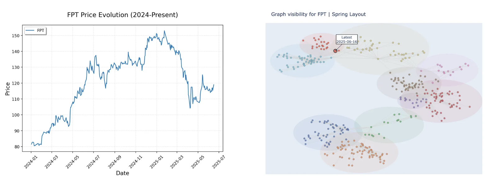
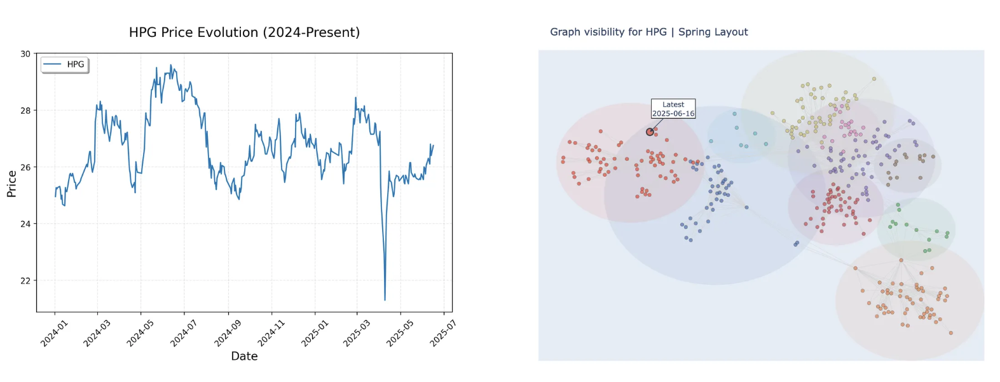
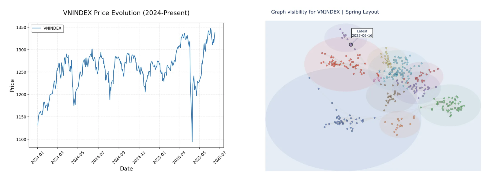
Chuyển đổi ngược trở lại thành time series thì sẽ trông như sau

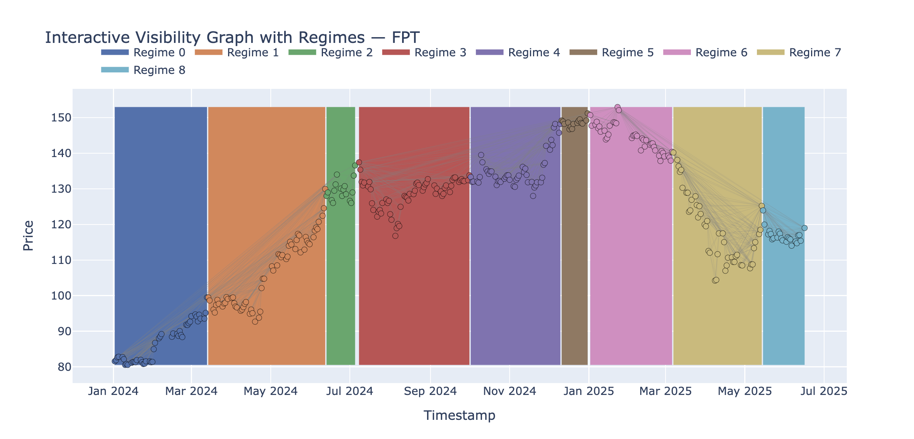

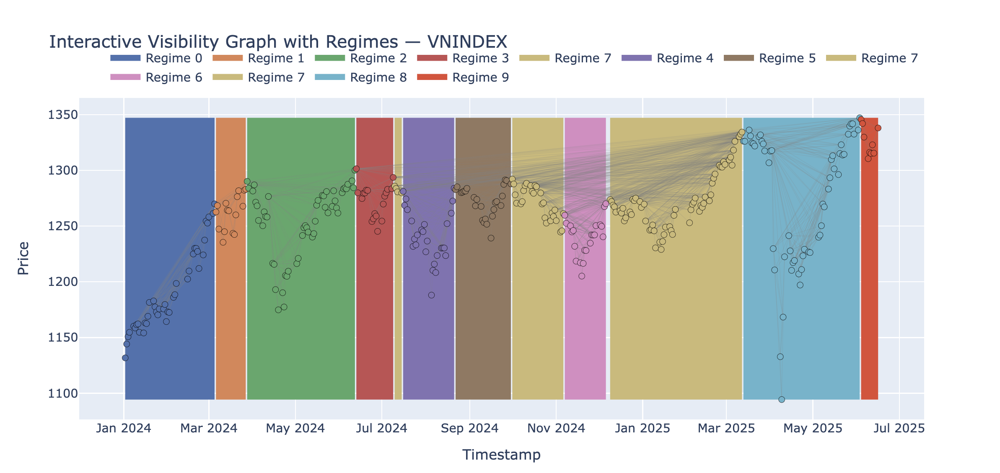

Phương pháp bắt tương đối chuẩn các thay đổi của giá cổ phiếu FPT. Với VNINDEX, việc xác định regime cũng tương đối chính xác và ta có thể nhận thấy Regime thứ 7 xuất hiện 3 lần. Việc xác định regime về mặt cảm quan là tương đối chính xác, tuy nhiên để thực sự đưa được regime này vào trong chiến lược đầu tư thì sẽ cần nhiều tính toán chi tiết hơn như: các thông tin mô tả mạng như (average shortest path, diameter, density, clustering coefficient,…). Viết phát triển tiếp tục mô hình regime detection này sẽ được nhường lại cho bạn đọc, hì! 

### Risk management indicator

Một trong những ứng dụng khác của mô hình này là xây dựng các chỉ báo nhằm phục vụ cho việc quản trị rủi ro. Bài viết sử dụng 2 chỉ báo 

**Diameter:** Trong graph theory, diameter là độ dài lớn nhất trong tất cả các quảng đường ngắn nhất giữa 2 node trong network. Nôm na có thể tưởng tượng là tìm ra tuyến đường ngắn nhất giữa mọi cặp thành phố có thể có trên bản đồ, sau đó chọn tuyến đường dài nhất trong số các tuyến đường ngắn nhất đó – đó chính là diamter. Diameter lớn cho thấy thị trường kém kết nối hơn, khi đó thông tin sẽ cần nhiều bước trung gian hơn để lan truyền. Điều này có thể báo hiệu rủi ro tăng, bởi thị trường đang phân mảnh.

**Betweenness Centrality Variance**: Betweenness centrality đo tần suất một node nằm trên đường đi đường ngắn nhất (shortest path) giữa các node khác. Betweenness centrality có nghĩa là node có ảnh hưởng rất lớn. Bằng cách lấy phương sai của các giá trị này, ta đánh giá sự phân tán của mức độ ảnh hưởng: Khi variance cao cảnh báo rằng chỉ một vài node giữ phần lớn vai trò kết nối – khi những điểm này biến động, toàn bộ cấu trúc mạng dễ bị tác động mạnh. Từ đó biến động lớn của betweenness variance chính là tín hiệu cảnh báo rủi ro tập trung, giúp ta phát hiện sớm các turning point và giảm tỷ trọng vị thế kịp thời.

Từ đó, việc sử dụng 2 chỉ báo này như một công cụ quản lý rủi ro nhằm đánh giá mức độ rủi ro của cổ phiếu. Bài viết sẽ thiết kế một hàm “activation” như là một công tắc để giảm hoặc bán hết danh mục khi thị trường vượt một mức rủi ro nhất định diễn tả thông qua 2 chỉ báo trên. Công cụ này sẽ được kết hợp với chiến lược TSMOM ([đọc tại đây](https://vnquant.vn/posts/2025/2025-03-24-tsmom-vietnam/)) như là công cụ quản lý rủi ro cho chiến lược này.

**Xây dựng chỉ báo**

```python
def rolling_graph_features(prices: pd.Series, window: int = 60):
    """
    Daily rolling visibility-graph features:
      - diameter (on largest component)
      - betw_var (variance of betweenness centrality)
    """
    dates = prices.index[window:]
    vg = NaturalVG(directed=None)
    data = {'diameter': [], 'betw_var': []}

    for dt in dates:
        vals = prices.loc[:dt].iloc[-window:].values
        G = vg.build(vals).as_networkx()

        # diameter
        if nx.is_connected(G):
            d = nx.diameter(G)
        else:
            comp = max(nx.connected_components(G), key=len)
            d = nx.diameter(G.subgraph(comp))
        data['diameter'].append(d)

        # betweenness variance
        bc = np.array(list(nx.betweenness_centrality(G).values()))
        data['betw_var'].append(bc.var())

    return pd.DataFrame(data, index=dates)
```

Tích hợp công cụ quản trị rủi ro cho chiến lược.

Chiến lược TSMOM cơ bản:

$$
r_{t,t+1}^{TSMOM} =\text{signal} *\text{position} *\text{return} - \text{cost}=  sign(r_{t-6, t})*\frac{0.4}{\sigma_t}*r_{t,t+1} - \text{cost}
$$

Chiến lược TSMOM có cơ chế quản trị rủi ro

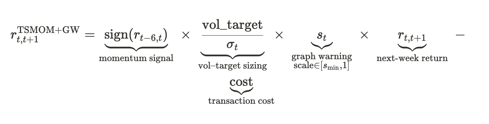


Trong đó hệ số cảnh báo đồ thị $s_t$ được định nghĩa theo từng đoạn với các ngưỡng $z_{\rm th}=1.645$, $z_{\max}=2.576$ và có giả trị tối thiểu là $s_{\min}$, $z_t^D , z_t^B$ là chỉ báo Dimater và Betweenness Centrality Variance được normalize. 

$$
s_t =
\begin{cases}
1, & z_t \le z_{\rm th},\\[6pt]
1 - \dfrac{z_t - z_{\rm th}}{\,z_{\max}-z_{\rm th}\,}\,(1 - s_{\min}),
& z_{\rm th} < z_t < z_{\max},\\[8pt]
s_{\min}, & z_t \ge z_{\max},
\end{cases}
\quad
z_t = \max\{0,\;z^D_t,\;z^B_t\}.
$$

Ngoài ra lấy max để 

- **Quan tâm kịch bản xấu nhất**: bằng cách lấy giá trị lớn nhất, bạn để chỉ báo nào (Diamater hay Betweenness centrality variance) “cực đoan” hơn sẽ chi phối tín hiệu rủi ro.
- **Tính đơn điệu (monocity)**: nếu một trong hai chỉ báo trở nên rủi ro hơn, $z_t$ chỉ tăng (không bao giờ giảm), đảm bảo bạn không bao giờ đánh giá thấp mức độ rủi ro.

Ngoài ra, hàm quản trị rủi ro chỉ được kích hoạt khi các chỉ báo vượt trên mức 90% và giảm vị thế tối thiểu khi chỉ báo vượt mức 99%.

- Dưới 90% → diễn biến còn trong vùng “bình thường” → giữ nguyên vị thế.
- Trên 90% → bắt đầu “penalize” dần, càng lên tới 99% càng giảm mạnh.
- Trên 99% → khẩn cấp → giảm ngay về mức tối thiểu.
- Giữa 90–99%, nội suy tuyến tính từ 1 → mức tối thiểu

Kết quả là một chỉ báo động: **giữ nguyên khi thị trường bình thường, giảm dần khi căng thẳng tăng, và “giảm tối đa” khi cực đoan**—tất cả dựa trên những mức cắt 90% và 99% quen thuộc trong quản trị rủi ro.

```python
# === graph early-warning scaling ===
# (a) daily graph features → weekly
gf_daily  = rolling_graph_features(prices, window=graph_window)
gf_weekly = (gf_daily
                .resample('W-FRI').last()
                .reindex(weekly_ret.index, method='ffill'))

# (b) compute threshold flags
alpha = 2.0 / (warn_lookback_weeks + 1)
mu_diam = gf_weekly['diameter'].ewm(alpha=alpha, min_periods=warn_lookback_weeks//2).mean()
sd_diam = gf_weekly['diameter'].ewm(alpha=alpha, min_periods=warn_lookback_weeks//2).std()

mu_betw = gf_weekly['betw_var'].ewm(alpha=alpha, min_periods=warn_lookback_weeks//2).mean()
sd_betw = gf_weekly['betw_var'].ewm(alpha=alpha, min_periods=warn_lookback_weeks//2).std()

z_diam = (gf_weekly['diameter'] - mu_diam) / sd_diam
z_betw = (gf_weekly['betw_var'] - mu_betw) / sd_betw

z_spike = pd.concat([z_diam, z_betw], axis=1).clip(lower=0).max(axis=1)

# assume z_spike is a pd.Series of your max‐z scores
z_th   = 1.645
z_max  = 2.576

# piecewise linear
#  a) between z_th and z_max, linearly ramp down
ramp = 1 - ((z_spike - z_th) / (z_max - z_th)) * (1 - s_min)

#  b) combine into one Series
risk_scale = pd.Series(1.0, index=z_spike.index)
# when above threshold, use ramp but cap at s_min

mask = z_spike > z_th
risk_scale[mask] = ramp[mask].clip(lower=s_min)

position_warn   = signal * pos_size * risk_scale
trade_cost_warn = 2 * commission * pd.Series(position_warn).diff().abs().shift(-1)
strat_ret_warn  = position_warn * weekly_ret.shift(-1) - trade_cost_warn
```

Kết quả thu được như sau cho cổ phiếu HPG

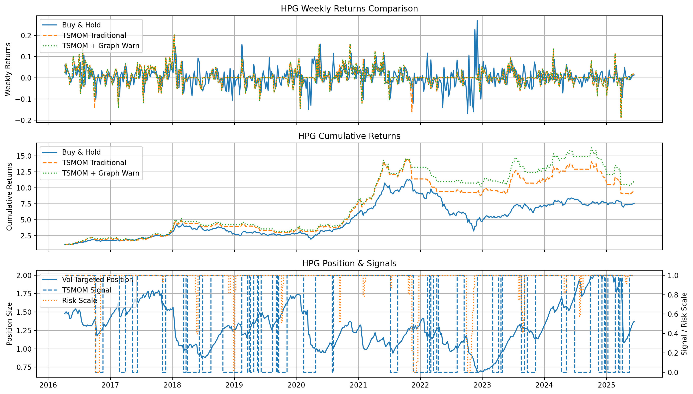

| Metric | Buy & Hold | TSMOM Traditional | TSMOM + Graph Warning |
| --- | --- | --- | --- |
| **Total Return** | 656.45% | 852.83% | 1000.08% |
| **Annualized Return** | 24.51% | 27.66% | 29.66% |
| **Annualized Volatility** | 33.91% | 29.95% | 29.14% |
| **Sharpe Ratio** | 0.82 | 0.97 | 1.04 |
| **Sortino Ratio** | 1.28 | 1.56 | 1.74 |
| **Max Drawdown** | –71.62% | –41.70% | –41.70% |
| **95% VaR** | –6.59% | –5.31% | –5.24% |

Kết quả cho cổ phiếu HPG cho thấy:

So với TSMOM truyền thống, việc thêm hệ số cảnh báo đồ thị giúp tăng lợi nhuận trung bình thêm 2% (từ 27.66% lên 29.66%) trong khi giảm nhẹ độ biến động (từ 29.95% xuống 29.14%) từ đó  Sharpe Ratio được đẩy lên từ 0.97 lên 1.04. Một mức tối ưu ổn 🙂 tuy nhiên không phải là xuất sắc khi max drawdown vẫn giữ nguyên. Điều này có thể đến từ việc sử dụng dữ liệu hoặc thiết kế của công cụ quản trị rủi ro chưa bắt được đúng những pha giảm mạnh của thị trường. Việc tối ưu hoặc xây dựng một cơ chế đo lường rủi ro khác có thể được dễ dàng thực hiện cho bạn đọc.

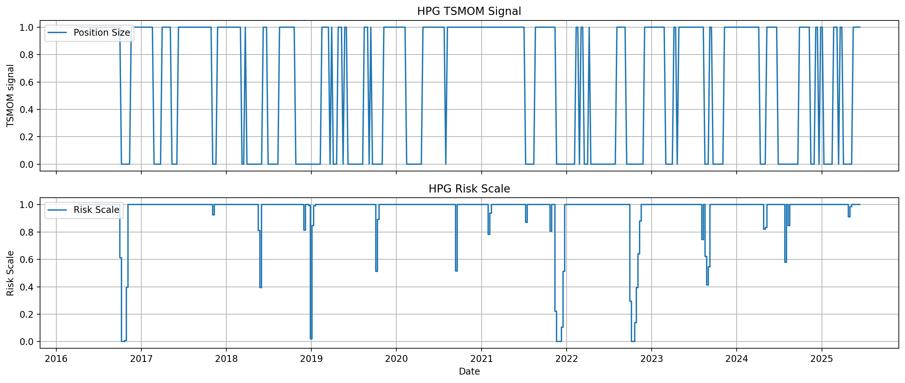

Tuy nhiên, việc tách bạch cơ chế giữa chiến lược mua/bán cổ phiếu với cơ chế quản trị rủi ro có thể giúp trader dễ dàng cân chỉnh được phần hiệu suất của chiến lược hay cơ chế quản trị rủi ro từ đó giúp cho hệ thống minh bạch, dễ kiểm soát và đáng tin hơn.

## Kết luận

Visibility Graph mở ra một lăng kính mới trong phân tích chuỗi thời gian tài chính, giúp chuyển hóa những quy luật ẩn sâu trong chuyển động giá thành cấu trúc mạng có thể khai thác bằng các công cụ của network science. Thay vì chỉ dựa vào giả định tuyến tính và tính dừng của mô hình thống kê truyền thống, phương pháp này tận dụng được các phụ thuộc phi tuyến và khả năng nhận diện các “regime” thị trường thông qua phân cộng đồng. Việc áp dụng Natural Visibility Graph cùng thuật toán Louvain không chỉ cho phép phát hiện trực quan các giai đoạn của giá cổ phiếu nói riêng và time series nói chung mà còn cung cấp nền tảng để xây dựng các chỉ báo quản trị rủi ro dựa trên cấu trúc mạng.

Ngoài ra, phương pháp này cũng là một cách tiếp cận đầy tiềm năng trong việc xây dựng các công cụ quản trị rủi ro thông qua khai thác thêm các đặc trưng mạng để xác định các giai đoạn stress của thị trường, rủi ro phân mảnh của cổ phiếu hay chuyển đổi regime để từ đó tích hợp vào trong từng chiến lược đầu tư.

Tóm lại, visibility graph không chỉ là công cụ hỗ trợ phân tích chuỗi thời gian mà còn là nền tảng để xây dựng các chỉ báo rủi ro mang tính cấu trúc và động lực. Việc tiếp tục khai thác các đặc trưng mạng chuyên sâu và tinh chỉnh cơ chế kích hoạt sẽ giúp hoàn thiện mô hình, đồng thời đem lại lợi thế cạnh tranh trong quản trị rủi ro và tối ưu hóa chiến lược đầu tư.

## Reference

[1] https://cbergillos.com/ts2vg/examples.html

[2] https://www.cs.cornell.edu/home/kleinber/networks-book/

[3] https://onlinelibrary.wiley.com/doi/epdf/10.1155/2019/5320686

[4] https://vnquant.vn/posts/2025/2025-05-17-stock-market-network/

[5] https://vnquant.vn/posts/2025/2025-03-24-tsmom-vietnam/

[6] https://arxiv.org/abs/0810.0920