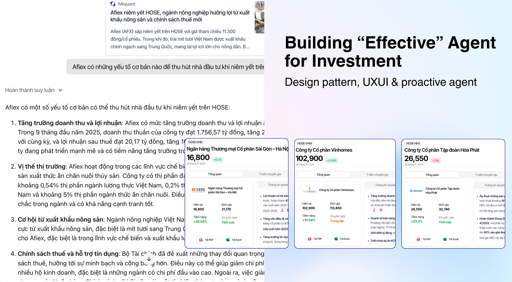
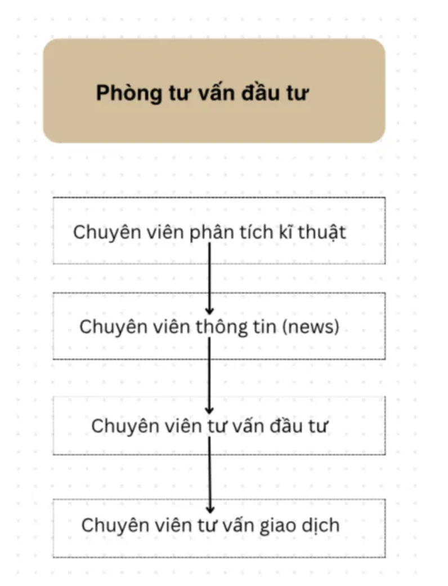
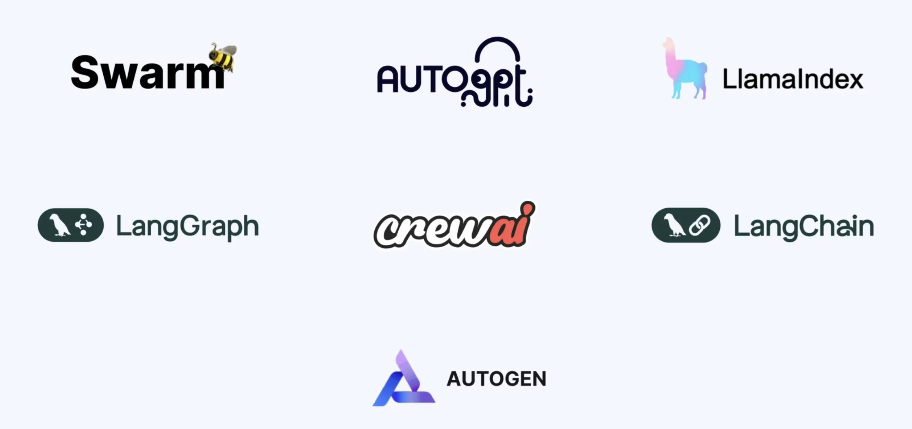
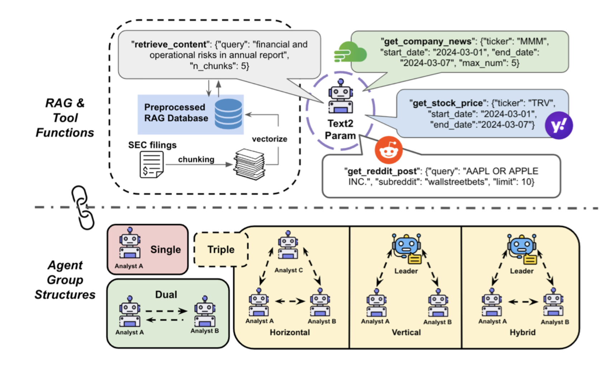

Sáu tháng trước, khi LLM bùng nổ và mọi người đều nói về AI Agent, RAG, mình cùng team miquant đã xác định đây là công nghệ cực kỳ hiệu quả. Chúng mình có thể tận dụng công nghệ này để "nâng cấp" nền tảng phân tích đầu tư và hỗ trợ tầm nhìn "automate research".

Và thế là bọn mình bắt tay vào làm. Sau nhiều kinh nghiệm đau thương, đến hôm nay mình đã có một sản phẩm mà mình tự tin sử dụng và đem ra thị trường. Bài viết này chia sẻ quá trình và kinh nghiệm mà mình cùng team có được khi build Agent cho phân tích đầu tư—những lỗi đã gặp và các tips hiệu quả không chỉ cho mảng đầu tư mà còn nhiều lĩnh vực khác.

Bài viết sẽ bắt đầu với những lỗi mà team gặp phải, hi vọng mọi người có thể tham khảo.

## 1. Hồi 1: Kinh nghiệm đau thương

Hồi mới bắt đầu build agent, chắc ai cũng đọc qua bài viết kinh điển của Anthropic ([link](https://www.anthropic.com/engineering/building-effective-agents)) với các design pattern chung như ReAct agent, multi-agent, workflow.

Lúc ấy, cuối năm 2024, team mình (bao gồm cả người làm trong ngành đầu tư và ComSci) quyết định chọn hướng parallelization (song song). Chúng mình thiết kế hệ thống multi-agent theo phong cách một phòng phân tích như công ty chứng khoán thông thường, đầy đủ các vị trí (đọc tại [đây](https://vnquant.vn/posts/2024/2024-12-02-ai-agent-for-investment/)). Design pattern này cực kỳ chi tiết và phức tạp: 1 agent phân tích kỹ thuật, 1 agent tạo chiến lược, 1 agent đọc news, 1 agent đọc báo cáo tài chính. Khi user hỏi câu gì, cả 4 agent đều chạy song song. Nghe thì cực kỳ hợp lý vì lấy ý tưởng từ cách tổ chức của con người, đặc biệt là cơ cấu của các công ty chứng khoán Việt Nam. Tuy nhiên, điều này dẫn đến một vài lỗi kinh điển khi build mô hình:

### “Over-Engineering” – quên mất mục tiêu thật sự

Bài học đau nhất: khi quá nhiều agent chạy song song, độ phức tạp tăng theo cấp số nhân.

Nghe thì rất hợp lý: mô phỏng một “phòng phân tích đầu tư” với đầy đủ chuyên gia. Nhưng thực tế lại phũ phàng:

- 4 agent chạy → 4 lần tốn tiền inference
- 4 agent chạy → 4 lần đợi response
- 4 agent chạy → 4 lần cơ hội… phát sinh bug
- 4 agent chạy → output bắt đầu “cãi nhau”, chưa kể phải tạo thêm một agent mới để… hoà giải

Và cái giá phải trả?

- Output loạn chuẩn dù câu hỏi cực kỳ đơn giản
- Chi phí tăng chóng mặt
- Thời gian phản hồi chậm đến khó tin

Mình còn nhớ lúc mới build, mỗi câu trả lời mất… 5 phút, câu “hi” cũng mất 30 giây :)))

Tệ hơn nữa, team quên mất một điều cực kỳ quan trọng: câu hỏi trong đầu tư không phải lúc nào cũng là phân tích chuyên sâu, rất nhiều chỉ là truy vấn thông tin nhanh. Đây là hai nhu cầu hoàn toàn khác nhau. Thế nên với cách tổ chức multi-agent phức tạp như vậy, 99% câu trả lời trả về đều dài 2.000 chữ trong 5 phút, phù hợp cho phân tích cổ phiếu sâu về riêng cổ phiếu, nhưng hoàn toàn không phù hợp cho mọi user và mọi tình huống. 

<!--  -->

<!--  -->

### Lựa chọn framework để xây dựng

Hồi mới bắt đầu cuối năm 2024, chỉ có vài thư viện để sử dụng mà có thể đưa lên production, mình nhớ có 4 thư viện mà mình nhớ là nổi tiếng nhất: CrewAI, LlamaIndex, Langgraph, Autogent. Với độ mới của công nghệ này và đặc biệt chưa ai build cho tài chính, chưa có mấy khái niệm như Context Engineering, long-term, short-term memory, mcp v.v.  

Cả thế giới lúc đó vẫn còn loay hoay ở mức **RAG cơ bản + tool call đơn giản**, chưa có nhiều tài liệu, chưa có hệ sinh thái rõ ràng để học theo. Trong bối cảnh đó, team mình chọn **CrewAI** cho phiên bản đầu tiên, vì nó RẤT đơn giản, thuần prompt engineering, dễ tích hợp tool call, và nhanh để ra bản demo demo bản đầu đọc tại [đây](https://vnquant.vn/posts/2024/2024-12-02-ai-agent-for-investment/)).

Đây là lỗi thứ hai, chọn sai framework cho usecase.

CrewAI hay, dễ dùng, nhưng: (1) không thiết kế để chạy workload lớn, hệ thống nghẽn khi có 10-20 chat concurrent, ngốn RAM khi host; (2) khó customize workflow, thiết kế khá cứng nhắc và không dành việc customize quá nhiều, muốn sửa phải vào thẳng source code để sửa; (3) đi theo hướng thiên về prompt engineering hơn là workflow design. Đây là các điểm mình gặp phải vào lúc đó (cuối năm 2024), bây giờ thư viện có thể đã được tối ưu tốt hơn.

Với mảng đầu tư, nơi yêu cầu tốc độ và khả năng tuỳ biến về cách thiết kế, CrewAI nhanh chóng lộ ra giới hạn. Hệ thống multi-agent theo cách thiết kế của CrewAI quá cồng kềnh và quá khó tuỳ biến, kiểm soát workflow. Đó là lúc bọn mình nhận ra: muốn build được agent cho ngành đầu tư thì cần một thư viện/framework khác yêu cầu: (1) khả năng tuỳ biến trong thiết kế; (2) khả năng can thiệp sâu vào trong workflow của agent; (3) tốc độ; (4) cộng đồng open source mạnh. Và sau khi research một hồi, với khả năng tuỳ biến và đáp ứng với nhiều usecase khác nhau, bọn mình quyết định chọn Langchain/Langgraph. 

### Phó mặc số phận cho xác suất

Phó mặc số phận cho xác suất nghĩa là sao? Là bạn, developer, người xây dựng Agent, không thể đoán trước được “behavior” của agent đó. Việc này sinh ra như thế nào? Đơn giản thôi, bạn để agent xử lý dữ liệu THÔ (raw data) trong lúc trả lời câu hỏi của user. Đây có lẽ là kinh nghiệm lớn thứ 2 mình học được khi build agent (kinh nghiệm lớn nhất ngay phần dưới).

Trong tài chính dữ liệu bao gồm: (1) báo cáo tài chính thuần (financial statement), (2) dữ liệu thị trường (market data), (3) dữ liệu phi cấu trúc: báo, analyst report, ...

Bạn thử tưởng tượng nếu bạn được đưa một dataframe dài 252 dòng với 5 cột chỉ toàn dữ liệu thô, liệu bạn có kết luận gì không? Bạn được đưa đưa cho toàn là số là số, xác suất bạn trích xuất được thông tin hay insight gì đó hữu dụng là… rất thấp.

LLM khi nhận dữ liệu thô thì phải tự đoán cái nào quan trọng, tự đoán chỗ nào là số liệu chính, tự đoán mối quan hệ giữa các cột, tự đoán đâu là logic đúng, và còn là tiếng việt nữa, nơi ít dữ liệu được train hơn các ngôn ngữ chính khác.

Nói cách khác: **nó hoạt động theo xác suất đúng như cách nó được train**, không có bất kỳ ràng buộc hay điều kiện kiểm soát nào. Và khi bạn để LLM “tự đoán” trong một môi trường dữ liệu phức tạp như tài chính, thì: xác suất agent trả lời đúng rất thấp, tính nhất quán gần như bằng 0, và bạn không thể tái lập câu trả lời ngay cả khi hỏi lại câu y hệt.

Đó chính là bản chất của việc *phó mặc số phận cho xác suất*. Và rất buồn cười là cũng mất tương đối lâu để mình nhận ra vấn đề này. 

Khác với các mảng thiên về code hay chatbot hỏi đáp, dữ liệu tài chính không chứa insight trong dạng thô. Insight chỉ xuất hiện sau khi được xử lý, và được tính toán và phân tích qua nhiều lớp định lượng (quant). Những thứ quan trọng như xu hướng cổ phiếu, định giá, sentiment, phân tích báo cáo tài chính hay kể cả ý tưởng đầu tư đều bắt buộc phải nằm trong một hệ thống định lượng riêng, rồi mới được đưa vào model. Nếu không, agent chỉ đang… đoán mò như một sinh viên đại học nhìn báo cáo tài chính rồi đoán 🙂. Rủi ro hallucinate là 100% và thứ bạn nhận lại của agent chỉ là một mớ bòng bong.

### UXUI

Kinh nghiệm mà mình nghĩ mình học được nhiều nhất chính là thiết UXUI, trải nghiệm người dùng trong mảng đầu tư. Bạn có thể build được một con chatbot cực kỳ lực, trả lời hay “vãi”, nhưng người dùng không biết hỏi gì hay không biết bắt đầu tư đâu… thì toàn bộ sức mạnh đó **bị lãng phí gần như 90%**.

Trong đầu tư, trải nghiệm người dùng lại càng quan trọng. User không muốn “ngồi nghĩ câu hỏi”, họ muốn được, vì đơn giản trong 1 ngày, có quá nhiều thông tin phải được xử lý, có quá nhiều sự kiện xảy đến với thế giới, crypto, cổ phiếu macro, …. Nhưng cơ bản họ không biết bắt đầu tư đâu. Đây là lúc những agent bắt chước chatgpt sẽ chết dần, vì trước khi thuyết phục được user rằng “tôi trả lời rất hay, nghiên cứu cực mượt” thì họ đã không biết hỏi gì rồi. 

So với chatGPT hay các agent cho vibe code, đây là những agent “Reactive” dành riêng cho việc xử lý vấn đề có sẵn, tức là bạn đã có câu hỏi rồi, bạn mới lên ChatGPT hoặc dùng Github Co-pilot. Nhưng ngành đầu tư thì có một chút khác biệt. Bạn đang không biết có chuyện gì đang diễn ra trên thế giới, trên thị trường, quá nhiều thông tin, rối và không biết bắt đầu từ đâu, nên các agent phải mang tính “proactive” hơn. Phải mớm câu hỏi, mớm ý tưởng cho user để họ bắt đầu đi tìm hiểu.

Vì vậy, một agent tốt trong đàu tư không thể chỉ chờ user đặt câu hỏi, nó phải có cơ chế gợi ý câu hỏi, như các sự kiện hot là gì, cổ phiếu nào outlier, tiền vào nhiều, tại sao, FED ra thông tin gì chưa, tôi có nên quan tâm không, tại sao Bitcoin giảm về 90k. Các thứ như thế. Agent phải đi trước người dùng 1 bước, gợi ý và cuối cùng là trả lời. Và đặc biệt phải nhanh, điều này dẫn đến một lỗi tiếp theo, lựa chọn mô hình LLM phù hợp.

### Lực chọn mô hình LLM không phù hợp.

Hiện tại, có 2 cách để bạn sử dụng LLM. Một là bạn lấy 1 mô hình open source về, tuning và host. Hai là bạn sử dụng 1 model từ các provider lớn như OpenAI, Microsoft, Anthropic, v.v. Nghe thì đơn giản, nhưng chọn sai hướng có thể khiến bạn mất 3–6 tháng và đốt một lượng chi phí không cần thiết.

Với hướng open-source, lợi thế rõ ràng là chi phí inference thấp, khả năng kiểm soát tốt từ weight đến tokenizer, tự do fine-tune theo domain hẹp và không bị lệ thuộc provider. Tuy nhiên, đó chỉ là bề nổi. Ở lớp vận hành thật sự, team sẽ phải đối mặt với vô số vấn đề: DevOps tốn kém và phức tạp, độ ổn định không cao, chất lượng model khó đoán, tình trạng crash và memory leak thường xuyên, fine-tune lệch một chút là mô hình xuống cấp toàn diện, đặc biệt là để scale một hệ thống chỉ tính tới vài trăm người xài chung lúc thì CAPEX mình nghĩ phải lên tầm chục triệu đô, và tất nhiên, với một start up không phải về AI provider mà thiên hướng về tài chính hơn thì đây không phải là cách hợp lý trong giai đoạn này.

Ngược lại, sử dụng model từ các provider lớn tuy chi phí cao hơn nhưng mang lại sự ổn định, chất lượng vượt trội và khả năng dự đoán hành vi tốt hơn rất nhiều. Team không phải lo về hạ tầng GPU, scaling, downtime, hay tuning phức tạp, tuy nhiên, bài toán bây giờ là phải tìm ra provider nào phù hợp chất lượng/giá thành. Hồi xưa thì team mình chọn đại, chứ gpt mà phang, nhưng dần già mình thấy cơ chế một mô hình cho tất cả đã đã không còn phù hợp. Nên với hệ thống agent hiện tại của miquant, team mình đã evaluation cho từng khâu như: trích xuất thông tin thì dùng con gì, định giá thì dùng con gì, trả lời user thì dùng con gì,…. Ở mỗi khâu, một agent chuyên môn cho đúng duy nhất khâu đó đã đươc áp dụng, và kết quả mình thấy tương đối tốt.

Với cách thiết kế kiểu này, bạn hạn chế được rủi ro tập trung là cái thứ nhất, cái thứ 2 tăng cao độ chính xác của hệ thông và đặc biệt, tối ưu chi phí cực tốt. Không phải lúc nào cũng cần 1 model reasoning cực thông minh, vừa vừa được rồi.

Và đây cũng là kết thúc hồi 1: kinh nghiệm đau thương. Và giờ tới hồi 2, kinh nghiệm từ team mình.

## Hồi 2: Kinh nghiệm build agent cho ngành có nhiều thông tin như đầu tư

### Xử lý trước thông tin và cơ chế cross-checking

Kinh nghiệm lớn nhất của mình khi build agent cho ngành đầu tư là: phải xử lý hết thông tin trước khi đưa vào LLM. Bạn chính là phụ bếp, gọt rửa trái cây, cắt thịt, bắt sâu, kể cả phải làm nước dùng luôn. Thứ bạn đưa vào LLM để trả lời cho người dùng là insight, không phải data. Điều này sẽ tăng được tính “reproducibility” và giảm “hallucination” cho agent của bạn.

Giả dụ, cho phân tích cổ phiếu, bên mình đã xử lý tất cả thông tin từ dữ liệu → insight thông qua các mô hình định lượng, thông tin đã được trích xuất gọn gàng sạch sẽ, đẹp đẽ và đã được eval trước khi đưa vào model. Từ đó, tính dự đoán được “predictability” sẽ được nâng cao cho các ngành mà dữ liệu cực nhiễu như tài chính.

Ví dụ như trường hợp trên, khi agent hỏi về cổ phiếu, các thông tin như luận điểm đầu tư, tin tức mới nhất, định giá, dự báo doanh thu đã được xử lý tất cả (xem thêm tại [đây](https://app.miquant.vn)). Agent chỉ việc vô bốc lên và sử dụng thôi. Điều này tạo được độ chính xác cực cao cho agent, khả năng tái lập, và nâng cao niềm tin của người sử dụng với agent, vì họ thể cross check câu trả lời qua cơ chế citation. Ngoài ra, với các ứng dụng nhạy cảm với độ chính xác của dữ liệu như ngành đầu tư, agent đơn lẻ là một cách xây dựng không hợp lý. Với miquant, agent là một công cụ tổng hợp dữ liệu, phân tích cho người dùng. Vì vậy, không chỉ dừng lại với cite báo hay analyst report, agent của miquant cite vào đúng "data platform" đội nhà build để việc check lại độ chính xác của agent là đơn giản và hợp lý nhất.

### UXUI Đẹp, đẹp, đẹp!!!

Sau khi xử được vấn đề hallucination, cái thứ 2 ban cần giải là làm sao cho user idea để có thể bắt đầu khám phá. Như một analyst đề xuất chủ đề vậy. Bên mình có build thêm một hệ thống cập nhật thị trường thời gian thực và “detect” các cổ phiếu tiềm năng/outlier.

Với một hệ thống “pro-active”, kết nối các hệ thống bên dưới khác về mảng tài chính như danh mục đầu tư của họ, các cổ phiếu tiềm năng, khuyến nghị, cập nhật tin tức việt nam và thế giới thời gian thực, nhà đầu tư giờ đây có thể nói là chủ động hơn trong việc đầu tư. Việc chat hay tìm hiểu là kết quả phái sinh của việc liên tục được cập nhật thông tin, cho ý tưởng dẫn đến việc “nghiên cứu” trở nên tự động.

### Cuối cùng, như đã nói ở trên, hệ thống ngầm mới là key driver.

Với miquant, agent chỉ đơn giản là một lớp kết nối và diễn tả lại các thông tin định tính lẫn định lượng. Tuy nhiên, lớp kết nối này là lớp quan trọng vì giúp cho nhà đầu tư nhàn hơn và đặc biệt tăng hiệu suất công việc của họ lên rất lớn. 

Với các sản phẩm agent thiên về dữ liệu như này, trước khi bạn bắt đầu xây hệ thống agent, hệ thống ngầm bên dưới mới là thứ giúp AI Agent của bạn stand out ra hẳn so với phần còn lại của thị trường. Với miquant, toàn bộ thông tin về cổ phiếu, về thị trường, vĩ mô, thế giới, crypto và kể cả các ý tưởng đầu tư đều được back bởi các mô hình định lượng chuyên sâu hơn và ít tính “stochastic” hơn. Agent chỉ là lớp kể câu chuyện mà nhà đầu tư có thể hiểu và cần.

## Kết luận

Sau 6 tháng thử nghiệm và sai lầm, team mình rút ra được 3 bài học lớn nhất khi build AI Agent cho đầu tư:

1. **Đơn giản hóa trước khi tối ưu** - Multi-agent phức tạp không phải lúc nào cũng tốt hơn
2. **Data phải được xử lý trước** - Đừng để LLM tự "đoán" với dữ liệu thô
3. **UX/UI proactive** - Agent phải đi trước user một bước, gợi ý thay vì chờ câu hỏi

Điều quan trọng nhất: hệ thống ngầm bên dưới mới quyết định chất lượng agent. AI Agent chỉ là lớp kết nối giúp nhà đầu tư tiếp cận insights nhanh hơn, chính xác hơn.

Nếu bạn quan tâm đến AI Agent trong finance hoặc muốn trải nghiệm những gì team mình đã build, hãy thử ngay tại: https://app.miquant.vn

Ngoài Agent, hiện miquant còn có công cụ "Xây dựng chiến lược tự động" - AI Ranking mời mọi người trải nghiệm. Mình sẽ lên bài blog về công nghệ này sớm nhất. Very exciting!

Cảm ơn mọi người đã đọc! Rất mong nhận được feedback từ các bạn để cùng nhau phát triển sản phẩm tốt hơn.