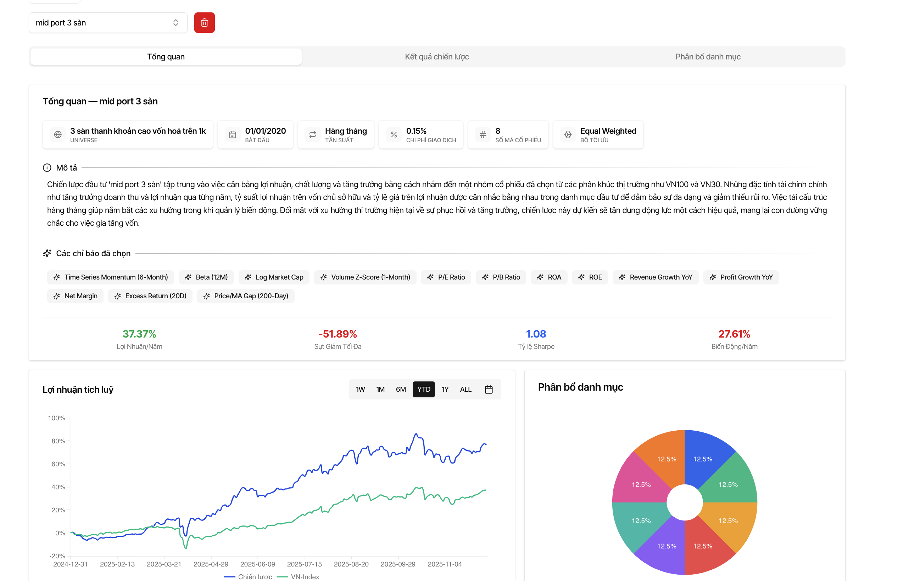
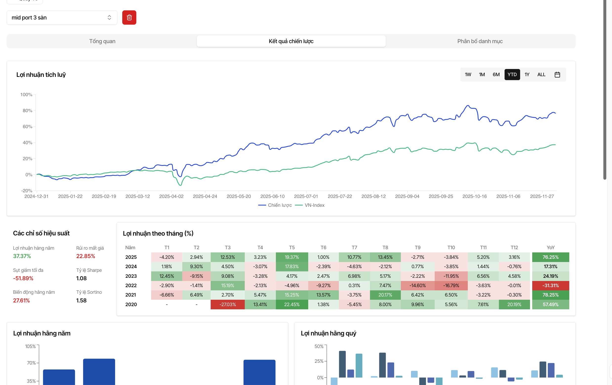

Trong suốt nhiều thập kỷ, đầu tư định lượng phát triển dựa trên nền tảng đơn giản: con người tự xây dựng tín hiệu, mô hình hoá chúng thành yếu tố hay tín hiệu (signal, factor), kiểm định (backtest), tinh chỉnh (calibration), rồi kỳ vọng rằng chiến lược đó sẽ hoạt động ổn định qua thời gian. Đây là thời kỳ của những hệ số quen thuộc như ROE, ROA, Momentum 12M–1M hay Price-to-Book (P/B). Nhưng khi dữ liệu ngày càng nhiều, thị trường ngày càng biến động và alpha trở nên khan hiếm, quy trình truyền thống lộ rõ sự chậm chạp và thiếu linh hoạt. 

Thị trường Việt Nam là một ví dụ sống động. Nhà đầu tư cá nhân chiếm tỷ trọng lớn, dòng tiền theo chủ đề xoay chuyển liên tục, tin tức và chính sách có tác động mạnh tức thì, trong khi cấu trúc ngành và quy mô doanh nghiệp thay đổi qua từng năm. Trong bối cảnh này, một mô hình định lượng truyền thống, với tín hiệu cố định, chu kỳ tái cân bằng cố định và tổ hợp yếu tố cố định và giả định “stationary”  khó có thể duy trì hiệu quả. 

Bài viết này phân tích sâu về sự khác biệt giữa Signal Construction truyền thống và framework AI Ranking mà team mình (Miquant) đang phát triển để phục vụ cho việc alpha mining làm sao cho thích ứng và đa dạng hoá danh mục ở “level” chiến lược.

## **1. Giới hạn toán học và vận hành của Signal Construction**

Signal Construction hay xây dựng tín hiệu bắt đầu từ việc chọn một nhóm đặc trưng tài chính mà nghe “hợp lý”, ví dụ với Quality factor: lợi nhuận trên vốn, lợi nhuận trên tài sản, biên lợi nhuận, mức độ đòn bẩy, khả năng thanh toán, v.v. Nhà nghiên cứu hay trader sau đó chuẩn hóa dữ liệu, kết hợp theo một trọng số nhất định rồi kiểm định kết quả. Đây là một tư duy cực kỳ hợp lý trong việc đầu tư. Vì lúc này, việc đầu tư thay vì dựa vào “cầu may” thì đã được kiểm định liệu chiến lược này có lời trong quá khứ không để lấy đó làm luận điểm cho thị trường hiện tại. Tuy nhiên, dù cách làm này có nền tảng khoa học, nhưng lại tồn tại bốn hạn chế mang tính cấu trúc.

**Thứ nhất, không gian tìm kiếm quá rộng so với khả năng thủ công.**

Một mô hình với với 7 chỉ số cơ bản đã có thể tạo ra hàng triệu tổ hợp khác nhau nếu xét đến biến đổi phi tuyến, các thang đo khác nhau, cách chuẩn hóa khác nhau, kiểu kết hợp khác nhau. Con người chỉ có thể thử vài chục biến thể, trong khi thị trường đòi hỏi khám phá hàng nghìn hoặc hàng triệu lựa chọn.

**Thứ hai, mối quan hệ giữa tín hiệu và lợi nhuận không cố định theo thời gian.**

Nếu giai đoạn 2016–2019 ủng hộ cổ phiếu ROE cao, thì trong giai đoạn lãi suất tăng, doanh nghiệp vay nợ thấp lại outperform. Điều này khiến một mô hình Quality cố định luôn bị trễ; nó phản ánh “bản chất trung bình của quá khứ” thay vì “động lực của hiện tại”.

**Thứ ba, khả năng bắt được hiệu ứng tương tác (interaction effects) gần như bằng không.**

Một công ty có ROE cao nhưng tăng trưởng lợi nhuận âm chưa chắc tốt. Một công ty nợ thấp nhưng biên lợi nhuận nhỏ dễ tổn thương trong môi trường chi phí tăng. Hệ thống yếu tố truyền thống rất khó mô hình hoá các mối quan hệ phi tuyến (nonlinear), thứ mà thị trường thực tế lại phụ thuộc rất nhiều.

**Thứ tư, backtest truyền thống dễ rơi vào bẫy overfitting hoặc regime bias.**

Nếu mô hình được tinh chỉnh cho một giai đoạn tăng mạnh, chiến lược sẽ sụp đổ khi thị trường chuyển sang giai đoạn phòng thủ. Dữ liệu Việt Nam vốn ngắn, lại nhiều giai đoạn nhiễu, khiến việc backtest càng khó đáng tin cậy nếu không có cơ chế rolling, regime-aware và đa mô hình.

Tóm lại, hạn chế lớn nhất của Signal Construction không nằm do tư duy, mà do giới hạn về tốc độ và không gian tìm kiếm: con người không thể khám phá đầy đủ những gì dữ liệu có thể cung cấp. Ngoài những yếu tố mang tính hệ thống này, hạn chế về con người thường là điểm lớn nhất. Với 1 cá nhân, từ việc tổng hợp dữ liệu, phát hiện những điểm bất thường “anomaly” để tận dụng “leverage” và xây dựng thành chiến lược có thể tốn hàng tháng trời mà kết quả có khi không đạt như mong đợi. 

## **2. Quality Factor trong thị trường Việt Nam: vì sao chiến lược suy yếu trong năm 2025?**

Trong thị trường phát triển như Mỹ, Quality Factor thường có tính ổn định cao hơn. Nhưng trong thị trường Việt Nam, hiệu quả của Quality phụ thuộc cực nhiều vào bối cảnh vĩ mô, chu kỳ tín dụng, chính sách ngành và thậm chí là tâm lý nhà đầu tư.

ROE cao chưa chắc tốt nếu biên lợi nhuận bị co lại trong chu kỳ chi phí tăng. ROA cao có thể che lấp rủi ro khi doanh nghiệp không có lợi thế cạnh tranh. Leverage thấp tốt trong chu kỳ thắt chặt tín dụng, nhưng lại khiến doanh nghiệp bỏ lỡ cơ hội mở rộng khi tín dụng rẻ. Một tín hiệu tốt trong 18 tháng trước chưa chắc tốt trong 6 tháng tiếp theo. Giới hạn của Quality Factor trong thị trường mới nổi nằm ở tính “trung bình hoá” quá mức: nó bỏ qua ngữ cảnh và chỉ mô tả một phần nhỏ của câu chuyện.

Lấy chính dữ liệu backtest của Miquant làm ví dụ, năm 2025 là một giai đoạn chất lượng hoạt động của chiến lược Quality VN100 Top-10 suy giảm rõ rệt so với các chiến lược khác và thậm chí so với benchmark.

Nhìn vào chuỗi này, có thể thấy **nửa đầu năm 2025 đặc biệt khó khăn**, khi Quality chịu drawdown mạnh hai tháng liên tiếp T3 và T4. Đây không chỉ là hiện tượng nhất thời mà phản ánh đặc trưng của thị trường 2025: dòng tiền xoay nhanh sang nhóm cổ phiếu tăng trưởng, đầu cơ, định giá thấp hoặc chu kỳ — những nhóm vốn là “gót Achilles” của chiến lược Quality. Bằng chứng trực quan hơn có thể thấy ở biểu đồ tăng trưởng tích luỹ trong 3 năm gần nhất: **đường màu xanh dương (Quality) bắt đầu thua kém VN-Index (đường xanh lá)** ngay khi thị trường chuyển pha sang trạng thái “risk-on” từ cuối quý 1/2025. Chỉ riêng giai đoạn 2024–2025, Quality VN100 Top-10 gần như đi ngang trong khi VN-Index phục hồi mạnh, kéo dài xu hướng underperform.

**Để hiểu nguyên nhân sâu hơn, cần nhìn vào bản chất của các cổ phiếu được Quality ưu tiên:**

1. Doanh nghiệp ổn định, ít nợ, biên lợi nhuận cao
2. Mức tăng trưởng trung bình → thấp, nhưng bền vững
3. Định giá không rẻ, thường premium hơn mặt bằng chung
4. Ít hấp dẫn khi thị trường bước vào pha đầu cơ hoặc hưng phấn

Nhìn vào danh mục Top 10 của Quality cho thấy danh mục gồm nhiều cổ phiếu logistic (SCS), điện (NT2, GEE), thuỷ sản (VHC, ANV), phân bón (DCM), giấy – nhựa (BMP, TLG). Đây đều là các ngành mang tính ổn định nhưng thiếu động lực tăng trưởng ngắn hạn, đặc biệt trong giai đoạn nhà đầu tư xoay mạnh sang nhóm ngân hàng, chứng khoán, bất động sản và thép — những ngành có beta cao — thì danh mục Quality mang tính phòng thủ lại trở nên kém hấp dẫn. Điều này lý giải vì sao Quality ghi nhận drawdown mạnh ở T3 và T4, đúng thời điểm nhóm cyclical tăng tốc.

**Dữ liệu lịch sử cũng cho thấy tính chu kỳ mạnh của Quality**

Bảng hiệu suất YoY trong báo cáo cũng thể hiện rõ chu kỳ:

- 2021: +61.81% — năm thị trường phục hồi hậu Covid, ngành thiết yếu bùng nổ
- 2022: –10.74% — chu kỳ thắt chặt chính sách, chi phí đầu vào tăng
- 2023: +28.98% — dòng tiền quay lại nhóm doanh nghiệp tốt
- 2024: +7.85% — hiệu suất trung bình
- 2025 YTD: +5.71% — bắt đầu suy yếu rõ rệt khi thị trường xoay sang high-beta cyclical

Ngay trong báo cáo Quality VN100, chỉ số rolling beta cho thấy Quality thường có **beta thấp hơn thị trường**, và đây là nguyên nhân khiến chiến lược thường underperform trong các pha bull mạnh hoặc thị trường đầu cơ ngắn hạn.

### **Bài học quan trọng từ trường hợp 2025**

Chất lượng — dù mang tính bền vững — nhưng không phải lúc nào cũng hiệu quả, đặc biệt trong thị trường Việt Nam với: (1) cấu trúc ngành biến động nhanh, (2) dòng tiền cá nhân chi phối, (3) chu kỳ tín dụng thay đổi liên tục, (3) và sự luân phiên mạnh giữa nhóm phòng thủ và nhóm chu kỳ.

Những điều này khiến một yếu tố đơn lẻ như Quality dễ rơi vào trạng thái “mismatch với thị trường”. Chiến lược hoạt động tốt khi thị trường cần sự an toàn, nhưng lập tức hụt hơi khi nhà đầu tư theo đuổi những doanh nghiệp có rủi ro cao (như đòn bẩy lớn hoặc beta cao). Chính case study năm 2025 là ví dụ hoàn hảo cho thấy tính rủi ro của việc phụ thuộc vào một yếu tố cố định, đặc biệt là khi thị trường chuyển sang trạng thái mà yếu tố đó không còn là “người được ưu ái”.

## **3. Bước ngoặt tư duy: Alpha Mining và bản chất của việc khám phá tín hiệu**

Trong nhiều thập kỷ, phương pháp xây dựng tín hiệu trong đầu tư định lượng chủ yếu dựa vào logic kinh tế và trực giác tài chính của con người: lựa chọn một số biến đại diện (ROE, biên lợi nhuận, tăng trưởng doanh thu…), chuẩn hóa chúng, và kết hợp theo một công thức cố định. Đây là mô hình “Signal Construction”: con người chủ động xác định tín hiệu, còn mô hình chỉ đóng vai trò tính toán.

Tuy nhiên, cách tiếp cận này gặp giới hạn tự nhiên khi thị trường ngày càng mang tính phi tuyến, dễ nhiễu và thay đổi nhanh theo chu kỳ. Một tín hiệu hoạt động tốt trong vài quý có thể ngay lập tức mất hiệu lực khi điều kiện vĩ mô, cấu trúc ngành hoặc dòng tiền thay đổi. Điều này đặc biệt đúng trong các thị trường mới nổi, nơi hành vi nhà đầu tư và trạng thái thanh khoản có thể chuyển đổi bất ngờ.

Những hạn chế đó dẫn đến một bước ngoặt tư duy: thay vì con người định nghĩa tín hiệu trước, hệ thống cần có khả năng khám phá tín hiệu trực tiếp từ dữ liệu. Nếu Signal Construction là quá trình “áp đặt cấu trúc lên dữ liệu”, **thì Alpha Mining là quá trình “để dữ liệu định hình cấu trúc”.**

Các hệ thống đầu tư hiện đại, với giao diện cho phép người dùng chọn từ nhiều nhóm chỉ báo, điều chỉnh universe, thay đổi chu kỳ tái cân bằng, không còn chỉ đóng vai trò tạo danh mục. Các cấu phần này tạo ra một không gian để kiểm tra các giả thuyết về tín hiệu: đâu là biến quan trọng, mối quan hệ giữa các biến thay đổi thế nào theo thời gian, và cấu trúc tín hiệu nào đang được thị trường phản ứng mạnh nhất.

Nói cách khác, Alpha Mining không phải là mở rộng của Signal Construction, mà là một cách tư duy mới, mà ở đó tín hiệu không được xác định trước mà được khám phá, mối quan hệ giữa biến và lợi nhuận không cố định mà phụ thuộc bối cảnh, và chất lượng chiến lược đến từ khả năng thích nghi hơn là công thức cố định.

## **4. Bốn tầng của một hệ thống Alpha Mining hiện đại**

Một hệ thống Alpha Mining không phải là một mô hình duy nhất, mà là một kiến trúc gồm nhiều tầng hoạt động cùng nhau. Các hệ thống như vậy, dù trong môi trường nghiên cứu hay trong ứng dụng thực tiễn, thường chia thành bốn lớp cơ bản.

### **(1) Tầng dữ liệu: nền tảng của không gian tín hiệu**

Alpha Mining chỉ có ý nghĩa khi dữ liệu đủ đa dạng, đủ sâu và đủ thời gian để mô hình nhận ra cấu trúc. Các hệ thống hiện đại thường sử dụng:

- dữ liệu giá và thanh khoản
- tín hiệu dòng tiền, kỹ thuật
- báo cáo tài chính
- và rất nhiều dữ liệu khác

Trong các công cụ xây dựng chiến lược, việc chia chỉ báo thành nhiều nhóm khác nhau (cash flow, efficiency, leverage, cycle indicators…) phản ánh cách các hệ thống này tổ chức dữ liệu thành “không gian tín hiệu” đa chiều. Ở tầng này, mục tiêu không phải chỉ lưu trữ dữ liệu, mà là **chuẩn hóa tất cả về một khung thời gian và cấu trúc thống nhất**, giúp mô hình có thể học được các tương tác phức tạp.

**(2) Tầng mô hình: engine khai phá tín hiệu**

Tầng mô hình là nơi Alpha Mining khác biệt hoàn toàn so với Signal Construction. Thay vì sử dụng công thức cố định, mô hình hiện đại tận dụng các mô hình machine learning, deep learning để có thể:

- phân tích và xây dựng các biến đổi một cách tự động,
- thử nghiệm tương tác giữa hàng chục hoặc hàng trăm tín hiệu,
- đánh giá tầm quan trọng của tín hiệu theo chu kỳ,
- và điều chỉnh theo real-time để thích nghi với thay đổi thị trường.

Việc người dùng lựa chọn chỉ báo, universe (tập hợp cổ phiếu đầu tư được) hay tần suất tái cân bằng thực chất là **thiết lập điều kiện ban đầu** cho engine mô hình hóa tín hiệu. Mỗi cấu hình tạo ra một trường hợp kiểm định khác nhau, cho phép mô hình khám phá alpha trong nhiều bối cảnh.

### **(3) Tầng backtest: kiểm định chiến lược**

Một hệ thống Alpha Mining cần một tầng kiểm định mạnh, không chỉ chạy backtest. Các quy trình hiện đại thường bao gồm:

- backtest rolling theo nhiều độ dài cửa sổ,
- kiểm định theo từng chế độ thị trường (uptrend, downtrend, high-liquidity, stress period…),
- phân tích hiệu suất theo tháng, quý, năm,
- đánh giá độ bền vững của tín hiệu (signal stability),
- mô phỏng phí giao dịch và trượt giá.

Những yếu tố này giúp hệ thống tránh các tín hiệu “đẹp trong lịch sử nhưng vô dụng trong tương lai”, đồng thời làm rõ khi nào một tín hiệu còn hiệu lực và khi nào không.

### **(4) Tầng triển khai: chuyển hóa tín hiệu thành quyết định thực tế**

Tầng cuối cùng của một hệ thống Alpha Mining không phải là mô hình dự báo, mà là **cơ chế chuyển hóa tín hiệu thành quyết định đầu tư khả thi**. Đây là giai đoạn mà các tín hiệu rời rạc, phi tuyến và thay đổi theo thời gian được hợp nhất thành một cấu trúc có thể vận hành trong thực tế.

Các hoạt động như xếp hạng cổ phiếu, ước tính xác suất outperform, hay tổng hợp thông tin từ dòng tiền, kỹ thuật, và sentiment không chỉ mang tính tiện ích. Những thao tác này thể hiện cách hệ thống dịch “alpha” từ dạng trừu tượng, vốn tồn tại trong không gian mô hình, sang dạng có thể hành động, nơi nhà đầu tư có thể trực tiếp sử dụng.

Một điểm quan trọng là ở giai đoạn triển khai, Alpha Mining tách biệt hoàn toàn khỏi tư duy chiến lược tĩnh của phương pháp Signal Construction. Trong mô hình truyền thống, nhà đầu tư thường xây dựng một chiến lược duy nhất, chẳng hạn một chiến lược Quality, rồi duy trì nó trong thời gian dài, bất chấp bối cảnh thị trường thay đổi. Ngược lại, trong Alpha Mining, **tính thích nghi** là yếu tố nền tảng. Chiến lược không phải một thực thể cố định, mà là một “đầu ra động” được cập nhật liên tục khi mô hình học lại từ dữ liệu mới. Mỗi bản cập nhật nhỏ từ sự thay đổi của một tín hiệu, một tương tác đến một trạng thái thị trường (regime) đều có thể dẫn đến sự điều chỉnh trong danh mục khuyến nghị.

Tuy nhiên, giá trị lớn nhất của tầng triển khai không nằm ở việc xây dựng *một* chiến lược mạnh, mà ở việc hệ thống có khả năng xây dựng và duy trì một tập hợp chiến lược đa dạng, mỗi chiến lược phản ánh một khía cạnh của không gian tín hiệu.

Trong thực tiễn Alpha Mining, việc tạo ra nhiều chiến lược mang ý nghĩa quan trọng trên ba phương diện:

**Thứ nhất, khai thác đa yếu tố (multi-factor exploration).**

Một không gian tín hiệu rộng bao gồm hàng trăm biến có thể dẫn đến vô số cấu trúc chiến lược khác nhau. Thay vì chọn trước một vài yếu tố kinh điển như Value – Momentum – Quality, hệ thống cho phép hình thành nhiều chiến lược dựa trên các nhóm thông tin khác nhau: dòng tiền, thanh khoản, chu kỳ sản xuất, cấu trúc chi phí, hành vi nhà đầu tư… Việc duy trì nhiều chiến lược giúp tránh cái bẫy “một mô hình – một góc nhìn”, vốn là điểm yếu cố hữu của Signal Construction.

**Thứ hai, cơ chế tự-kiểm định (self-validation).**

Một chiến lược đơn lẻ rất dễ rơi vào tình trạng overfit, đặc biệt trong thị trường nhiều nhiễu. Nhưng khi hệ thống có hàng chục hoặc hàng trăm chiến lược cùng vận hành, mỗi chiến lược trở thành một điểm dữ liệu về cấu trúc thị trường. Sự đồng thuận hoặc bất đồng giữa các chiến lược đóng vai trò như một “cơ chế kiểm tra chéo” tự nhiên: nếu nhiều chiến lược độc lập đều lựa chọn cùng một nhóm cổ phiếu, điều đó phản ánh sự tồn tại của một cấu trúc thị trường thực; ngược lại, nếu chỉ một chiến lược đưa ra tín hiệu đơn lẻ, hệ thống có cơ sở để đặt câu hỏi về tính ổn định của tín hiệu đó.

**Thứ ba, ensemble inference và expert system (hơi khó dịch tiếng việt).**

Việc duy trì nhiều chiến lược cho phép hệ thống tổng hợp kết quả theo cách tương tự ensemble learning hay expert system trong học máy: mỗi chiến lược là một “người bỏ phiếu”, và danh mục cuối cùng được hình thành dựa trên mức độ đồng thuận. Điều này giảm nhiễu, giảm rủi ro tín hiệu sai và tăng độ bền vững của alpha. Trong thực tế, cổ phiếu được nhiều chiến lược độc lập lựa chọn thường có mức độ tin cậy cao hơn, phản ánh tính “đa nhân tố” của tín hiệu dẫn dắt.

Nhờ vậy, tầng triển khai không chỉ đơn giản là kết thúc của pipeline Alpha Mining, mà còn là nơi mô hình và thực tế tương tác trực tiếp. Tại đây, các chiến lược không còn là thực thể đơn độc mà trở thành một **hệ sinh thái**, nơi từng chiến lược là một phiên bản nhìn thị trường theo góc độ riêng. Việc kết hợp, đối chiếu và tổng hợp giữa chúng tạo ra một lớp alpha ổn định và giàu thông tin hơn nhiều so với bất kỳ mô hình đơn lẻ nào có thể đem lại.

# **5. Vì sao Alpha Mining vượt trội?**

Alpha Mining không chỉ là một khái niệm mới, nó phản ánh sự phù hợp tự nhiên với những thị trường có mức độ nhiễu cao, chu kỳ dòng tiền nhanh và các tương tác phi tuyến (non-linear)

**Cấu trúc thị trường thay đổi nhanh tạo lợi thế cho hệ thống thích nghi**

Ở các thị trường mới nổi, dòng tiền có thể thay đổi đáng kể chỉ trong vài tuần: từ midcap sang ngân hàng, từ nhóm phòng thủ sang cổ phiếu chu kỳ. Các chiến lược dựa trên yếu tố cố định thường phản ứng chậm trước sự thay đổi này. Trong khi đó, Alpha Mining nhờ việc học lại tín hiệu theo thời gian và được xây dựng dựa trên rất nhiều dữ liệu khác nhau có khả năng thích nghi tự nhiên với sự dịch chuyển này.

**Alpha decay nhanh đòi hỏi mô hình học liên tục**

Một tín hiệu có thể mạnh trong 3–6 tháng rồi yếu ngay sau đó.

Ở Việt Nam, chu kỳ này thậm chí còn ngắn hơn.

Các mô hình cố định không thể theo kịp tốc độ decay này, trong khi Alpha Mining được thiết kế để có liên tục học lại, liên tục đánh giá hiệu quả, và loại bỏ tín hiệu yếu.

**Sự phi tuyến trong hành vi nhà đầu tư khiến tín hiệu truyền thống kém hiệu quả**

Hành vi giao dịch trong thị trường mới nổi thường bị ảnh hưởng bởi các yếu tố như tin tức đột ngột, thay đổi chính sách, kỳ vọng ngắn hạn,

Những yếu tố này tạo ra mối quan hệ phi tuyến giữa tín hiệu và giá, khiến các yếu tố truyền thống (như Value hay Quality) khó duy trì hiệu quả liên tục. Alpha Mining với khả năng khám phá tương tác và biến động phi tuyến phù hợp hơn nhiều trong bối cảnh này.

**Không gian tín hiệu rộng nhưng nhiễu, các mô hình ML xử lý tốt hơn con người**

Thị trường Việt Nam có rất nhiều tín hiệu tiềm năng: dòng tiền tổ chức, kỹ thuật theo phiên, tín hiệu volume bất thường, luân chuyển ngành, cải thiện thanh khoản… nhưng mức nhiễu cũng cực cao.

Con người khó có thể đánh giá hàng trăm biến cùng lúc, đặc biệt là khi mối quan hệ giữa chúng thay đổi nhanh. Mô hình Alpha Mining có thể xử lý lượng thông tin lớn hơn, tìm ra cấu trúc tiềm ẩn mà mắt thường không thể nhận ra.

## **Kết luận**

Lịch sử của đầu tư định lượng được xây dựng trên nền tảng phổ quát: con người chọn tín hiệu, mô hình hoá chúng thành yếu tố, kiểm định, điều chỉnh và hi vọng rằng cấu trúc tín hiệu đó sẽ duy trì hiệu quả đủ lâu trong tương lai. Trong bối cảnh dữ liệu hạn chế và thị trường vận động tương đối ổn định, phương pháp này vừa hợp lý vừa hiệu quả.

Nhưng thế giới thị trường tài chính của thập kỷ 2020 trở đi đã thay đổi triệt để: dữ liệu bùng nổ theo cấp số nhân, tương tác giữa nhà đầu tư ngày càng phi tuyến, dòng tiền dịch chuyển với tốc độ cao và alpha trở nên khan hiếm. Trong môi trường như vậy, Signal Construction bộc lộ hạn chế mang tính cấu trúc: cứng nhắc, đơn chiều và không nắm bắt được các hiệu ứng động. Trường hợp Quality Factor trong thị trường Việt Nam năm 2025 là một ví dụ điển hình. Một yếu tố vốn được coi là ổn định trong nhiều thị trường phát triển lại có thể underperform kéo dài chỉ vì điều kiện vĩ mô, thanh khoản và cấu trúc dòng tiền thay đổi nhanh đến mức các tín hiệu truyền thống không kịp thích nghi. Đây không phải là lỗi của Quality, mà là giới hạn của cách tiếp cận “yếu tố cố định”.

Trong bối cảnh ấy, **Alpha Mining** xuất hiện như một sự tiến hóa tự nhiên, không phải để thay thế Signal Construction, mà để vượt qua giới hạn của nó. Tư duy Alpha Mining đảo ngược vai trò của con người và dữ liệu: thay vì con người định nghĩa tín hiệu và ép thị trường đi theo mô hình, Alpha Mining để dữ liệu mô tả thị trường, cho phép tín hiệu tự hình thành và tự điều chỉnh theo thời gian.

Nếu bạn muốn trải nghiệm ngay sản phẩm này thì có thể trải nghiệm ngay tại đây: https://app.miquant.vn/platform/ai-ranking